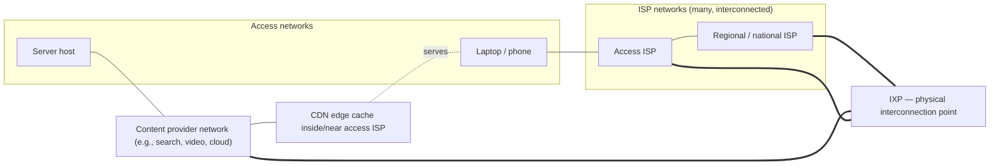

# Lecture 01 — Instructor Teaching Notes
## What Is a Network? Overview, History & the Internet Today (120 min)

| Field | Value |
|---|---|
| Status | Draft v0.1 — instructor review required |
| CLOs | CLO1 primary; CLO4/CLO5 introduced |
| Textbook anchor | KR ch. 1; PD ch. 1; T ch. 1 (perspective) |

---

## 1. Objectives hook
Driving question (write on board before class): **"You press play on a video. In 0.2 seconds,
thousands of kilometres of fibre, dozens of devices, and several protocols moved a second of
it to you. What happened — and where did the time go?"**

Opening story (2 min): last semester a student complained the "campus Wi-Fi is broken" because
a game was laggy while a download ran at full speed. The network was fine — it was *full*.
Today we build the vocabulary to say precisely why those two things can be true at once.

## 2. Minute plan

| Minutes | Segment | What happens |
|---|---|---|
| 0–5 | Course logistics (brief) | Grading/instructor-info one slide; points to syllabus |
| 5–10 | Prior knowledge + hook | Anonymous poll: "What happens when you type a URL?" (free text, no wrong answers); reveal board question |
| 10–25 | Concept 1 | What is a network; circuit vs packet switching |
| 25–45 | Concept 2 | The four delays; bandwidth vs throughput; jitter & loss |
| 45–55 | Concept 3 | Internet structure: access, ISPs, IXP, CDN (mini-diagram) |
| 55–60 | Break | — |
| 60–63 | Recap questions | 2 rapid-fire items (below) |
| 63–93 | Worked examples + worksheet | Delay calculations (instructor-led, then pairs do worksheet part A) |
| 93–108 | GA-01 demo + explore | Wireshark tour on a sample trace; students replicate |
| 108–118 | Summary + exit ticket | Synthesis map; 3-item exit ticket |
| 118–120 | Preview | "Layers" question; reading assignment |

Concept teaching ≈ 55 min; worked examples/activities ≈ 40 min; demo ≈ 15 min. This is a
foundation lecture: deliberately more concept-time than later analysis lectures.

## 3. Concept walkthrough

### 3.1 What is a network? (10 min)
- **Definition (Tanenbaum, classic):** a collection of *autonomous* computers interconnected
  by a single technology. "Autonomous" = no master/slave relationship (excludes a keyboard
  wired to one PC — that's I/O, not networking).
- Smallest network: two machines on one link. From there, networks compose: LANs connected
  by routers form internetworks; the Internet is *the* worldwide internetwork of networks.
- **internet** (lowercase, any internetwork) vs **the Internet** (the global public one).
- The unit of exchange is the **packet**: a chunk of user data plus headers. Header = control
  information structured so *other machines* can act on it. This header idea is the seed of
  everything in the course.
- A **protocol** is an agreement on message format and order, and on actions taken when
  messages are sent/received (KR's definition). Analogy that lands: it's not a "law", it's a
  *convention* two parties must both follow to communicate — like politeness formulas in a
  phone call ("hello", "over and out").

### 3.2 Two ways to move data: circuit vs packet switching (15 min)
- **Circuit switching:** reserve an end-to-end path *before* talking; the reservation (a
  circuit) holds dedicated capacity whether or not you speak. Traditional telephone network
  is the canonical example. Guarantees capacity; wastes it during silence.
- **Packet switching:** no reservation. Data is chopped into packets; each is **stored and
  forwarded** hop by hop: a router must receive the whole packet, check it, queue it, then
  transmit it on the next link. Links are shared statistically among many flows.
- Consequences (build the table with the class):

| | Circuit switching | Packet switching |
|---|---|---|
| Setup | Required (call setup) | None |
| Capacity | Dedicated, guaranteed | Shared, best effort |
| Utilization | Poor for bursty traffic | High (statistical multiplexing) |
| Congestion behavior | Call may be *blocked* | Packets *queue* (delay) or drop (loss) |
| Failure response | Connection breaks | Packets reroute (with care) |
| Fit | Constant-rate voice (its origin) | Bursty data — the modern workload |

- **Store-and-forward delay is quantifiable:** a router forwards the 1st bit of a packet only
  after receiving the last bit. One hop adds transmission delay L/R twice (receive + send) —
  KR's classic figure 1.x analysis. Worked example in §6 below.
- Historical irony worth stating: packet switching itself predates the Internet
  (early-1960s work by Baran, Davies, Kleinrock — cite Leiner et al. / RFC 2235). The ARPANET
  (first four nodes, 1969) carried its first packets on this principle.

### 3.3 Where time goes: the four delays (20 min) — core of the lecture
Per hop, per packet, four components add up:

1. **Processing delay** — header inspection, FIB lookup, checksum. Hardware routers: often
   *less than microseconds* (simplified teaching model: "negligible unless doing deep work").
2. **Queueing delay** — time waiting in an output buffer. *Variable*; depends on traffic
   intensity ρ = La/R (L avg packet size, a avg arrival rate, R link rate).
   - ρ → 0: nearly empty queue. ρ → 1: queue grows without bound (simplified model).
   - This is the delay that makes networks feel "random", and the root of **jitter**.
3. **Transmission delay** — push all L bits onto the link: **L / R** seconds.
   - 1,000-byte packet on 100 Mbps: 8,000 b / 10⁸ b/s = 80 µs. On 1 Gbps: 8 µs.
4. **Propagation delay** — signal travels distance d at speed s ≈ 2×10⁸ m/s in copper/fibre
   (about 2/3 of vacuum light speed): **d / s**.
   - 1,000 km → 5 ms one-way. Transmission and propagation are *independent*: a long fat pipe
     (high R, long d) has tiny transmission delay and large propagation delay.

- **Total nodal delay** = d_proc + d_queue + d_trans + d_prop. End-to-end latency sums this
  across the path plus end-host stacks.
- **RTT** = time for a small message to go and come back (later: measured by ICMP echo).
- **Jitter** = variation of packet delay across a flow. Interactive audio/video care deeply;
  bulk downloads don't. This is why "the network is slow" is an incomplete bug report.
- **Loss** = buffer overflow (queue full → drop) or transmission errors. Retransmission or
  concealment follows — cost depends on the application.

### 3.4 Bandwidth vs throughput (10 min)
- **Bandwidth (link capacity R):** bits/second the link can carry. Property of the *link*.
- **Throughput:** achieved end-to-end transfer rate. Property of the *path + endpoints*.
  Bounded by the **bottleneck link** (min over path capacities, minus overheads and losses).
- Worked figure: client on 100 Mbps, server on 1 Gbps, both connected through a 10 Mbps
  access circuit → throughput ≈ 10 Mbps regardless of the fat links at the ends.
- **Latency vs bandwidth are orthogonal:** a transatlantic 400 Gbps pipe still has ~30+ ms
  RTT. You can't buy your way out of physics with capacity. (Keep bufferbloat as a teaser:
  "a full queue can make a *fast* network *slow* — L19 revisits".)

### 3.5 The Internet today (15 min, structural only)
- Not one cloud, one owner, or one technology: **an interconnection of many thousands of
  independent networks (autonomous systems)** — ISPs, universities, enterprises, cloud and
  content providers — under common protocols. No single owner; governance via standards
  bodies (IETF: protocols; IEEE: LANs; ICANN/IANA: names & numbers).
- Structure sketch (draw live, then reveal):



- **IXP**: a physical switch fabric where different networks exchange traffic directly
  (cheaper, faster than transiting a third network).
- **CDN**: geo-distributed caches that push content *toward* users — why your video often
  comes from a box in your own ISP. (L23 revisits HTTP; L31 revisits design.)
- History milestones in 3 minutes (cite RFC 2235; Leiner et al.): ARPANET 1969 → TCP/IP
  switchover Jan 1, 1983 ("flag day") → DNS 1983 → public WWW 1991 → commercialization
  mid-90s → broadband/mobile/cloud era. Point: the *architecture* is old and stable; the
  *edge* keeps changing.

## 4. Important definitions

| Term | Definition (teach verbatim) |
|---|---|
| Computer network | Autonomous computers interconnected by a single technology |
| Protocol | Agreement on message format/order and on actions taken on send/receive |
| Packet | Self-contained chunk of data + headers; unit of switching |
| Circuit switching | Communication after reserving an end-to-end path with dedicated capacity |
| Packet switching | Store-and-forward exchange of packets over shared links |
| Store-and-forward | Router receives the full packet before forwarding it |
| Bandwidth (capacity) | Rate a link can carry, b/s |
| Throughput | Achieved end-to-end rate; bounded by bottleneck |
| Latency / RTT | One-way delay / round-trip time of a small message |
| Jitter | Variation in packet delay within a flow |
| Packet loss | Drop due to full buffers or transmission error |
| Autonomous system (AS) | A network under one administrative authority |
| IXP | Physical facility where networks interconnect and exchange traffic |
| CDN | Distributed caches serving content close to users |

## 5. Real-world examples
- **Video call vs game vs email:** same network, opposite sensitivities — call needs low
  jitter, game needs low RTT, email only needs eventual delivery. Tolerance defines design.
- **Speed-test results** show download bandwidth *and* "loaded latency": an idle line can
  have 5 ms RTT that becomes 80 ms under load (queueing, not physics).
- **Undersea fibre cut** (e.g., a single cable event): traffic reroutes via other paths —
  packet switching's rerouting property — but RTT jumps (longer path).
- **Streaming starts fast then plateaus:** player fills a buffer; bottleneck limits steady
  throughput to the bottleneck rate even on "1 Gbps" access.

## 6. Mathematical / technical examples (worked in class)
1. **Transmission delay:** 1 MB (10⁶ B) file, single full-size-fraction packet stream over
   100 Mbps: 8×10⁶ b / 10⁸ b/s = **0.08 s**. Over 1 Gbps: 0.008 s.
2. **Propagation:** Karachi→London ≈ 6,300 km route: 6.3×10⁶ m / 2×10⁸ m/s = **31.5 ms**
   one-way; ≥ 63 ms RTT floor before any queueing — you cannot "fix" this with faster links.
3. **Store-and-forward:** 1,500-byte packet over three hops of 10 Mbps:
   per-hop transmit = 12,000 b/10⁷ b/s = 1.2 ms; three hops ≈ 2× per-hop transmission delays
   at each store-and-forward stage along the path ≈ **3.6 ms** pure transmission (teach the
   KR approximation: end-to-end ≈ N×L/R for N links ignoring propagation/queueing).
4. **Traffic intensity:** 100 Mbps link, avg 100-byte... (deliberately absurd then corrected)
   — actually: avg packet 1,000 B, arrival 8,000 packets/s → La = 8×10⁷ b/s → ρ = 0.8:
   heavy queueing regime. At 12,000 pps → ρ = 0.96: queueing delay explodes. Ask: which
   engineer lever fixes this? (Arrival shaping vs capacity.)

## 7. GA-01: guided Wireshark tour (demo script)
Purpose: make "packets are real" concrete on day one. Offline trace — no network needed.
1. Download one small HTTP capture from the Wireshark SampleCaptures page (link in README)
   **or** load a page on the VM and capture 30 s beforehand. Verify it offline before class ⚠.
2. Demo sequence: open trace → explain the 3-pane layout → scroll raw hex → click one HTTP
   packet → walk the dissection tree `Frame → Ethernet → IPv4 → TCP → HTTP` → say "each of
   these gets its own lecture" → apply display filter `http` → apply `ip.addr==<host>` →
   Statistics → Conversations (show who talked to whom).
3. Students repeat on their laptops; first filter and first color-coded conversation.

## 8. Common misconceptions (address explicitly)

| Misconception | Debunk move |
|---|---|
| "Bandwidth = the speed I experience" | Bottleneck + throughput example; speed-test loaded-latency story |
| "Latency and bandwidth are the same/interchangeable" | Orthogonality: fat pipe still has RTT floor; d/s math |
| "Distance doesn't matter, it's instant" | 6,300 km → ≥63 ms RTT; light-speed bound |
| "Packet switching is simply better" | Trade-off table: no guarantee vs high utilization; circuit switching thrives for reserved constant-rate links |
| "Ping measures bandwidth" | ICMP echo measures RTT/loss (L16 formalizes); throughput needs data volume (iperf3, LAB-01) |
| "The Internet is one big cloud run by someone" | AS/IXP/CDN sketch; no single owner; standards bodies |

## 9. Suggested practical demonstration
As §7 (offline Wireshark tour). Exact commands to produce the fallback trace on the course VM:

```bash
# On the course VM, BEFORE class (needs internet access once):
timeout 30 wireshark -k -w /tmp/l01-demo.pcapng &   # capture while fetching a page
curl -s https://example.com > /dev/null
# Verify the capture contains TCP and HTTP packets:
tshark -r /tmp/l01-demo.pcapng -Y "http" | head
tshark -r /tmp/l01-demo.pcapng -q -z conv,tcp | head
```

⚠ Verify `tshark`/`curl` output on the current VM image the same morning; keep the downloaded
SampleCaptures file as the offline backup.

## 10. Classroom activities
- **Predict-observe-explain:** before the Wireshark demo, ask "how many packets to load one
  small page? Write a number." Reveal; discuss why guesses were low (handshakes, DNS, ACKs).
- **Delay-sorting race:** read 6 scenarios (satellite link page load; campus Netflix at
  21:00; game ping spike; fibre cut reroute; bufferbloat download; intra-DC copy) — pairs
  assign dominant delay component + justify. Worksheet part A.
- **Think-pair-share:** "The university doubles its Internet bandwidth. Name two problems
  that will NOT improve." (Expected: propagation-bound RTT; queueing on the *internal*
  bottleneck; packet loss on Wi-Fi airtime.)

## 11. Problem-solving questions (answer key in §12 of worksheet notes? — key is in §12 below)
1. 2,400-byte packet over 1 Gbps — transmission delay?
2. 800 km of fibre — one-way propagation delay?
3. Bottleneck: 50 Mbps access, 500 Mbps elsewhere — max achievable throughput and why?
4. ρ = 0.5 vs ρ = 0.99 on the same link — what changes qualitatively?
5. A colleague "fixes" lag by upgrading 10 Mbps→100 Mbps. RTT was 40 ms. Comment.

## 12. Formative assessment (4 MCQ + 2 short, with answers)
- MCQ1: Which delay does a faster link NOT reduce? → **propagation**.
- MCQ2: Store-and-forward means a router forwards *after*: → **receiving the whole packet**.
- MCQ3: Throughput of a path is bounded by: → **the bottleneck link**.
- MCQ4: Jitter matters most for: → **interactive audio/video**.
- SA1: In one sentence: why does packet switching beat circuit switching for bursty traffic?
  → shared links carry many bursty flows whose peaks don't coincide → high utilization.
- SA2: 1,500 B on 10 Mbps: transmission delay = 12,000/10⁷ = **1.2 ms**.

## 13. Exit ticket (collect; 3 items)
1. List the four delay components and mark the two that a router upgrade changes.
2. One sentence: difference between bandwidth and throughput.
3. One thing from the Wireshark tour you want explained later.

*(Answer key: 1. processing/queueing change; propagation/transmission(no—transmission does change with link rate; mark accordingly: processing, queueing, transmission all improve with faster link; only propagation is fixed) — accept "propagation unchanged" as the key point. 2. capacity of link vs achieved end-to-end rate. 3. free.)*

## 14. Anticipated difficulties
- Transmission vs propagation confusion — always pair units (bits per second vs metres per
  second); drill "what changes if the link is faster / longer?"
- First-lecture anxiety: students fear tooling. Reassure: Wireshark mastery is a thread, not
  a day-one requirement (GA-01 is a tour).

## 15. Instructor preparation checklist
- [ ] ⚠ Verify sample trace exists on podium machine AND VM; verify filters show packets
- [ ] Rehearse §6 calculations on the board once (units! bits vs bytes)
- [ ] Print worksheets; prepare poll (tool or hands)
- [ ] Check projector resolution for Wireshark fonts (14 pt+ rule)
- [ ] Have the circuit-vs-packet table skeleton ready to fill live
- [ ] Skim exit tickets from the last delivery if available; adjust misconception emphasis

## 16. Timing fallbacks (what to cut if behind)
Cut §3.5 history to 60 s (self-study pointer); drop activity "think-pair-share" (§10); keep
all of §3.3 and §6 — they carry the assessment.

## 17. References
- Kurose & Ross, *Computer Networking: A Top-Down Approach*, 8th ed., ch. 1 (§1.1–1.5).
- Peterson & Davie, *Computer Networks: A Systems Approach*, 6th ed., ch. 1.
- Tanenbaum, Feamster & Wetherall, *Computer Networks*, 6th ed., ch. 1 (perspective).
- Leiner et al., "A Brief History of the Internet", Internet Society.
- RFC 2235 (Hobbes' Internet Timeline) — history milestones.
- Wireshark wiki SampleCaptures page — demo trace source.
- ⚠ VERIFY editions and section numbers against the copies ordered this semester
  ([textbooks-references.md](../../docs/textbooks-references.md)).
