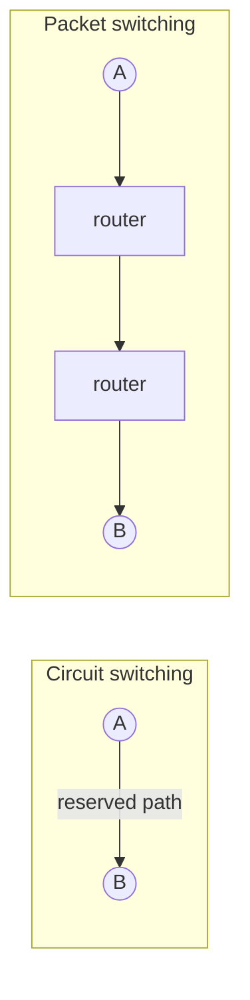
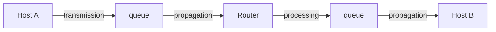

# Lecture 01 — What Is a Network? — Slide Deck

| Field | Value |
|---|---|
| Slides | 18 (120 min: 10 open · 55 teach · 5 break · 45 activity/demo · 10 wrap) |
| Companions | [`notes.md`](notes.md) (timing, misconceptions) · [`worksheet.md`](worksheet.md) |
| Style | [Course deck conventions](../../lectures/README.md#deck-conventions) — one idea/slide, ≤6 lines, labeled diagrams |

## Deck outline

| # | Slide | # | Slide |
|---|---|---|---|
| 1 | Title | 10 | Worked example: total delay |
| 2 | Hook: 40 years in one frame | 11 | Bandwidth vs throughput vs goodput |
| 3 | What makes it a network? | 12 | The Internet's shape today |
| 4 | Circuit vs packet switching | 13 | Activity brief: GA-01a trace tour |
| 5 | Why packet switching won | 14 | Demo walkthrough cues |
| 6 | The four delay types | 15 | Classroom questions |
| 7 | Delay: physical causes | 16 | Common misconceptions |
| 8 | Loss & jitter | 17 | Summary |
| 9 | Delay taxonomy (diagram) | 18 | Exit question |

## Slides

### Slide 1 — Title
**Computer Networks — Lecture 1**
What is a network? Overview, history & the Internet today
*Course | Instructor | Semester*

> Notes — Welcome; today ends with every student tracing one packet's cost structure.

### Slide 2 — Hook: 40 years in one frame
- 1969: 4 nodes. Today: billions of hosts
- One design decision made that possible
- Guess before I reveal it

> Notes — Take 2–3 guesses (accept "packet switching" quickly). Sets the arc: principles, not products.

### Slide 3 — What makes it a network?
- **Network** = devices exchanging data via **agreed protocols**
- Protocols, not cables, define a network
- Components: end hosts · switches · routers · links

> Notes — Stress the protocol clause: two same-vendor boxes without a shared protocol are not interoperable. Name the four component roles once — CLO1 anchor.

### Slide 4 — Circuit vs packet switching

| | Circuit | Packet |
|---|---|---|
| Setup | Required | None |
| Capacity | Dedicated | Shared (statistical) |
| Failure | Call drops | Reroute |

> Notes — Use telephony vs web examples. The table is the examinable artifact; the diagram is the memory hook.

### Slide 5 — Why packet switching won
- Bursty traffic → idle circuits waste capacity
- Packets share links → statistical multiplexing
- Survives failures: packets reroute

> Notes — Tie to Slide 2's reveal. Cost teaser (leads to L19): sharing needs congestion control.

### Slide 6 — The four delay types
- **Transmission** — push bits onto the link
- **Propagation** — signal travels the medium
- **Queueing** — wait in buffers
- **Processing** — per-hop lookup/parse

> Notes — The taxonomy recurs in every later lecture and the midterm. Board mnemonic: T-P-Q-P ("Two Pizzas, Quarter Past").

### Slide 7 — Delay: physical causes

| Type | Depends on | Typical scale |
|---|---|---|
| Transmission | link rate, frame size | µs–ms |
| Propagation | distance ÷ medium speed | µs–ms (fiber ≈ 5 µs/km) |
| Queueing | load vs capacity | 0–∞ (the wildcard) |
| Processing | device CPU/ASIC | µs |

> Notes — Only queueing is load-dependent — that insight powers L04 baselines and L19 congestion. Fiber ≈ 2×10⁸ m/s.

### Slide 8 — Loss & jitter
- **Loss**: buffers overflow (or errors) → retransmit or drop
- **Jitter**: variation in delay — kills real-time media
- Delay ≠ jitter ≠ loss (three different complaints)

> Notes — Video-call mapping: freeze = loss, robot voice = jitter, lag = delay.

### Slide 9 — Delay taxonomy (diagram)

> Notes — Walk one packet left→right aloud, naming each delay at each element. 60 seconds, high value.

### Slide 10 — Worked example: total delay
- 1500 B frame, 100 Mb/s, 1 ms propagation, 0.2 ms queueing
- Transmission = 12 000 bits ÷ 10⁸ b/s = **120 µs**
- Total one-way ≈ **1.32 ms**

> Notes — Students compute the 120 µs before revealing (worksheet Q3 mirrors this). State the assumption clause explicitly.

### Slide 11 — Bandwidth vs throughput vs goodput
- **Bandwidth**: capacity of the link
- **Throughput**: bits actually delivered/s
- **Goodput**: useful payload/s (headers & retransmits excluded)

> Notes — iperf3 measures throughput; goodput needs payload accounting. Sets up L04's measurement discipline.

### Slide 12 — The Internet's shape today
- Access networks → ISP edge → core → IXPs
- CDNs: copies *near* users
- "Cloud" = someone else's datacenter fabric

> Notes — Skim; L03 returns with the full packet journey. Cite IXP/CDN as business-driven topology, not protocol.

### Slide 13 — Activity brief: GA-01a trace tour
- Open the pre-captured trace (provided file)
- Find: one ARP, one DNS, one TCP, one HTTP
- Label each with its layer + one field

> Notes — Pairs, 25 min. Worksheet has the scaffold. Circulate for "which layer is this?" debates — the intended productive confusion.

### Slide 14 — Demo walkthrough cues
- Instructor projects Wireshark, same trace
- Filter bar as a *lens*, not magic: `dns`, `tcp.port==443`
- Read the three panes top-down: frame → packet → bytes

> Notes — Do NOT explain hex deeply today; the point is "everything is fields." 5 min.

### Slide 15 — Classroom questions
1. Why can't queueing delay have a fixed maximum?
2. A link upgrades 10× — which delay types shrink, which don't?
3. Where would you *feel* jitter first: video or file download?

> Notes — Q2 is the formative gold: propagation is unchanged by bandwidth. Cold-call after pair-talk.

### Slide 16 — Common misconceptions
- "Bandwidth = speed" → it's capacity, not latency
- "Ping measures bandwidth" → it measures RTT
- "Fiber is fast because light is instant" → finite: 5 µs/km

> Notes — notes.md §6 has the full misconception table with counters.

### Slide 17 — Summary
- Networks = hosts + links + **protocols**
- Packet switching: statistical sharing, resilience
- Delay = T + P + Q + P; queueing is load's fingerprint
- Next: why layers? (L02)

> Notes — 60-second recap by asking the class to supply each bullet's keyword.

### Slide 18 — Exit question
A 1000 B frame leaves a 10 Mb/s link. Which delay term, and how long?
*(Tomorrow: we stack these into layers.)*

> Notes — Answer: transmission = 8000/10⁷ = 800 µs. Collect on exit slips; feed W01 quiz pool.

### Demonstration instructions (slide 13–14 companion, instructor)
- Trace file: `lectures/assets/ga01a-tour.pcapng` *(to be captured on the teaching image — ITI item)*
- Filters in order: `arp` → `dns` → `tcp` → `http`; keep a blank-slate Wireshark profile
- Fallback: GA-01a's paper worksheet works without laptops

### References for the deck
- PD §1 (course text) — delay taxonomy, network components
- Kurose & Ross ch.1 — circuit/packet switching comparison tables
- RFC 1958 — architectural principles of the Internet
