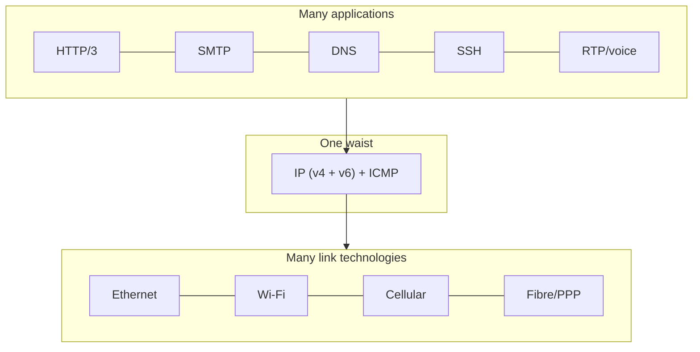

# Lecture 02 — Instructor Teaching Notes
## Layered Architectures: OSI & TCP/IP (120 min)

| Field | Value |
|---|---|
| Status | Draft v0.1 — instructor review required |
| CLOs | CLO1 primary; CLO2 introduced |
| Textbook anchor | KR §1.5; PD §1.4–1.5; RFC 1122 §1 |

---

## 1. Objectives hook
Board before class: **"Your email app speaks SMTP, your NIC speaks Ethernet, your router
speaks IP. How do three engineers who never met each other make one working email?"**

Hook story (2 min): swap-the-USB-Wi-Fi story — you plug in a different network card and mail
still works. Something *structured* makes that possible. That structure is layering.

## 2. Minute plan

| Minutes | Segment | What happens |
|---|---|---|
| 0–7 | Recap + hook | 2-question recall on L01 delays; hook story |
| 7–25 | Concept 1 | Why layering; services vs protocols; trade-offs |
| 25–40 | Concept 2 | OSI 7 layers — job + PDU per layer |
| 40–55 | Concept 3 | TCP/IP 5-layer view; hourglass; standards bodies |
| 55–60 | Break | — |
| 60–75 | Worked example | Encapsulation walkthrough on a real packet (slide/diagram + board) |
| 75–95 | GA-02 | Header-dissection puzzle worksheet, pairs |
| 95–110 | Concept 4 + discussion | What layering costs us; critique; cross-layer teaser |
| 110–118 | Summary + exit ticket | Layer map from memory |
| 118–120 | Preview | Applications next; assign reading |

## 3. Concept walkthrough

### 3.1 Why layering? (18 min)
- Problem: network software is enormous (drivers, routing, transport, applications). One
  monolith is unbuildable and unteachable. Solution: **modular decomposition by concern**.
- Two distinct ideas students conflate — separate them explicitly:
  - **Service:** what a layer offers to the layer above (e.g., "reliable byte pipe").
  - **Protocol:** the rules for peer conversation *within* a layer between remote machines.
- Layer N on host A talks to layer N on host B **using the services of layer N-1**. This
  "vertical services, horizontal protocols" picture is the entire model — draw it big.
- **Benefits:** complexity hiding, independent evolution (Wi-Fi swapped under unchanged
  TCP), reuse, testability, vendor competition at defined interfaces.
- **Costs (say these out loud — engineers must know them):** header overhead per layer;
  duplicate functionality (link retransmission *and* TCP retransmission); rigidity (some
  information is lost crossing layers — L19's bufferbloat and L29's diagnosis both live here);
  layering violations tempt vendors (NAT mixes L3/L4 — honest example, revisited L14).

### 3.2 OSI: the 7-layer reference model (15 min)
Teach OSI as an **analytical vocabulary**, never as a suite. Mnemonic order top-down:
Application, Presentation, Session, Transport, Network, Data Link, Physical.

| # | Layer | Job (one line) | PDU | Examples |
|---|---|---|---|---|
| 7 | Application | Network services to apps | message | HTTP, SMTP, DNS |
| 6 | Presentation | Format, encoding, encryption | — | TLS record formatting (loosely) |
| 5 | Session | Dialogue management | — | (mostly folded into TCP/apps) |
| 4 | Transport | Process-to-process delivery | segment (TCP) / datagram (UDP) | TCP, UDP |
| 3 | Network | Host-to-host routing across networks | packet | IP, ICMP |
| 2 | Data link | Node-to-node framing, MAC, error detect | frame | Ethernet, Wi-Fi, PPP |
| 1 | Physical | Bits on a medium | bits/symbols | 1000BASE-T, 802.11 PHY |

- The historical argument (2 min, not a debate): OSI = 7 layers from ISO (a *model*), whose
  protocol suite lost to TCP/IP's working code; TCP/IP = the deployed suite whose *model* is
  often drawn as 5 layers for teaching (KR's choice, ours too).

### 3.3 TCP/IP 5-layer view & the hourglass (12 min)
- Our working model: **Application / Transport / Network / Link / Physical**. Map each to
  its OSI ancestors explicitly (5–7 → application; 1–2 → link+physical).
- **Hourglass/waist:** many apps on top, many link technologies below, ONE narrow waist:
  IP. That single design decision is why any app can run on any link technology — the
  "narrow waist makes innovation possible" argument (draw it; this is a favorite exam
  question).

### 3.4 Encapsulation, PDUs, headers (worked example, 15 min + §6)
- Each layer prepends a header (some add trailers at L2). Demultiplexing fields that make
  the stack work: **EtherType** (which L3 payload?), **protocol field in IP** (which L4?),
  **ports** (which process?), each a "which module above me gets this?" pointer.
- **MTU** and fragmentation preview: L2 limits frame size (Ethernet payload ~1500 B); IP
  fragmentation exists but is discouraged; TCP segments to fit (MSS) — details in L18.
- Walk one real packet from a browser fetch (diagram in §7 of L01's demo; reuse trace).

### 3.5 Standards bodies (10 min)
| Body | Domain | Artifacts |
|---|---|---|
| ISO | The OSI reference model | ISO/IEC 7498-1 |
| IEEE | LAN/MAN (L1–L2) | 802.3 Ethernet, 802.11 Wi-Fi, 802.1Q VLAN |
| IETF | Internet protocols | RFCs (open, free, numbered; e.g., RFC 9293 = TCP) |
| ITU-T | Telecom side | xDSL, optical transport standards |
| ICANN/IANA | Names & numbers governance | IP allocation, root zone, parameter registries |
- Reading an RFC: header, status (Standards Track/Informational), MUST/SHOULD/MAY
  (RFC 2119/8174 boilerplate). Show RFC 9293's TOC live (2 min) — demystify standards.

## 4. Important definitions
Service · Protocol · Encapsulation · Decapsulation · PDU · Header/trailer · MTU ·
Demultiplexing (EtherType, IP protocol, port) · Reference model vs protocol suite ·
Narrow waist. (One-line verbatim definitions in slide notes; quiz-ready.)

## 5. Real-world examples
- **Same app, many links:** video call over Wi-Fi → 4G → Ethernet without dropping —
  layering at work (transport survives the L2 change).
- **TLS's awkward home:** encryption is "presentation-ish"; deployed inside the transport/
  application boundary — layering is a model, reality is messier (L24 revisits properly).
- **MTU mismatch pain:** VPN tunnel overhead → fragments → sluggish uploads; classic
  "it works on office Wi-Fi, not at home" tickets.

## 6. Mathematical/technical example
Sizes: app message 1,000 B → +TCP header 20 B = 1,020 B segment → +IPv4 20 B = 1,040 B
packet → +Ethernet 14 B header + 4 B FCS (+ 8 B preamble counted on wire) = 1,058 B frame
(≈1,066 B on wire). Overhead = 66/1,000 ≈ 6.6% — quantify "layering costs bytes".
Link at 100 Mbps → transmission delay 1,066×8/10⁸ ≈ 85 µs; tie back to L01's L/R.

## 7. GA-02: header-dissection puzzle (20 min)
Worksheet: one annotated Ethernet frame (fields blank) from a provided capture excerpt;
students fill EtherType, IP proto, ports, and name each PDU; then mark where encapsulation
happens going down. (Full frame data provided on the sheet; no tooling required.)

## 8. Common misconceptions

| Misconception | Debunk |
|---|---|
| "OSI is a protocol suite the Internet rejected" | Model (ISO/IEC 7498-1) vs suite; Internet runs TCP/IP but uses OSI vocabulary |
| "Every packet has all 7 layers" | Real packets have 4–5 headers; OSI 5/6 rarely appear as distinct headers |
| "Layers map 1:1 to headers always" | ARP lives at the L2/L3 boundary (L12); NAT rewrites L3+L4 together (L14) |
| "Layering is free" | 6.6% overhead math above; duplicate retransmissions (L06 vs L18) |
| "TCP/IP model has exactly 4 layers, period" | Textbook views differ (4 vs 5); state which one THIS course uses and why |

## 9. Suggested practical demonstration
Open Wireshark on the L01 trace: show the dissection tree expanding each layer header byte
by byte; highlight EtherType 0x0800 → IPv4 proto 6 → TCP ports; then change filter to
`tcp.port==443` and note TLS bytes "belong" to no neat single OSI box (foreshadow L24).
⚠ Verify trace and filters the same morning.

## 10. Classroom activities
- **Human protocol stack:** 5 volunteers play layers of a "request" passing a folded note
  (headers = colored sticky notes added/removed). Cheap, loud, effective for encapsulation.
- **Standards-body matching game:** 8 cards (802.11, RFC 9293, 802.1Q, ICANN, …) to bodies.
- **Hourglass debate (3 min):** "Is one waist a weakness (single point of stasis) or
  strength (universal interop)?" — seeds L28 SDN discussion.

## 11. Problem-solving questions
1. Name the PDU at each of the 5 layers of our model.
2. Which header field lets the L3 module choose the correct L4 module? Which L2 field picks
   the L3 payload type?
3. A vendor proposes a "new layer 2.5". Argue for/against with one layering benefit and one
   cost.
4. Your 1,200-byte app message gains 20 B TCP + 20 B IP + 18 B Ethernet. Compute overhead %.
5. Why might a router be described as a "L3 device" when it also implements L1–L2?

## 12. Formative assessment (with answers)
- MCQ: EtherType = 0x0806 means the payload is → **ARP** (foreshadow L12).
- MCQ: The unit handed from Transport to Network is → **segment**.
- MCQ: Which body publishes RFCs? → **IETF**.
- Short: one cost of layering not discussed in class → e.g., duplicated reliability,
  cross-layer info loss, processing overhead.

## 13. Exit ticket
1. Draw the 5-layer stack; label each PDU.
2. Which field demultiplexes at the transport layer?
3. Name the standards body for Wi-Fi.

## 14. Anticipated difficulties
- Abstraction fatigue: students want "real packets" — the GA-02 concrete frame is the
  antidote; keep §3.2 table to 12 minutes max.
- Session/Presentation confusion: acknowledge these are *conceptual homes*, rarely separate
  headers today.

## 15. Instructor preparation checklist
- [ ] ⚠ Verify trace + Wireshark on podium; print GA-02 sheets
- [ ] Prepare sticky notes in 3 colors for human-stack activity
- [ ] Have RFC 9293 open to TOC in a browser tab
- [ ] Board pre-write: hook question + 5-layer blank stack

## 16. Timing fallbacks
Drop the debate (§10c) and standards matching game; §3.4 walkthrough and GA-02 are
non-negotiable (they carry the assessment).

## 17. References
- KR §1.5; PD §1.4–1.5; T ch. 1 (layering critique).
- RFC 1122 (Requirements for Internet Hosts) — layering requirements view.
- ISO/IEC 7498-1 — OSI reference model (existence/purpose).
- RFC 9293 — TCP (as a live RFC-reading example). RFC 2119/8174 — RFC keyword conventions.
- ⚠ VERIFY edition/section numbers this semester.
