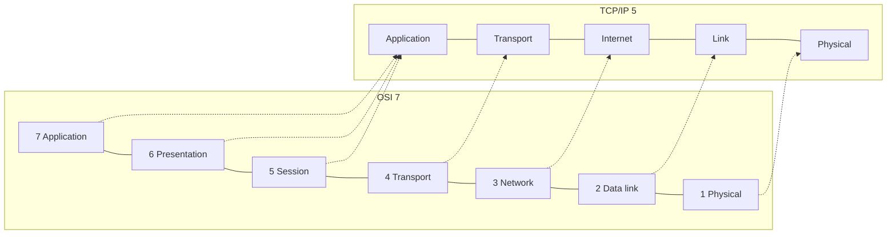
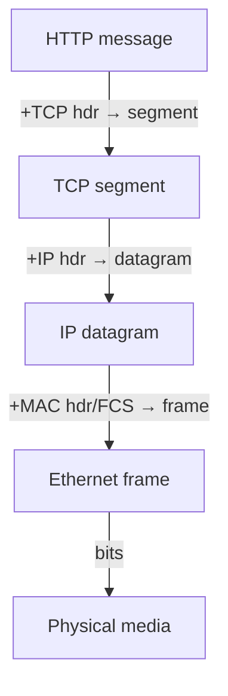
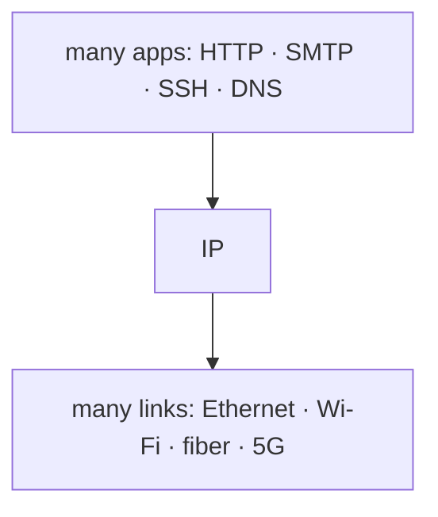

# Lecture 02 — Layered Architectures: OSI & TCP/IP — Slide Deck

| Field | Value |
|---|---|
| Slides | 17 (120 min: 10 open · 55 teach · 5 break · 40 activity · 10 wrap) |
| Companions | [`notes.md`](notes.md) · [`worksheet.md`](worksheet.md) (GA-02 header puzzle) |
| Style | [Course deck conventions](../../lectures/README.md#deck-conventions) |

## Deck outline

| # | Slide | # | Slide |
|---|---|---|---|
| 1 | Title | 10 | Standards bodies |
| 2 | Hook: who builds a postal system? | 11 | Worked example: read a capture |
| 3 | Why layers? The interface idea | 12 | The hourglass |
| 4 | The five-layer TCP/IP view | 13 | Costs of layering |
| 5 | OSI 7 vs TCP/IP 5 (mapping) | 14 | Activity: GA-02 header puzzle |
| 6 | Encapsulation (diagram) | 15 | Classroom questions |
| 7 | PDU names & header fields | 16 | Summary |
| 8 | Decapsulation at the receiver | 17 | Exit question |
| 9 | Worked example: header math | | |

## Slides

### Slide 1 — Title
**Computer Networks — Lecture 2**
Layered architectures: OSI & TCP/IP

> Notes — Yesterday: one packet's costs. Today: the *structure* that makes the Internet buildable by rivals.

### Slide 2 — Hook: who builds a postal system?
- Sender, sorter, driver, post office — none invent the stamp
- Each layer trusts the one below
- Networking solved coordination the same way

> Notes — 2 min. The postal metaphor returns at encapsulation.

### Slide 3 — Why layers? The interface idea
- **Service**: what a layer does for the layer above
- **Interface**: how the layers talk — the *stable contract*
- Implementations can change; interfaces don't

> Notes — The contract idea is why Intel and Broadcom NICs both work: they implement the same interface. Exam anchor (CLO1).

### Slide 4 — The five-layer TCP/IP view

| Layer | Job | Example |
|---|---|---|
| Application | semantics | HTTP |
| Transport | host-to-host delivery | TCP/UDP |
| Internet | global routing | IP |
| Link | local delivery | Ethernet |
| Physical | bits on media | 1000BASE-T |

> Notes — This is the course's working model. Physical is explicit on purpose (L05–L06 need it).

### Slide 5 — OSI 7 vs TCP/IP 5 (mapping)

> Notes — OSI's 5–7 collapse into "Application" for us. Warning: "OSI is dead" confuses the *model* (alive) with the *protocol suite* (lost) — misconception table.

### Slide 6 — Encapsulation (diagram)

> Notes — Each down-arrow adds exactly one layer's header. Sender adds, receiver strips. The single most-reused diagram of the course.

### Slide 7 — PDU names & header fields

| Layer | PDU | Adds |
|---|---|---|
| Transport | Segment | ports, seq/ack |
| Internet | Datagram | IPs, TTL |
| Link | Frame | MACs, FCS |

> Notes — PDU names are vocabulary the whole course assumes; quiz W01 tests them. Each header's *fields* preview coming lectures.

### Slide 8 — Decapsulation at the receiver
- Frame arrives → check FCS → strip link header
- IP header → is this for me? → strip
- Port number → which process? → deliver

> Notes — Mirror of Slide 6 right-to-left; each strip = one layer's decision. Demux teaser: "which process?" gets its own lecture (L17).

### Slide 9 — Worked example: header math
- HTTP 800 B + TCP 20 + IP 20 + Ethernet 18 = **858 B** frame
- Overhead = 58/858 ≈ **6.8%**
- At 100 Mb/s: extra transmission cost ≈ 4.6 µs

> Notes — Numbers on the board live (worksheet Q2 pairs). Assumption: no TLS, no options, standard 1518-max frame not binding.

### Slide 10 — Standards bodies
- **IEEE** — L1/L2 (Ethernet = 802.3)
- **IETF** — IP/TCP/HTTP-side RFCs
- **ISO / ITU** — OSI model, telecom
- Open specs → multi-vendor interop

> Notes — One sentence each; the quiz wants IEEE↔Ethernet, IETF↔IP pairs.

### Slide 11 — Worked example: read a capture
- Show a real (pre-captured) frame in Wireshark
- Expand: Ethernet → IP → TCP → HTTP lines
- Point at each header added in Slide 6's diagram

> Notes — Live 3-min demo; same trace file as L01. Students see the diagrams are *real*.

### Slide 12 — The hourglass

> Notes — Narrow waist = anything can talk to anything *if both speak IP*. Benefit: innovation at the edges; cost: the waist is hard to replace (IPv4→6 friction).

### Slide 13 — Costs of layering
- Duplication across layers (error checks at L2 *and* L4)
- Performance: cross-layer info hidden behind interfaces
- Cross-layer designs trade purity for speed (enrichment)

> Notes — Balanced view: layers aren't free. Notes.md §5 has the debate script.

### Slide 14 — Activity: GA-02 header puzzle
- Worksheet: scrambled header lines from one frame
- Reassemble the encapsulation order
- Justify each placement with one field's meaning

> Notes — Pairs, 20 min, then plenary. The justification clause is the assessable part, not the ordering.

### Slide 15 — Classroom questions
1. Which layer's header does a router read? A switch? (trailer?)
2. Where does TLS sit in our 5-layer model — and why is that awkward?
3. Give one interface that has stayed stable for 30 years.

> Notes — Q2 is the discussion gem: TLS is app-layer crypto *below* HTTP — expect "layer violation!" energy; land on " layered models are maps, not laws."

### Slide 16 — Summary
- Layers = services + stable interfaces
- Encapsulation: one header per layer, PDUs named
- TCP/IP 5 is our working map; OSI survives as vocabulary
- Next: apps, sockets, and the first real packet journey (L03)

> Notes — Ask class to name the four PDUs cold before advancing.

### Slide 17 — Exit question
Name the PDU and one field added at each layer, top to bottom.
*(Hint: yesterday's delay math meets tomorrow's journey.)*

> Notes — Expected: message→segment(ports)→datagram(IPs,TTL)→frame(MACs,FCS). Exit slips feed W01 quiz pool.

### Demonstration instructions (slide 11 companion, instructor)
- Reuse the L01 trace (`lectures/assets/ga01a-tour.pcapng` — ITI: capture once on the teaching image)
- Expand exactly one HTTP-carrying frame; freeze the three-pane view
- Fallback: GA-02 worksheet's printed frame hex works offline

### References for the deck
- PD §1.4, §2.1 (layering, encapsulation)
- RFC 1122 — TCP/IP layer requirements
- Tanenbaum & Wetherall ch.1 — OSI/TCP-IP comparison (edition: ⚠ verify)
