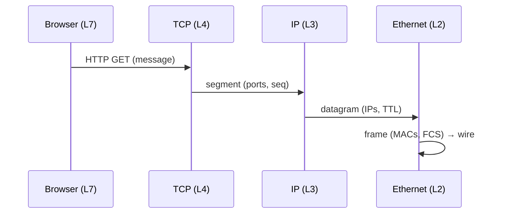

# Lecture 03 — Applications, Sockets & the Packet's Journey — Slide Deck

| Field | Value |
|---|---|
| Slides | 18 (120 min: 10 open · 50 teach · 5 break · 45 demo/activity · 10 wrap; CS-01 kickoff in wrap) |
| Companions | [`notes.md`](notes.md) · [`worksheet.md`](worksheet.md) (GA-03a/b) |
| Style | [Course deck conventions](../../lectures/README.md#deck-conventions) |

## Deck outline

| # | Slide | # | Slide |
|---|---|---|---|
| 1 | Title | 10 | Client/server vs P2P |
| 2 | Hook: the magic URL | 11 | Worked example: transfer time |
| 3 | Application-layer anatomy | 12 | First packet hunt (trace) |
| 4 | Ports & well-known numbers | 13 | Activity: GA-03b journey on paper |
| 5 | Sockets: the OS handle | 14 | Live demo: GA-03a Python socket |
| 6 | The five-layer journey (diagram) | 15 | Classroom questions |
| 7 | Cache-miss vs cache-hit | 16 | CS-01 kickoff |
| 8 | Throughput math for a transfer | 17 | Summary |
| 9 | Worked example: fetch timeline | 18 | Exit question |

## Slides

### Slide 1 — Title
**Computer Networks — Lecture 3**
Applications, sockets & the first packet hunt

> Notes — Today the layered model *moves*: we follow one HTTP fetch end to end.

### Slide 2 — Hook: the magic URL
- You type a URL; a page appears in ~1 s
- List everything that had to happen
- Today we make the invisible list visible

> Notes — Collect 5–6 student items on the board; tick them off as slides cover them. Missing DNS/DHCP items are expected — park them.

### Slide 3 — Application-layer anatomy
- **Messages**: the app's own format (HTTP request lines, headers)
- **Client/server**: requester + listener
- **P2P**: every peer both (Skype-era file share)

> Notes — HTTP header anatomy on the board: method, path, version, Host. Apps own their format — lower layers just carry bytes.

### Slide 4 — Ports & well-known numbers

| Port | Service |
|---|---|
| 80/443 | HTTP/HTTPS |
| 53 | DNS |
| 22 | SSH |
| 25 | SMTP |

- Port = which *program* inside the host

> Notes — Demultiplexing metaphor: IP delivers to the building, port to the apartment. Ephemeral ports appear in the trace — point them out.

### Slide 5 — Sockets: the OS handle
- A socket = one endpoint: **(IP, protocol, port)**
- The app's only door to the network
- `socket()` → `connect()` → `send()`/`recv()`

> Notes — CLO1: apps implement L7 only; the OS does L2–L4. This is why every language has sockets, not "TCP libraries."

### Slide 6 — The five-layer journey (diagram)

> Notes — Same journey as L02's stack diagram, now with timestamps. The trace in slide 12 shows the *same arrows* really happening.

### Slide 7 — Cache-miss vs cache-hit
- First fetch: **DNS → TCP → TLS → HTTP**
- Cached fetch: connection reuse skips DNS (often TCP+TLS too)
- Each skip = round trips saved

> Notes — RTT arithmetic preview: every skipped handshake saves 1–2 RTTs — sets up slide 8.

### Slide 8 — Throughput math for a transfer
- Time ≈ **size ÷ bottleneck rate** + **setup RTTs × RTT**
- Bottleneck = the slowest link on the path
- Propagation/queueing ride on top

> Notes — The course's core formula family; L04 measures each term. Write it big — exams reuse it three ways.

### Slide 9 — Worked example: fetch timeline
- 10 MB object, 25 Mb/s bottleneck, RTT 40 ms, 2 setup RTTs
- Data: 8×10⁷ ÷ 2.5×10⁷ = **3.2 s**
- Setup: 80 ms → total ≈ **3.28 s**

> Notes — Students predict "a second or two," then see 3.2 s — bottleneck math beats intuition. Assumptions stated aloud (CLO5 discipline).

### Slide 10 — Client/server vs P2P

| | Client/server | P2P |
|---|---|---|
| Control | Central | Distributed |
| Scales by | Server capacity | Peer count |
| Fits | Web, banking | File distribution |

> Notes — One slide only; depth is enrichment. Modern CDNs are "client/server with P2P-shaped economics" — nice nuance for strong students.

### Slide 11 — Worked example: read the timeline
- Project the pre-captured fetch: DNS answer, SYN, SYN-ACK, GET, 200 OK
- Students annotate which L3/L4 fields changed at each step

> Notes — 5 min pair work on the projected trace. The annotation sheet is worksheet GA-03b.

### Slide 12 — First packet hunt (trace)
- Filters: `dns` → `tcp.flags.syn==1` → `http`
- For each: who talks to whom (IP:port pairs)?
- One field that only exists at that step

> Notes — Same discipline as L01 but now with the journey vocabulary. Keep hex analysis off — fields only.

### Slide 13 — Activity: GA-03b journey on paper
- Worksheet: blank sequence diagram, one row per layer
- Fill the fetch of `http://campus.example/`
- Mark where addresses change (MAC per hop! IP end-to-end)

> Notes — The MAC/IP distinction is today's hardest idea (preview of L12). Worksheet has the two-column trap for it.

### Slide 14 — Live demo: GA-03a Python socket
- 12-line TCP client: connect, send `GET /`, print reply
- Swap hostname/port live; read the error when nothing listens
- Every student sees *an app is just a socket program*

> Notes — Code lives in the GA-03a worksheet; keep it short. The connection-refused error is a feature: refusal proves the stack works below the app.

### Slide 15 — Classroom questions
1. Which round trips happen before the first HTTP byte? (count them)
2. Your fetch fails at "connection refused" — which layer answered?
3. Where did the MAC address change on the journey? The IP?

> Notes — Q3 is the deliberate repeat of GA-03b's trap — retrieval practice, not redundancy.

### Slide 16 — CS-01 kickoff
- Scenario packet: the volcano-eruption incident (case-study-strategy §2)
- Task: attribute each symptom to a layer, L1–L7
- Individual, graded inside the lab component

> Notes — 5 min brief; full packet in the case-study doc. This is the course's first graded artifact — point to the integrity rules (individual work).

### Slide 17 — Summary
- Apps speak messages via **sockets**
- Journey: DNS → TCP → TLS → HTTP on a cache miss
- Time ≈ size ÷ bottleneck + RTTs × RTT
- Next: measuring the network honestly (L04)

> Notes — Point back at the Slide-2 board list: every mystery item is now named.

### Slide 18 — Exit question
A fetch needs DNS (1 RTT), TCP (1 RTT), TLS (1 RTT), then GET+first-byte (1 RTT) at RTT 50 ms. Minimum time to first byte?
*(Tomorrow we measure these numbers instead of assuming them.)*

> Notes — Answer: 4 × 50 = 200 ms (+ data time). Exit slips feed W02 quiz pool.

### Demonstration instructions (slide 14 companion, instructor)
- Python 3 on the teaching image; run the GA-03a client against a listener you pre-start (`python3 -m http.server 8000`)
- Pre-plan the refusal demo: stop the listener, rerun, show the error text
- Network-restricted lab rooms: loopback works identically (127.0.0.1)

### References for the deck
- PD §2.1 (applications & transport interface)
- Kurose & Ross ch.2 §2.1 (app architectures), §2.7 (socket programming)
- RFC 9110 §3 — HTTP semantics (message model)
