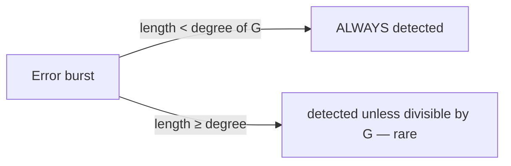

# Lecture 06 — Data Link: Framing, Errors & Reliability — Slide Deck

| Field | Value |
|---|---|
| Slides | 17 (120 min: 10 open · 55 teach · 5 break · 40 GA-06 CRC hand-computation · 10 wrap) |
| Companions | [`notes.md`](notes.md) · [`worksheet.md`](worksheet.md) (GA-06 CRC worksheet) |
| Style | [Course deck conventions](../../lectures/README.md#deck-conventions) |

## Deck outline

| # | Slide | # | Slide |
|---|---|---|---|
| 1 | Title | 10 | ARQ vs FEC |
| 2 | Hook: the unreadable letter | 11 | Link reliability trade-off |
| 3 | Why framing? | 12 | Worked example: burst error |
| 4 | Framing: flags & stuffing | 13 | GA-06 CRC worksheet brief |
| 5 | Error detection ladder | 14 | Classroom questions |
| 6 | Parity & checksums | 15 | Common misconceptions |
| 7 | CRC: the idea | 16 | Summary |
| 8 | CRC by hand (worked) | 17 | Exit question |
| 9 | CRC strength (diagram) | | |

## Slides

### Slide 1 — Title
**Computer Networks — Lecture 6**
Data link layer: framing, errors & reliability

> Notes — Yesterday: signals degrade. Today: how L2 notices and fixes it.

### Slide 2 — Hook: the unreadable letter
- A page with no spaces, margins, or page breaks
- Physical layer delivers *bits* — where does one frame end?
- Framing is the postal system of the bit stream

> Notes — 2 min. Students propose "just count bytes" — debunk with variable-length frames and lost bytes.

### Slide 3 — Why framing?
- Receiver must find **message boundaries** in a bit stream
- Without frames: no addressing, no error scope, no retransmit unit
- Frame = header + payload + (often) trailer

> Notes — Anchor: the FCS needs to know what it covers — framing defines the cover.

### Slide 4 — Framing: flags & stuffing

```text
Data:   A  ESC  FLAG  B
Sent:   A  ESC ESC  ESC FLAG  B
```

- FLAG delimits frames; ESC escapes itself and FLAG
- Receiver reverses exactly — transparency restored

> Notes — Walk the doubling rule slowly; worksheet Q has the reverse direction. This is byte-stuffing (PPP-style) as the teaching model.

### Slide 5 — Error detection ladder

| Method | Catches | Cost |
|---|---|---|
| Parity | odd # of bit flips | 1 bit |
| Checksum | many patterns; blind to compensating | 16 bits |
| CRC | all bursts < degree + most longer | 32 bits |

> Notes — The ladder is detection only — correction comes at slide 10. Cost column motivates why Ethernet uses CRC-32.

### Slide 6 — Parity & checksums
- Parity: one bit makes 1-count even/odd — catches 1 flip, misses 2
- Checksum: add 16-bit words — order-blind, addition-blind
- Both cheap *because* both weak

> Notes — Live demo of a compensating error on the board: 0x0001+0x0002 vs 0x0003+0x0000 — same sum. 90 seconds, converts skeptics.

### Slide 7 — CRC: the idea
- Treat the frame as a polynomial's coefficients
- Divide by an agreed generator G
- Remainder = FCS; receiver re-divides: zero = clean

> Notes — Demystify: it's long division with XOR, no magic. The next slide *is* the long division.

### Slide 8 — CRC by hand (worked)
- Data `1101`, generator `1011` (degree 3)
- Append 000 → `1101000`; divide (XOR steps on board)
- Remainder appended → transmitted `1101001`-style codeword

> Notes — The full division runs on the board at GA-06 (worksheet has grid). Students replicate one step each, chained aloud.

### Slide 9 — CRC strength (diagram)



> Notes — The precise statement students must own: *guaranteed* below the degree; probabilistic above. Quiz W03 Q9 tests the phrase.

### Slide 10 — ARQ vs FEC

| | ARQ (retransmit) | FEC (repair) |
|---|---|---|
| Needs | return path | redundancy upfront |
| Best when | low RTT, low error rate | long RTT / one-way links |
| Cost | time per loss | bandwidth always |

> Notes — Satellite vs LAN examples. Hybrid ARQ exists (enrichment). The 600 ms RTT argument is worksheet-ready.

### Slide 11 — Link reliability trade-off
- Detection (CRC) + ARQ = classic wired LAN choice
- FEC = wireless/space where retransmit is too slow
- "Reliability" is a *budget*, not a switch

> Notes — Preview: TCP rebuilds reliability end-to-end at L18 — why both layers check errors (L02's layering-cost slide returns).

### Slide 12 — Worked example: burst error
- CRC-8 (degree 8) vs a 5-bit burst → always caught
- Same CRC vs a 12-bit burst → caught unless the burst divides G
- Ethernet CRC-32: bursts up to 32 bits guaranteed

> Notes — Connect directly to slide 9's diagram. The "rare" case probability is enrichment (depends on G's factors).

### Slide 13 — GA-06 CRC worksheet brief
- Pairs: compute two CRCs by hand (one easy, one with a mid-division "1")
- Verify with Python (`bin()` trick or online-free grid) — *after* hand work
- Plenary: swap worksheets, check each other's remainders

> Notes — Hand-work first is the rule; the Python check is confirmation, not the method. 35 min.

### Slide 14 — Classroom questions
1. Why does the FCS live in the *trailer*?
2. A frame passes FCS but is addressed to another host — what does the switch do?
3. Which layer retransmits on a wired LAN — L2 or L4? Why?

> Notes — Q1: hardware can compute while receiving; Q3: Ethernet drops, TCP repairs — sets up L18.

### Slide 15 — Common misconceptions
- "CRC encrypts" → it detects; it hides nothing
- "Checksum = CRC with more bits" → different math entirely
- "FCS failure means the payload is corrupt" → *any* field may be corrupt, including addresses

> Notes — The last one explains why switches drop (not forward) FCS-failing frames — back-fills L07 prep.

### Slide 16 — Summary
- Framing makes bits addressable and checkable
- Detection: parity → checksum → CRC (strength with cost)
- Correction: ARQ (time) vs FEC (bandwidth)
- Next: the most famous L2 of all — Ethernet (L07)

> Notes — One-line recap per column of the ladder table.

### Slide 17 — Exit question
Data `111000`, generator `1011` (degree 3): what gets appended?
*(Show the appended zeros and the remainder.)*

> Notes — Answer: append 000 → 111000000; XOR-division steps: 1110⊕1011=0101 →
1010⊕1011=0001 → 1000⊕1011=0011; the next leading segment is `110` (shorter than
the generator, so division stops); remainder **110**; codeword =
111000**110** (verified by polynomial division and an independent register model:
re-division of the codeword yields remainder 000).
Exit slips feed W03 pool.

### Demonstration instructions (instructor)
- Board work only — no capture needed
- Optional: show a real FCS-failing frame in Wireshark from a deliberately damaged capture (ITI: mangle one frame of the L01 trace with `tcpreplay`-style edit, keep it labeled synthetic)
- Worksheet includes the offline grid version for no-device rooms

### References for the deck
- PD §2.4 (data link: framing, error detection/correction)
- Tanenbaum & Wetherall — CRC worked example (⚠ verify edition)
- RFC 1662 — PPP HDLC-like framing (byte stuffing reference)
