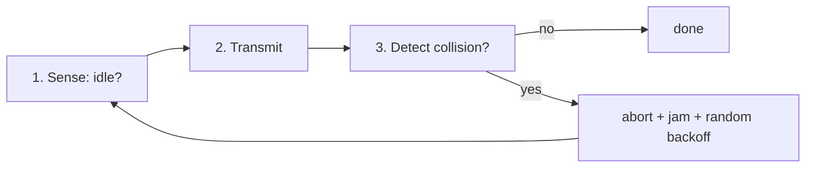

# Lecture 07 — MAC Protocols & Wired LANs: Ethernet — Slide Deck

| Field | Value |
|---|---|
| Slides | 17 (120 min: 10 open · 55 teach · 5 break · 40 GA-07 dissection · 10 wrap) |
| Companions | [`notes.md`](notes.md) · [`worksheet.md`](worksheet.md) (GA-07 frame dissection) |
| Style | [Course deck conventions](../../lectures/README.md#deck-conventions) |

## Deck outline

| # | Slide | # | Slide |
|---|---|---|---|
| 1 | Title | 10 | Ethernet speeds ladder |
| 2 | Hook: the party-line problem | 11 | Worked example: wire time |
| 3 | The multiple-access problem | 12 | GA-07 dissection brief |
| 4 | ALOHA → CSMA/CD (history) | 13 | Classroom questions |
| 5 | CSMA/CD in four steps | 14 | Common misconceptions |
| 6 | Why it died: full duplex | 15 | Summary |
| 7 | Ethernet frame (diagram) | 16 | Exit question |
| 8 | Field walk: MACs, EtherType | 17 | Minimum frame size why |
| 9 | FCS = L06's CRC | | |

## Slides

### Slide 1 — Title
**Computer Networks — Lecture 7**
MAC protocols & wired LANs: Ethernet

> Notes — One protocol, 50 years, still carrying the world's campus traffic. Today: why it looks the way it does.

### Slide 2 — Hook: the party-line problem
- One wire, many talkers: how do you take turns?
- Interrupting each other = collision
- Ethernet's ancestors literally did this — with radios and coax

> Notes — 2 min role-play option: three students "transmit" simultaneously on a paper wire. Cheap, memorable.

### Slide 3 — The multiple-access problem
- Shared medium: who transmits when?
-MAC = Medium Access Control — L2's traffic cop
- Solutions: take turns (token) vs sense-and-transmit (CSMA)

> Notes — Token-ring vs Ethernet is the historical fork; Ethernet's "just try" eventually won on cost and speed. Enrichment pointer in notes.md.

### Slide 4 — ALOHA → CSMA/CD (history)
- ALOHA: transmit, hope, retransmit on collision (≈18% max utilization* — *teaching model*)
- Slotted ALOHA: twice as good, still bad
- CSMA: listen first; CD: detect collisions, back off

> Notes — The utilization numbers are the classic textbook modeling result (PD/K&R treatment) — cite, don't derive today. The arc matters: *listen before talk*.

### Slide 5 — CSMA/CD in four steps



> Notes — Exponential backoff: double the contention window per retry (course-level account). This algorithm is dead on modern LANs — but it taught the world contention.

### Slide 6 — Why it died: full duplex
- Switched ports: separate TX/RX pairs per station
- Send and receive simultaneously — collisions cannot occur
- CSMA/CD = dead code on every modern port

> Notes — The exam favorite "why obsolete": duplex + switch = no shared medium to collide on (quiz W04 Q1). History kept alive for design humility.

### Slide 7 — Ethernet frame (diagram)

```text
| Preamble+SFD | Dst MAC | Src MAC | EtherType | Payload      | FCS   |
| 8 B          | 6 B     | 6 B     | 2 B       | 46–1500 B    | 4 B   |
```

- Frame proper = everything after preamble; 64 B minimum, 1518 B max

> Notes — THE diagram of the week (visual-topic list). Preamble is a *preamble*, not a header — receiver sync, not addressing.

### Slide 8 — Field walk: MACs, EtherType
- MACs: 48-bit, first half = OUI (vendor), burned in
- EtherType 0x0800 = IPv4 (0x0806 = ARP, 0x86DD = IPv6)
- EtherType vs Length: the two meanings of bytes 13–14

> Notes — Students decode two real EtherTypes in GA-07. MAC structure returns in L12's ARP — plant the seed.

### Slide 9 — FCS = L06's CRC
- Ethernet's trailer IS the CRC-32 from yesterday
- FCS fails → frame dropped, never forwarded
- Detection at L2, repair at L4 (preview: L18)

> Notes — Continuity payoff: yesterday's math is inside every frame on the projected capture. Layering costs made concrete.

### Slide 10 — Ethernet speeds ladder
- 10 M → 100 M → 1 G → 10 G → 25/40 → 100 → 400 G
- Same frame format across all of it
- Autonegotiation: both ends agree on speed/duplex

> Notes — The stability of the *format* is the design lesson. Autonegotiation failure = duplex mismatch (L11 security/practice preview, GA-08).

### Slide 11 — Worked example: wire time
- Min frame 64 B = 512 bits
- At 1 Gb/s: 512 ÷ 10⁹ = **512 ns** on the wire
- At 100 Mb/s: 5.12 µs — 10× longer

> Notes — Wire time explains *why* Gigabit kept the 64 B minimum only with changes (carrier extension in half-duplex GE — enrichment; full-duplex made it moot).

### Slide 12 — GA-07 dissection brief
- Worksheet: dissect 3 real frames from the course capture
- Decode: MACs, EtherType, is it min-sized? (ARP is 42 B + padding — the classic)
- Name the L3 protocol each frame carries

> Notes — 25 min pairs. The ARP frame's padding is the aha: frames have a *floor*, payloads don't pad the IP packet.

### Slide 13 — Classroom questions
1. Which delay term dominates a 64 B frame at 100 Mb/s?
2. Why did CSMA/CD need a *minimum* frame size?
3. A frame's EtherType is 0x86DD — what's inside?

> Notes — Q2: transmission time must exceed 2× worst-case propagation for collision detection — the honest physics; keep it course-level.

### Slide 14 — Common misconceptions
- "Preamble is the first header" → it's sync, not addressing
- "MAC address = device identity forever" → burned-in ≠ in-use (spoofable, L11)
- "Switches fix collisions" → modern links *cannot have* them (full duplex)

> Notes — Notes.md §6 has counters. The spoofable-MAC point primes L11's 802.1X answer.

### Slide 15 — Summary
- MAC = taking turns; CSMA/CD was the wired answer
- Full-duplex switching retired contention
- Frame anatomy: preamble/MACs/EtherType/payload/FCS
- Next: what switches actually do with these frames (L08)

> Notes — Have students name the five frame-proper fields in order, cold.

### Slide 16 — Exit question
A frame arrives with EtherType 0x0806 and dst MAC ff:ff:ff:ff:ff:ff. What protocol and delivery mode?
*(Tomorrow: the switch's decision for exactly this frame.)*

> Notes — Answer: ARP, broadcast. Exit slips feed W04 quiz pool (graded-window candidate week).

### Slide 17 — Minimum frame size why
- Collision detection needs the *transmission* to still be running when the collision echoes back
- 512-bit minimum ⇔ 2 × worst-case propagation on legacy max segments
- Full duplex: the constraint evaporates

> Notes — Backup slide; deploy if Q2 of the classroom questions lands flat. Course-level account, cite PD for the segment math.

### Demonstration instructions (instructor)
- GA-07 uses the course capture (same file as L01/L02 — ITI: one capture serves three lectures)
- Wireshark "Bytes" pane for the preamble walk; colorize ARP vs IPv4
- Fallback: worksheet prints the frames as hex grids, fully offline

### References for the deck
- IEEE 802.3 — frame format, media standards
- PD §2.6 (Ethernet) — frame fields, CSMA/CD history
- GA-07 worksheet ([`worksheet.md`](worksheet.md))
