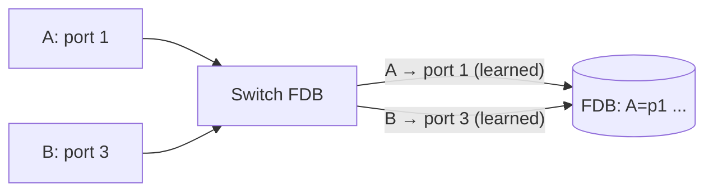
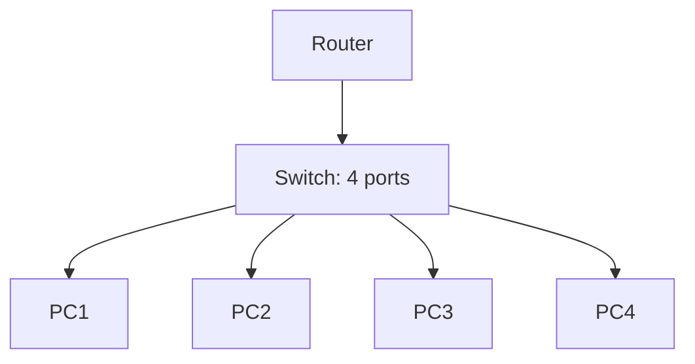

# Lecture 08 — Switching & LAN Design — Slide Deck

| Field | Value |
|---|---|
| Slides | 18 (120 min: 10 open · 55 teach · 5 break · 40 GA-08 FDB prediction · 10 wrap) |
| Companions | [`notes.md`](notes.md) · [`worksheet.md`](worksheet.md) (GA-08 FDB prediction) |
| Style | [Course deck conventions](../../lectures/README.md#deck-conventions) |

## Deck outline

| # | Slide | # | Slide |
|---|---|---|---|
| 1 | Title | 10 | STP: purpose only |
| 2 | Hook: the omniscient postmaster | 11 | LAN hierarchy design |
| 3 | Switch vs hub vs router | 12 | Worked example: predict the FDB |
| 4 | The three-frame rule | 13 | GA-08 brief |
| 5 | Learning (diagram) | 14 | Classroom questions |
| 6 | Forwarding vs flooding | 15 | Common misconceptions |
| 7 | Aging | 16 | Summary |
| 8 | Collision vs broadcast domains | 17 | Exit question |
| 9 | Domain count (diagram) | 18 | Loop storm demo |

## Slides

### Slide 1 — Title
**Computer Networks — Lecture 8**
Switching & LAN design

> Notes — Yesterday: the frame. Today: the machine that moves it — and what happens when you wire them into loops.

### Slide 2 — Hook: the omniscient postmaster
- A switch learns who lives where, purely by *listening*
- No configuration, no registration desk
- How can listening be enough? (Answer: source addresses never lie)

> Notes — 2 min. The reveal: every frame announces its sender — learning is free.

### Slide 3 — Switch vs hub vs router

| | Hub | Switch | Router |
|---|---|---|---|
| Layer | L1 repeats | L2 forwards | L3 routes |
| Reads | nothing | MACs | IPs |
| Domains | 1 collision | per-port collision | separates broadcast |

> Notes — Hubs are museum pieces but the *contrast* teaches: repetition vs decision. Full table is worksheet-quotable.

### Slide 4 — The three-frame rule
On every frame, a switch: **1. Learn source · 2. Look up destination · 3. Forward or flood**

> Notes — The entire lecture compresses to this line. GA-08 is literally applying it twelve times.

### Slide 5 — Learning (diagram)

> Notes — Learning reads the *source* MAC; never trust anything else. Emphasize: learning happens even when the frame is then flooded.

### Slide 6 — Forwarding vs flooding
- Known destination → out one port (filtering!)
- Unknown destination → all ports in VLAN except ingress
- Broadcasts/multicasts → always flooded (per VLAN)

> Notes — "Filtering" is the quiet win: known unicast = one cable, not every cable. GA-08 tests the unknown-unicast case hardest.

### Slide 7 — Aging
- FDB entries expire (typically 300 s)
- Why: machines move, MACs lie (L11 preview), stale ports rot
- Aging too short = floods; too long = stale forwarding

> Notes — The moving-laptop thought experiment makes aging inevitable. Numbers are defaults, not laws — say so.

### Slide 8 — Collision vs broadcast domains
- **Collision domain**: one full-duplex port (modern)
- **Broadcast domain**: one VLAN (or one L2 segment)
- Switches grow broadcast domains; routers cut them

> Notes — The exam table from quiz W04 Q4. Modern Ethernet: collision domains are trivially small; broadcast domains are the *design* problem.

### Slide 9 — Domain count (diagram)

- Collision domains: **4** (each port) · Broadcast domains: **1** (one VLAN)

> Notes — Students answer the counts *before* the reveal (quiz W04 asked the same numbers — retrieval).

### Slide 10 — STP: purpose only
- Redundant links = loops = frame storms
- STP finds redundant paths and *logically blocks* them
- Keeps one loop-free connected graph; fails over when a link dies

> Notes — Deliberately mechanics-free (course scope): purpose only. The next slide shows *why* blocking matters via the storm.

### Slide 11 — LAN hierarchy design
- Access (ports) → distribution (policy) → core (speed)
- Small broadcast domains per floor/team
- Uplinks: the switch's ports that face "up"

> Notes — Design vocabulary for the capstone (L31/L32). One diagram in notes.md; here, words suffice.

### Slide 12 — Worked example: predict the FDB
- Empty switch. A(p1)→M(unknown); M(p3) replies; A(p1)→M again
- After 1: learn A=p1, flood
- After 2: learn M=p3 — subsequent frames filter

> Notes — Run it live with three volunteers holding name cards (A, M, switch). GA-08 extends this to two switches.

### Slide 13 — GA-08 brief
- Worksheet: two-switch topology, six frames in sequence
- Predict FDB contents and port-of-egress per frame
- Then the bonus: what changes if a loop exists (no STP)?

> Notes — 30 min pairs + plenary. The bonus is the STP slide's payoff; expect the word "storm."

### Slide 14 — Classroom questions
1. Does a switch learn from a *broadcast* frame's source? (Yes — why?)
2. Two stations, same MAC — what does the FDB do?
3. Why is "the switch remembers every MAC ever" false?

> Notes — Q2: flapping entries alternate ports — foreshadows the loop storm and L11's spoofing defense.

### Slide 15 — Common misconceptions
- "Switches read IPs" → L2 device; MACs only
- "Flooding = broadcast" → unknown *unicast* floods too, once
- "STP optimizes paths" → it only prevents loops (RSTP speed is enrichment)

> Notes — The flooding≠broadcast confusion appears in every CS-01-style incident report; name it now.

### Slide 16 — Summary
- Three-frame rule: learn, look up, forward/flood
- Domains: collision per port, broadcast per VLAN
- Loops need STP-class logic — purpose over mechanics
- Next: VLANs — carving one switch into many (L09)

> Notes — Recite the three-frame rule as a class; it anchors L09 and L11.

### Slide 17 — Exit question
Frame from MAC-X (port 2) to unknown MAC-Y. List the switch's two actions in order.
*(Tomorrow: two switches, two VLANs, one trunk.)*

> Notes — Answer: learn X=p2, flood to all VLAN ports except p2. Exit slips feed W04 pool.

### Slide 18 — Loop storm demo (backup/instructor)
- Two switches, two parallel links, one broadcast — frame multiplication per switch
- FDB flaps between ports; CPU and links saturate
- This is the *entire* reason STP exists

> Notes — Show as paper-animation on the board (arrows multiplying) if no lab sim is wired; LAB-02's environment covers the real thing for those who have it.

### Demonstration instructions (instructor)
- GA-08 is paper-first: no capture required
- Optional Wireshark beat: one unknown-unicast flood burst visible as a burst of the *same frame* on multiple ports (SPAN) — ITI item on the teaching image
- Fallback: worksheet's frame-sequence table is fully offline

### References for the deck
- PD §2.6 (switches), §3.2 (LAN switching)
- IEEE 802.1D (STP purpose — cite for the concept, not mechanics)
- GA-08 worksheet ([`worksheet.md`](worksheet.md))
