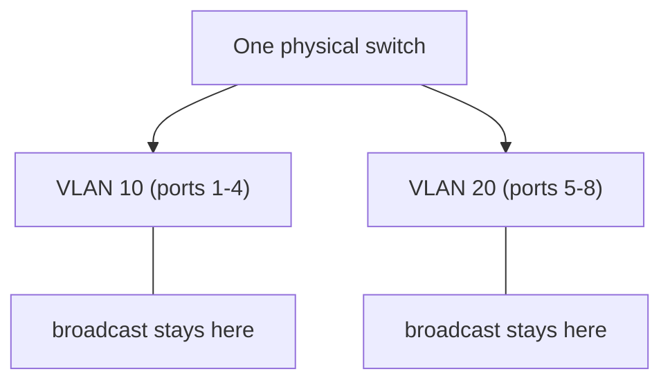

# Lecture 09 — VLANs & L2 Segmentation — Slide Deck

| Field | Value |
|---|---|
| Slides | 17 (120 min: 10 open · 50 teach · 5 break · 45 LAB-02 · 10 wrap) |
| Companions | [`notes.md`](notes.md) · [`worksheet.md`](worksheet.md) · [LAB-02](../../labs/lab-02-switching-vlans/README.md) |
| Style | [Course deck conventions](../../lectures/README.md#deck-conventions) |

## Deck outline

| # | Slide | # | Slide |
|---|---|---|---|
| 1 | Title | 10 | Inter-VLAN routing |
| 2 | Hook: one switch, two companies | 11 | Worked example: trace a tag |
| 3 | The VLAN idea (diagram) | 12 | LAB-02 brief |
| 4 | What a VLAN changes | 13 | Classroom questions |
| 5 | 802.1Q tag anatomy | 14 | Common misconceptions |
| 6 | Access vs trunk | 15 | Summary |
| 7 | Tagged vs untagged walk | 16 | Exit question |
| 8 | Native VLAN (and its danger) | 17 | Security payoff slide |
| 9 | Worked example: two VLANs, one wire | | |

## Slides

### Slide 1 — Title
**Computer Networks — Lecture 9**
VLANs & L2 segmentation (LAB-02 today)

> Notes — Yesterday's switch learns and floods *everywhere*. Today: walls inside the box.

### Slide 2 — Hook: one switch, two companies
- Two startups share one office, one switch
- Must they share broadcasts? Sniff each other's frames?
- Today's answer: no — with 4 bytes

> Notes — 2 min. Collect their "buy a second switch" answer — then make it free.

### Slide 3 — The VLAN idea (diagram)



- One box behaves as two isolated switches

> Notes — THE visual for segmentation (course visual-topic list). Isolation is at L2 only — a router can still join them (slide 10).

### Slide 4 — What a VLAN changes
- Broadcast domain shrinks (per-VLAN flooding)
- Forwarding tables partitioned — frames never cross
- Security: L2 attacks can't traverse; policy moves to the router

> Notes — CLO2+CLO7 double coverage. "Never cross" is absolute at L2 — say it absolutely, then qualify at slide 10.

### Slide 5 — 802.1Q tag anatomy

```text
| Dst MAC | Src MAC | TPID 0x8100 | PCP | DEI | VLAN ID (12 b) | EtherType | payload | FCS |
```

- Inserted **after the source MAC**; frame grows by 4 B
- VLAN ID: 1–4094 usable

> Notes — The tag is *inside* the frame, between MACs and EtherType. 12 bits → 4096 IDs explains every "why only 4094 VLANs" exam question.

### Slide 6 — Access vs trunk

| Port type | Carries | Tagged? |
|---|---|---|
| Access | one VLAN | untagged |
| Trunk | many VLANs | tagged (native excepted) |

> Notes — The printer/uplink scenario from quiz W05 Q3: access ports speak "plain Ethernet," trunks speak "labeledEthernet."

### Slide 7 — Tagged vs untagged walk
- Host → switch port (access): no tag
- Switch → trunk: tag added (VLAN ID stamped)
- Trunk → far switch → access port: tag stripped

> Notes — Walk one frame's round trip on the diagram; LAB-02 shows the same frames in Wireshark. Tags exist only *between* switches.

### Slide 8 — Native VLAN (and its danger)
- Trunk's one untagged lane: frames ride untagged
- Native mismatch → untagged frames enter the *wrong* VLAN on the far side
- Best practice: set native to a dead VLAN or match it exactly

> Notes — The classic silent failure (case bank PB-018 rehearses it). "Frames leaking by configuration" — the audit phrase students should own.

### Slide 9 — Worked example: two VLANs, one wire
- SW1 ↔ SW2 trunk; VLAN 10 + 20
- PC-A (VLAN10, SW1 p2) pings PC-B (VLAN10, SW2 p5)
- Hop by hop: untagged → tagged(10) → untagged

> Notes — Board the hop list; students supply the tag state per hop. Mirrors LAB-02 T2 exactly.

### Slide 10 — Inter-VLAN routing
- VLANs are separate subnets → a router (or L3 switch) joins them
- Policy point: firewall rules live *here*
- Segmentation without routing = isolation; with routing = zones

> Notes — Design thinking begins: VLAN+router = zone+policy. CLO3 preview (subnet-per-VLAN) before L13 formalizes it.

### Slide 11 — Worked example: trace a tag
- Capture excerpt (synthetic, labeled): two frames, one tagged, one not
- Students name: which is trunk-side, which access-side, which VLAN

> Notes — Use LAB-02's offline capture bundle if the lab is namespace-only. 90 seconds.

### Slide 12 — LAB-02 brief
- Pairs: build VLAN 10 + 20 on the lab switch fabric
- Prove isolation (same-VLAN ping works; cross-VLAN ARP fails)
- Capture one tagged + one untagged frame; label the fields

> Notes — 45 min. The cross-VLAN ARP failure *is* the learning objective — celebrate it when students first see it.

### Slide 13 — Classroom questions
1. Why do VLAN IDs top out at 4094?
2. Where is the tag added, and where removed?
3. Hosts in VLAN 10 and 20 share a switch. Can they ARP each other?

> Notes — Q3: no — L2 isolation; the ARP never crosses. If someone says "the switch blocks it," sharpen: the switch *doesn't bridge* it.

### Slide 14 — Common misconceptions
- "VLANs encrypt traffic" → they isolate; crypto is L24's job
- "Trunks are faster" → they're *wider* (more VLANs), not faster
- "One switch can only be one VLAN" → ports, not boxes, hold membership

> Notes — Quick hits; the encryption one matters most before L24.

### Slide 15 — Summary
- VLAN = walls inside the switch (per-VLAN broadcast + forwarding)
- 802.1Q: 4 bytes, 12-bit ID, added after source MAC
- Access = untagged member; trunk = tagged carrier
- Next: the same walls, without wires (Wi-Fi, L10)

> Notes — Ask for the three-frame rule's VLAN variant: "learn, look up *in-VLAN*, forward/flood *in-VLAN*."

### Slide 16 — Exit question
A trunk carries VLANs 10 and 20, native = 1. An untagged frame arrives on it. Which VLAN owns it?
*(And what if the far switch believes native = 20?)*

> Notes — Answer: VLAN 1 (the native lane); mismatch → VLAN 20 on the far side = the leak. Exit slips feed W05 pool.

### Slide 17 — Security payoff slide
- Guest Wi-Fi, IoT devices, printers: VLAN them
- Blast radius of ARP poisoning / flooding = one VLAN
- Defense-in-depth layer #2 (L11/L25 return to this)

> Notes — CLO7 foreshadowing; cases PB-017/PB-018 give the incident versions. One slide, big font.

### Demonstration instructions (instructor)
- LAB-02 environment: bridge + `vlan_filtering=1` namespaces (per lab package) — ITI: run the T0 script the week before
- Offline alternative: labeled capture bundle with tagged/untagged frames (same fields discussed on slide 11)
- Keep a teardown helper ready (lab package instructor notes)

### References for the deck
- IEEE 802.1Q — tag format, native VLAN behavior
- PD §3.2 (VLANs)
- LAB-02 package: [`../../labs/lab-02-switching-vlans/README.md`](../../labs/lab-02-switching-vlans/README.md)
