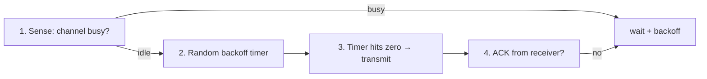

# Lecture 10 — Wi-Fi Fundamentals — Slide Deck

| Field | Value |
|---|---|
| Slides | 17 (120 min: 10 open · 50 teach · 5 break · 45 LAB-03 · 10 wrap) |
| Companions | [`notes.md`](notes.md) · [`worksheet.md`](worksheet.md) · [LAB-03](../../labs/lab-03-wifi-survey/README.md) |
| Style | [Course deck conventions](../../lectures/README.md#deck-conventions) |

## Deck outline

| # | Slide | # | Slide |
|---|---|---|---|
| 1 | Title | 10 | Frame types & association |
| 2 | Hook: the invisible wire | 11 | Worked example: airtime math |
| 3 | Wireless ≠ wired: the radio | 12 | LAB-03 brief |
| 4 | CSMA/CA (diagram) | 13 | Classroom questions |
| 5 | Why avoid, not detect | 14 | Common misconceptions |
| 6 | 2.4 vs 5 GHz | 15 | Summary |
| 7 | Channels 1/6/11 (diagram) | 16 | Exit question |
| 8 | SSID · BSSID · ESS | 17 | Channel-plan sketch |
| 9 | Data rates vs throughput | | |

## Slides

### Slide 1 — Title
**Computer Networks — Lecture 10**
Wi-Fi fundamentals (LAB-03 today)

> Notes — Same L2 concepts — MACs, frames, FCS — but the medium is shared air with physics problems of its own.

### Slide 2 — Hook: the invisible wire
- Same job as Ethernet: deliver frames on one link
- New problems: hidden stations, shared airtime, no collisions *heard*
- Everything old (MACs, FCS) — everything new (RF)

> Notes — Position the lecture as *delta* from L07/L08, not a new subject. Students relax when 802.11 frames carry familiar MACs.

### Slide 3 — Wireless ≠ wired: the radio
- One channel, everyone shares it — like the party line of L07, permanently
- Signal strength falls with distance/obstacles (dBm)
- Noise floor + interference decide SNR, not raw signal

> Notes — dBm returns from L05's dB table. "Strong bars ≠ fast Wi-Fi" — SNR and contention decide (full treatment L30).

### Slide 4 — CSMA/CA (diagram)



> Notes — Compare side-by-side with L07's CSMA/CD chart: same skeleton, avoidance instead of detection. That contrast is the quiz item.

### Slide 5 — Why avoid, not detect
- Radio can't transmit and listen simultaneously (one antenna)
- A collision at the *receiver* may be unheard at the sender (hidden station)
- So: avoid collisions, confirm with ACKs

> Notes — The hidden-station sketch on the board (A—AP—B, A and B out of range) earns the whole slide. RTS/CTS = enrichment pointer.

### Slide 6 — 2.4 vs 5 GHz

| | 2.4 GHz | 5 GHz |
|---|---|---|
| Range | better (less attenuation) | shorter |
| Channels | 3 non-overlapping | many |
| Crowding | microwaves, BT, neighbors | cleaner |

> Notes — The physics: lower frequency penetrates walls better but bands are narrower — the classic trade-off pair (quiz W05 Q4). 6 GHz gets a cameo in L30.

### Slide 7 — Channels 1/6/11 (diagram)

```text
2.4 GHz channels (20 MHz each, adjacent overlap shown):
ch1  |==========|
ch6            |==========|
ch11                     |==========|
     1    2    3    4    5    6    7    8    9   10   11
plan: AP-A=ch1   AP-B=ch6   AP-C=ch11   (no overlap)
```

> Notes — The only ASCII sketch I keep — students draw their own in LAB-03 anyway. "Non-overlapping" = no partial-band corruption (quiz W06 Q5).

### Slide 8 — SSID · BSSID · ESS
- **SSID**: network name (one per "network")
- **BSSID**: one AP radio's MAC (one per cell)
- **ESS**: all APs sharing one SSID — roamable zone

> Notes — The naming trio students mix up forever; the exam asks the *association* question (quiz W05 Q5): clients associate to a BSSID.

### Slide 9 — Data rates vs throughput
- "AC1200" is a marketing sum of radios/bands
- Real per-client throughput ≈ airtime share × PHY rate × overhead factor
- Contention eats the rest (slide 11's math)

> Notes — Set expectations: 866 Mb/s PHY rate → ~400–600 Mb/s ideal → tens of Mb/s with 40 neighbors. Numbers are illustrative; LAB-03 measures real ones.

### Slide 10 — Frame types & association
- Management: beacons, probe request/response, (de)auth, association
- Control: ACK, RTS/CTS
- Data: your frames (with the L07 MAC structure)

> Notes — Beacon = "I exist, here are my capabilities" — students find beacons in LAB-03's capture within a minute.

### Slide 11 — Worked example: airtime math
- One AP, fair sharing, 100 Mb/s real airtime goodput
- 4 active clients → ≈ 25 each; 5 → 20 each
- Adding clients never adds capacity — it divides it

> Notes — The counterintuitive core (quiz W10-adjacent, full treatment L30/LA-10). Division, not multiplication.

### Slide 12 — LAB-03 brief
- Survey 3 locations: SSID/BSSID/channel/RSSI/SNR
- Capture 60 s: find beacons, one data frame, count retry-heavy sources
- Deliverable: table + one recommendation for a crowded location

> Notes — 45 min. Phones/laptops with a Wi-Fi analyzer app suffice if monitor-mode capture isn't available (lab package has the alternatives).

### Slide 13 — Classroom questions
1. Why does your neighbor's AP on channel 6 hurt you *more* than one on 9?
2. Who decides a client roams AP1 → AP2?
3. Where did the FCS go in 802.11 frames?

> Notes — Q1: partial overlap corrupts; same-channel at least takes turns cleanly. Q2: the *client* decides — L30 builds on it.

### Slide 14 — Common misconceptions
- "More bars = more speed" → SNR + airtime decide
- "APs on the same channel are fine if far apart" → co-channel contention reaches far
- "5 GHz goes through walls better" → *worse* attenuation-wise; it wins on channels/cleanliness

> Notes — The wall myth is ubiquitous; notes.md has the attenuation explanation with the dB figures.

### Slide 15 — Summary
- Same L2 jobs, hostile medium: avoidance + ACKs
- 2.4/5 GHz: range vs channels; plan 1/6/11
- SSID names it, BSSID is the cell, ESS roams
- Next: wireless in practice + first security walls (L11)

> Notes — Recap via the CSMA/CA four steps; students recite them once.

### Slide 16 — Exit question
Your AP serves 100 Mb/s of airtime; 8 clients actively stream. Fair-share throughput each?
*(LAB-03 report due next week.)*

> Notes — Answer: 100/8 = 12.5 Mb/s. Exit slips feed W05 pool.

### Slide 17 — Channel-plan sketch (backup)
- Blank 2.4 GHz ruler; students place 6 APs with non-overlapping reuse
- Solution: 1-6-11-1-6-11 with distance separation
- The exercise is the assessment: plan reuse like a frequency auction

> Notes — Deploy during LAB-03 slack time or as the L10 quiz warm-up next week.

### Demonstration instructions (instructor)
- LAB-03: survey apps on phones OR monitor-mode capture on the teaching laptop (ITI: verify monitor mode works in the room a week ahead — some drivers fail indoors)
- Fallback: pre-captured beacon/data trace labeled with the room it came from (synthetic labeling rule applies to edited captures)
- Seating-chart note: campus Wi-Fi is the survey target — no configuration changes to it, read-only per the ethics gate

### References for the deck
- IEEE 802.11 — frame types, CSMA/CA
- PD §2.7 / KR §6.3 (Wi-Fi fundamentals — ⚠ verify section numbers against your editions)
- LAB-03 package: [`../../labs/lab-03-wifi-survey/README.md`](../../labs/lab-03-wifi-survey/README.md)
