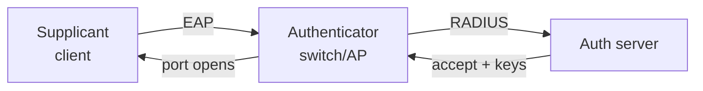

# Lecture 11 — Wireless Practice & LAN Security Preview — Slide Deck

| Field | Value |
|---|---|
| Slides | 17 (120 min: 10 open · 55 teach · 5 break · 40 case drill · 10 wrap; CS-02 kickoff in wrap) |
| Companions | [`notes.md`](notes.md) · [`worksheet.md`](worksheet.md) |
| Style | [Course deck conventions](../../lectures/README.md#deck-conventions) |

## Deck outline

| # | Slide | # | Slide |
|---|---|---|---|
| 1 | Title | 10 | 802.1X in three roles |
| 2 | Hook: the office that "had Wi-Fi" | 11 | Duplex mismatch strikes back |
| 3 | Survey → design workflow | 12 | Worked example: read a survey |
| 4 | Coverage vs capacity | 13 | Case drill: PB-021 rehearsal |
| 5 | The "all bars, no speed" file | 14 | Classroom questions |
| 6 | Roaming in practice | 15 | CS-02 kickoff |
| 7 | Rogue APs | 16 | Summary |
| 8 | Evil twin (concept) | 17 | Exit question |
| 9 | WPA2-PSK vs 802.1X | | |

## Slides

### Slide 1 — Title
**Computer Networks — Lecture 11**
Wireless practice & LAN security preview

> Notes — L10 gave the physics; today the *practice*: surveys, roaming, and the first security walls (CLO7 opens here).

### Slide 2 — Hook: the office that "had Wi-Fi"
- Survey: −50 dBm *everywhere* — "perfect signal"
- Users: video calls die at 10:00 daily
- Good signal is not good design

> Notes — 2 min. The reveal: 60 users, one AP, one channel — capacity, not coverage (L10's division math returns).

### Slide 3 — Survey → design workflow
1. Measure: RSSI, SNR, channel usage per location
2. Model: clients per cell, airtime demand
3. Place: APs by *capacity*, adjust for coverage gaps
4. Validate: re-survey under load

> Notes — The professional loop LAB-03 rehearsed. "Under load" is the step everyone skips — and the one that finds the truth.

### Slide 4 — Coverage vs capacity
- Coverage: can every seat hear an AP? (RSSI/SNR floors)
- Capacity: can every seat *transmit*? (airtime per client)
- Dense designs: small cells, more APs, careful channel reuse

> Notes — The 2×2 of WLAN design. For the exam: the *question* determines which metric you optimize.

### Slide 5 — The "all bars, no speed" file
- Case card: conference room, −55 dBm, 40 users, one AP, ch 6
- Diagnose in 60 seconds: airtime starvation
- Fixes ranked: split the cell, steer to 5 GHz, schedule heavy apps

> Notes — PB-021 rehearsal (slide 13 does it properly). Keep the fix-ranking vocabulary: deployability tonight vs next budget cycle.

### Slide 6 — Roaming in practice
- Client keeps the SSID, changes BSSID
- The *client* decides (it owns the RF measurements)
- Fast transition / key caching minimize the gap — VoIP cares

> Notes — Quiz W15 Q4 asks this verbatim later; today it's introduced. The roam gap = frames in flight during reassociation.

### Slide 7 — Rogue APs
- Unauthorized AP bridging the trusted LAN
- Risks: bypasses wall security, invites clients
- Defense: 802.1X/NAC — unknown devices fail port auth; WIDS detects

> Notes — First CLO7 defense mechanism of the course. The "so what" is physical: a $30 AP undoes a million-dollar firewall.

### Slide 8 — Evil twin (concept)
- Attacker's AP *impersonates* a trusted SSID
- Clients connect; attacker reads/injects
- Countermeasures: 802.1X (mutual auth), VPN on untrusted nets, user training

> Notes — Concept only, no how-to (ethics gate). The mutual-authentication idea sets up slide 9 and L24's TLS.

### Slide 9 — WPA2-PSK vs 802.1X

| | WPA2-PSK | WPA2-802.1X |
|---|---|---|
| Credential | shared password | per-user/device |
| Revocation | change it everywhere | disable one identity |
| Fits | home | enterprise |

> Notes — The shared-password problem: everyone holds the key forever. Quiz W15/M2-review asks the "what does 802.1X authenticate" question.

### Slide 10 — 802.1X in three roles

- Authenticator never sees secrets — it relays

> Notes — The three-role diagram is the memory anchor. Per-session keys replace the shared PSK (notes.md has the key-derivation sketch, course-level).

### Slide 11 — Duplex mismatch strikes back
- One end 100/full, other 100/half → works *mostly*, crawls under load
- Autonegotiation failure mode; late collisions on the half side
- Diagnose: interface counters (FCS errors, collisions)

> Notes — The classic "connected but slow" (case bank PB-012/PB-019 family). Counters as evidence — the L04 habit pays off.

### Slide 12 — Worked example: read a survey
- Table of 4 locations: RSSI, SNR, channel, client count
- Location D: −45 dBm, SNR 40 dB, 55 clients on ch 6
- Verdict? (Coverage fine; capacity broken; split cell)

> Notes — The table mirrors LAB-03's deliverable format — the worksheet's post-lab question reuses it.

### Slide 13 — Case drill: PB-021 rehearsal
- Practice-bank case PB-021 (conference-room dead zone), 20 min, pairs
- Produce: diagnosis + two fixes ranked by deployability
- Instructor key in the case file — do not open early

> Notes — The practice bank's first in-lecture appearance. CS-02's design skills rehearse here in miniature.

### Slide 14 — Classroom questions
1. Why can't a switch alone stop a rogue AP?
2. Your roaming users drop calls between floors. Name two design suspects.
3. What does the *authenticator* receive from the auth server?

> Notes — Q1: the rogue is *inside* the wall — port auth (802.1X) is the switch-side answer. Q3: accept/reject + keying material (course level).

### Slide 15 — CS-02 kickoff
- Meridian LAN design: addressing plan + VLAN/survey justification
- Due L16 — 4% weight (proposed plan)
- Individual; rubric: evidence 40 / reasoning 40 / communication 20

> Notes — 5 min brief from case-study-strategy §2. Point to PB-020/PB-021 as rehearsal material and the integrity rules.

### Slide 16 — Summary
- Survey → model → place → validate; capacity ≠ coverage
- Security walls: rogue-AP defense, 802.1X, no shared secrets
- Practice-bank cases = design rehearsal
- Next: IP & ARP — the layer that finally routes (L12)

> Notes — Module 2 closes: L2 complete. One-sentence module recap before the L3 turn.

### Slide 17 — Exit question
Which single control converts "anyone can plug into the wall" into "only known devices may"?
*(Module 3 begins: your first routing table.)*

> Notes — Answer: 802.1X/NAC port authentication. Exit slips feed W06 pool.

### Demonstration instructions (instructor)
- PB-021 drill is paper-first; case file: [`../../case-studies/cases/pb-021-conference-room-dead-zone.md`](../../case-studies/cases/pb-021-conference-room-dead-zone.md)
- Optional demo: AP roaming between two same-SSID APs with a continuous ping running — the 1–2 s loss spike *is* the roam gap (ITI: needs two APs; else narrate the notes.md figure)
- CS-02 brief distribution: case-study-strategy §2 + rubric; post to the LMS

### References for the deck
- IEEE 802.1X; IEEE 802.11i (WPA2 family)
- PD §2.7 (LAN security preview — ⚠ verify section)
- Case bank: PB-012, PB-019–PB-022
