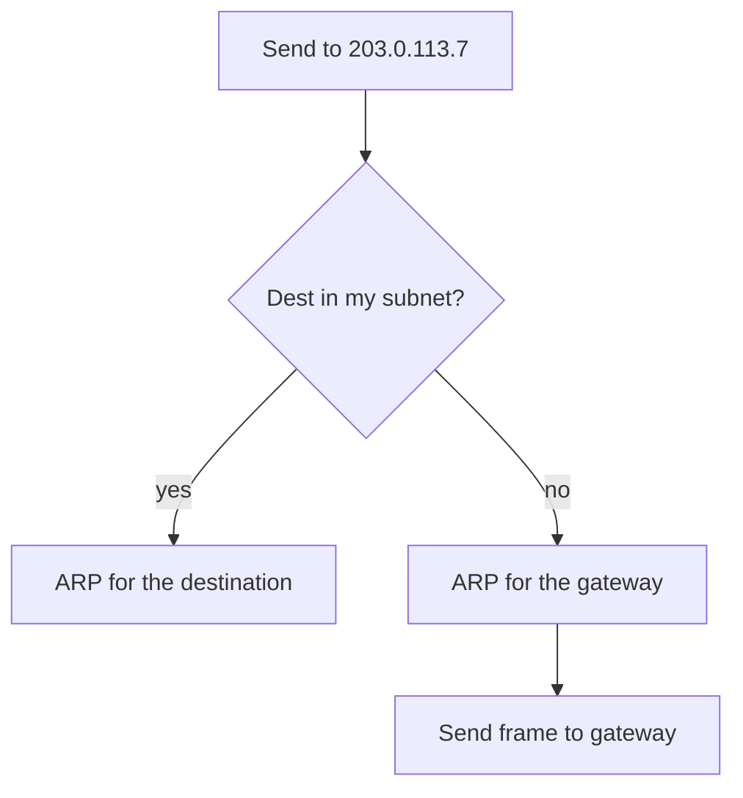
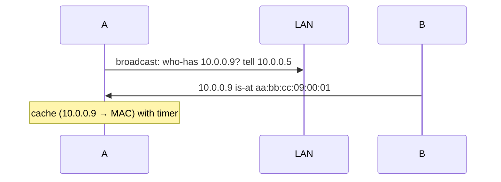

# Lecture 12 — IP Fundamentals & ARP — Slide Deck

| Field | Value |
|---|---|
| Slides | 18 (120 min: 10 open · 55 teach · 5 break · 40 GA-12 · 10 wrap) |
| Companions | [`notes.md`](notes.md) · [`worksheet.md`](worksheet.md) (GA-12) |
| Style | [Course deck conventions](../../lectures/README.md#deck-conventions) |

## Deck outline

| # | Slide | # | Slide |
|---|---|---|---|
| 1 | Title | 10 | ARP packet + cache (diagram) |
| 2 | Hook: the address that lies | 11 | Worked example: two sends |
| 3 | The IPv4 header | 12 | GA-12 brief |
| 4 | Fields that matter | 13 | Classroom questions |
| 5 | Addresses: network + host | 14 | Common misconceptions |
| 6 | Masks & membership test | 15 | Summary |
| 7 | On-link vs off-link decision | 16 | Exit question |
| 8 | Worked example: mask math | 17 | Header diagram (backup) |
| 9 | ARP: why it exists | 18 | Proxy ARP warning |

## Slides

### Slide 1 — Title
**Computer Networks — Lecture 12**
IP fundamentals & ARP (GA-12 today)

> Notes — Module 3 begins. Ethernet delivers *locally*; IP delivers *globally*. Today: the joining logic.

### Slide 2 — Hook: the address that lies
- Your laptop has *two* addresses: MAC (burned in) and IP (assigned)
- Only one of them changes when you move buildings
- Which — and why?

> Notes — 2 min pair vote. IP is topology-dependent (locator), MAC is device identity. The duality organizes the whole module.

### Slide 3 — The IPv4 header

```text
| Ver/IHL | TOS | Length | ID | Flags/Frag | TTL | Proto | Checksum | Src IP | Dst IP |
```

- 20 B bare; every field earns its place
- Today: TTL, Proto, Src/Dst; the rest by name

> Notes — The full field walk lives in GA-12; on screen keep only the five starred fields. Fragmentation is enrichment (PMTU returns at L27).

### Slide 4 — Fields that matter
- **TTL**: hop counter — router decrements; 0 → drop + ICMP Time Exceeded
- **Proto**: 6 = TCP, 17 = UDP (the demux promise to L4)
- **Src/Dst**: the end-to-end identities that never change in flight

> Notes — TTL's second job (loop defense) gets its full scene at L16; today it's "hops." The Src/Dst immutability is THE slide-13 trap's answer.

### Slide 5 — Addresses: network + host
- Dotted quad = 32 bits: **network part + host part**
- The mask draws the boundary
- Same network part = same link ("neighbors")

> Notes — /8, /16, /24 as "how many bits are the name of the street vs the house." Subnetting math formalizes at L13 — today is the *concept*.

### Slide 6 — Masks & membership test
- Mask 255.255.255.0 (/24): first 24 bits = network
- Test: is B in A's subnet? — AND both with the mask, compare
- Hosts do this *for every send*

> Notes — The AND-test is worksheet drill 1. Every future subnet question is this test plus counting.

### Slide 7 — On-link vs off-link decision



> Notes — THE decision flowchart (visual-topic: routing-table thinking begins here). The frame's MAC dst and IP dst differ — the exam's favorite confusion.

### Slide 8 — Worked example: mask math
- Host 10.0.0.5/24 sends to 10.0.0.9 → on-link → ARP for .9
- Same host to 8.8.8.8 → off-link → ARP for gateway .1
- Same host to 10.0.1.9 → off-link! (10.0.0.0/24 ≠ 10.0.1.0/24)

> Notes — The third case is the silent killer (PB-025 rehearses it). Students vote on each case before the reveal.

### Slide 9 — ARP: why it exists
- IP knows *where* logically; L2 needs *who* physically
- ARP asks the link: "who has 10.0.0.9?"
- One link at a time — never across routers

> Notes — The scope sentence is absolute (review-M3 Q2's answer). Broadcast asks everyone; only the owner answers.

### Slide 10 — ARP packet + cache (diagram)



- Cache entries age; requests repeat on expiry

> Notes — Excerpt D from the packet-analysis bank is this diagram verbatim — cross-reference it for the "repeated who-has" reading drill.

### Slide 11 — Worked example: two sends
- Frame 1: to 10.0.0.9 → dst MAC = B's MAC
- Frame 2: to 8.8.8.8 → dst MAC = gateway's MAC
- IP headers differ only in destination — MACs differ *fundamentally*

> Notes — Build a two-row table live. This table is quiz W06 Q3/Q4 and midterm C1's core mechanic.

### Slide 12 — GA-12 brief
- Worksheet: 6 sends from one host; predict ARP target + MAC dst per send
- Includes one trap: an IP *configured* off its true subnet
- Then: read the two real ARP frames in the course capture

> Notes — 30 min pairs. The trap teaches why "but the address looks right" fails when the mask lies.

### Slide 13 — Classroom questions
1. Why doesn't a router forward ARP broadcasts?
2. Two hosts claim the same IP — what do ARP tables show?
3. Where does the TTL change on a single link?

> Notes — Q2: duplicate-IP chaos = flapping MAC per IP (ties to L26's spoofing defense). Q3: nowhere — TTL is L3, changed only by routers.

### Slide 14 — Common misconceptions
- "ARP finds MACs for any IP" → same-link only
- "The gateway rewrites the IP headers" → it rewrites *MACs*; IPs persist end-to-end (NAT is the exception, L14!)
- "Switches answer ARP" → hosts answer; switches just flood the question

> Notes — The gateway/NAT boundary matters: today's gateway is MAC-rewriting only; NAT arrives at L14 — plant the flag now.

### Slide 15 — Summary
- IP = locator + identifier; the mask splits network/host
- On-link → ARP the target; off-link → ARP the gateway
- MACs change per hop; IPs don't (yet)
- Next: carving address space deliberately — subnetting (L13)

> Notes — Read the slide-7 flowchart aloud once as the summary; it compresses everything.

### Slide 16 — Exit question
Host 172.16.9.20/24, gateway 172.16.9.1, sends to 172.16.9.200. ARP target and frame MAC dst?
*(L13: what if you're the one designing the subnets?)*

> Notes — Answer: on-link → ARP for 172.16.9.200; MAC dst = 200's MAC. Exit slips feed W06 pool.

### Slide 17 — Header diagram (backup)
- Full 20-byte IPv4 header rendered to scale with byte counts
- Deploy during GA-12 plenary for the "which field did you use?" audit

> Notes — Backup slide for the worksheet's header-grid question.

### Slide 18 — Proxy ARP warning (backup)
- A router answering ARP for hosts it can route to
- Hides subnet mistakes — "works" until it doesn't
- Recognize, don't rely: it masks the on-link test you just learned

> Notes — Legacy networks use it; our labs don't. Two minutes, honest caveat.

### Demonstration instructions (instructor)
- GA-12 paper-first; the ARP capture pair comes from the course trace (L01 file)
- Optional live beat: `ping` a lab neighbor while capturing — the who-has/is-at pair appears in real time (ITI: any two-station lab setup)
- No-device fallback: worksheet includes the printed ARP frames

### References for the deck
- RFC 791 (IPv4), RFC 826 (ARP)
- PD §4.3 (IPv4, ARP)
- Packet-analysis bank: Excerpt D
