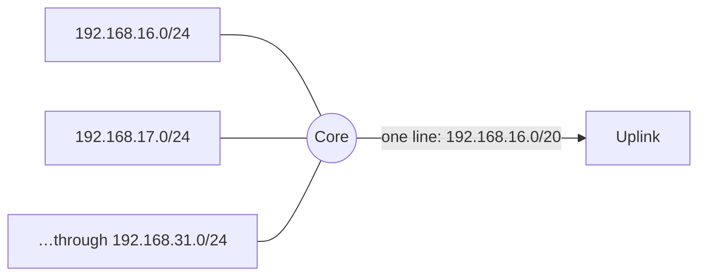

# Lecture 13 — Subnetting & VLSM — Slide Deck

| Field | Value |
|---|---|
| Slides | 18 (120 min: 10 open · 55 teach · 5 break · 40 LAB-04 · 10 wrap; subnetting problem set released) |
| Companions | [`notes.md`](notes.md) · [`worksheet.md`](worksheet.md) · [LAB-04](../../labs/lab-04-subnetting-design/README.md) |
| Style | [Course deck conventions](../../lectures/README.md#deck-conventions) |

## Deck outline

| # | Slide | # | Slide |
|---|---|---|---|
| 1 | Title | 10 | Aggregation |
| 2 | Hook: the /16 that died | 11 | Worked example: full VLSM plan |
| 3 | Why subnet? | 12 | The four-step method |
| 4 | The mask as a fence | 13 | LAB-04 brief |
| 5 | Powers of two table | 14 | Classroom questions |
| 6 | The three questions | 15 | Common misconceptions |
| 7 | Worked example: /26 split | 16 | Summary |
| 8 | VLSM: right-size each | 17 | Exit question |
| 9 | Largest-first ordering | 18 | Problem-set release slide |

## Slides

### Slide 1 — Title
**Computer Networks — Lecture 13**
Subnetting & VLSM (LAB-04 today)

> Notes — CLO3's home lecture: the course's most transferable examinable skill. Method beats memorization today.

### Slide 2 — Hook: the /16 that died
- A campus "temporarily" flat: one /16, 4 000 hosts
- Broadcast storms by year two; no boundaries at all
- Subnetting is *designed* structure — let's design some

> Notes — 2 min. The failure mode (blast radius) echoes L08/L09 — now we fix it at L3 with addressing.

### Slide 3 — Why subnet?
- Size networks to *need* (hosts + growth)
- Bound broadcast/blast domains (L08/L09 payoff)
- Summarize routes (slide 10)

> Notes — Three reasons, one per later application. The exam designs always include a "justify your mask" clause — these are the justifications.

### Slide 4 — The mask as a fence

```text
192.168.4.0/24  fence at 24 bits
192.168.4.0/26  fence at 26 — 64 addresses inside
```

- Moving the fence right → smaller rooms
- Moving it left → bigger rooms (aggregation)

> Notes — The fence metaphor carries the lecture. Every mask is just "where the fence sits."

### Slide 5 — Powers of two table

| Hosts needed | Prefix | Usable |
|---|---|---|
| ≤ 2 | /30 | 2 |
| ≤ 6 | /29 | 6 |
| ≤ 14 | /28 | 14 |
| ≤ 30 | /27 | 30 |
| ≤ 62 | /26 | 62 |
| ≤ 126 | /25 | 126 |
| ≤ 254 | /24 | 254 |

> Notes — The only table worth memorizing verbatim. Formula under it: usable = 2^h − 2.

### Slide 6 — The three questions
1. **How many hosts?** → smallest usable ≥ need (table)
2. **Which range?** → aligned blocks, largest-first
3. **What's left?** → the next free aligned block

> Notes — The method slide: students photograph this one. Every LAB-04 and exam item is these three questions iterated.

### Slide 7 — Worked example: /26 split
- 192.168.4.0/24 into four equal /26s
- .0–.63 · .64–.127 · .128–.191 · .192–.255; 62 usable each
- Fence moved twice; four rooms of 64

> Notes — Equal splits first (quiz W06 Q2 revisits) — VLSM comes next, unequal is the real skill.

### Slide 8 — VLSM: right-size each
- Need: 100, 50, 30, 10, 6, 2 hosts in one /24
- /25 · /26 · /27 · /28 · /29 · /30 → fits in 252 addresses
- Fixed-length /26s would need 4 chunks = 256 for the *first* need alone

> Notes — The VLSM pitch in one comparison: 252 vs 256+ addresses. Variable-length = right-sizing (review-M3 Q4 uses this exact set).

### Slide 9 — Largest-first ordering
- Allocate biggest need first, aligned to its block size
- Then next-biggest in the leftover
- Alignment: blocks start on multiples of their size

> Notes — The rule that prevents overlaps. The alignment-jump artifact (a /28 skipping a /29 gap) appears in the problem set's Task 3 — flag it now.

### Slide 10 — Aggregation



- 16 /24s → one /20 line; longest-prefix handles exceptions

> Notes — The design payoff of fences: fewer table lines. Quiz W08 Q3's longest-prefix rule is why aggregation is *safe* (exceptions win).

### Slide 11 — Worked example: full VLSM plan
- 10.20.0.0/22: staff 500, labs 200, link /30, reserve /26
- Staff: 10.20.0.0/23 (510) · Labs: 10.20.2.0/24 · Link: 10.20.3.0/30 · Reserve: 10.20.3.4/26
- Free: 10.20.3.68 – 10.20.3.255

> Notes — Full walk on the board with the three questions asked aloud per block (quiz W07 Q1 mirrors with /22 → /26 + /30).

### Slide 12 — The four-step method
1. List needs, sort **descending**
2. Pick prefix per need (powers-of-two table)
3. Allocate aligned blocks in order
4. Record ranges + leftovers; verify no overlap

> Notes — Slide 6's three questions + sorting = the method. LAB-04 and the problem set both grade the *recorded* steps, not just answers.

### Slide 13 — LAB-04 brief
- Pairs: three design tasks (split, VLSM plan, aggregation summary)
- Instrument deliverable: this lab IS the 5% problem set's rehearsal
- Submit the plan table + verification column

> Notes — 40 min. The problem set releases today (slide 18) — the lab is deliberately the same skill, different numbers.

### Slide 14 — Classroom questions
1. Why can't a /31 host two PCs *and* a network+broadcast?
2. You need 300 hosts — /23 wastes 210. Is there anything smaller that fits?
3. Where does aggregation break?

> Notes — Q2: no — /24 holds 254 < 300; the *next* size up is /23; waste is the price (or redesign roles). Q3: exceptions + overlapping ownership.

### Slide 15 — Common misconceptions
- "/24 means 24 hosts" → it means 24 network *bits*
- "Usable = total" → always minus network + broadcast (except /31, /32 — enrichment)
- "VLSM is a different protocol" → it's just per-subnet fence placement

> Notes — The first one generates /26 = 26 hosts on exit slips every year; show the powers-of-two table again.

### Slide 16 — Summary
- Fence metaphor: masks place boundaries
- Three questions + largest-first = every design
- Aggregation: fences compress routes; LPM keeps it safe
- Next: DHCP & NAT — addresses that assign themselves (L14)

> Notes — Timing check: this slide should land by minute 70; LAB-04 follows immediately.

### Slide 17 — Exit question
Smallest prefix for 90 hosts, and its usable count?
*(Problem set due L16 — start tonight.)*

> Notes — Answer: /25 (126 ≥ 90). Exit slips feed W07 pool (graded-window candidate week).

### Slide 18 — Problem-set release slide
- Six tasks, 100 points, individual
- Released today · due L16 at lecture start
- Show working; assumptions earn marks (marking-guide §1)

> Notes — Point to [`assessments/assignments/subnetting-problem-set-student.md`](../../assessments/assignments/subnetting-problem-set-student.md); integrity: strictly individual.

### Demonstration instructions (instructor)
- LAB-04 is paper/Python-first (`ipaddress` verification encouraged *after* hand work)
- Optional board kit: magnetic fence line + address cards for the alignment walk
- ITI: verify the problem set's Task-3 alignment artifact against the verify script pattern

### References for the deck
- PD §4.3 (subnetting), VLSM treatment
- RFC 950 (subnetting), RFC 3021 (/31)
- Assessments: [`../../assessments/assignments/subnetting-problem-set-student.md`](../../assessments/assignments/subnetting-problem-set-student.md)
