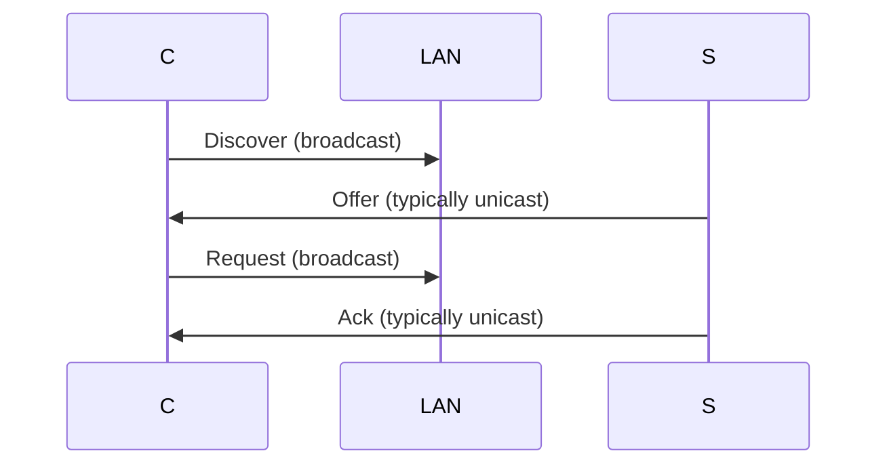
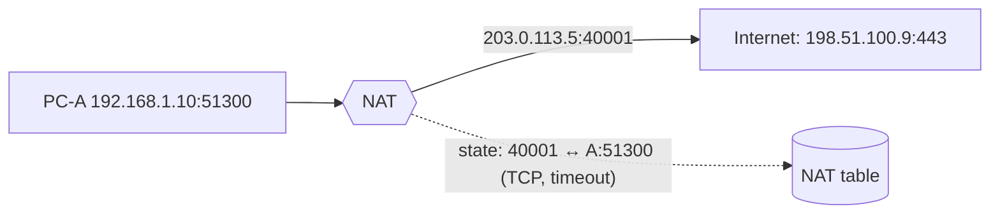

# Lecture 14 — DHCP & NAT — Slide Deck

| Field | Value |
|---|---|
| Slides | 18 (120 min: 10 open · 55 teach · 5 break · 45 LAB-05 · 10 wrap) |
| Companions | [`notes.md`](notes.md) · [`worksheet.md`](worksheet.md) · [LAB-05](../../labs/lab-05-dhcp-nat-router/README.md) |
| Style | [Course deck conventions](../../lectures/README.md#deck-conventions) |

## Deck outline

| # | Slide | # | Slide |
|---|---|---|---|
| 1 | Title | 10 | NAT: the four headers |
| 2 | Hook: the 400-device classroom | 11 | NAT state (diagram) |
| 3 | DHCP: the bootstrap problem | 12 | What NAT breaks |
| 4 | DORA (diagram) | 13 | Worked example: read a NAT table |
| 5 | What DHCP tells you | 14 | LAB-05 brief |
| 6 | Leases in 60 seconds | 15 | Classroom questions |
| 7 | Worked example: which packet is which | 16 | Common misconceptions |
| 8 | NAT: why it exists | 17 | Summary |
| 9 | Public vs private space | 18 | Exit question |

## Slides

### Slide 1 — Title
**Computer Networks — Lecture 14**
DHCP & NAT (LAB-05 today)

> Notes — Two protocols that run every home and campus network, mostly unnoticed. Today they become visible.

### Slide 2 — Hook: the 400-device classroom
- 400 devices arrive at 09:00; 254 addresses exist
- Who assigns what to whom — without a spreadsheet?
- DHCP + NAT: the answer hiding in your pocket

> Notes — 2 min. The pool-exhaustion number (254 vs 400) plants L22's deep dive and quiz W07 Q5's APIPA story.

### Slide 3 — DHCP: the bootstrap problem
- New device: no IP, no mask, no gateway, no DNS
- It can't even *find* the DHCP server by address
- Solution: broadcast — "any DHCP server here?"

> Notes — The chicken-and-egg framing is why Discover must broadcast (quiz W07 Q3's first clause).

### Slide 4 — DORA (diagram)

- Discover/Request broadcast — client can't be addressed (yet)

> Notes — The protocol students remember by its name; the *why* of each broadcast/unicast choice is what's examinable. LAB-05 captures the real thing.

### Slide 5 — What DHCP tells you
- IP address + mask (the "where")
- Default gateway (the "how out")
- DNS servers (the "how to find names")
- Lease duration (the "how long it's yours")

> Notes — Four fields = quiz W07 Q3's list. Each maps to a failure story: no lease (APIPA), wrong gateway, wrong DNS, expired lease.

### Slide 6 — Leases in 60 seconds
- Addresses are *rented*, not owned
- Renewal at 50% (T1) with the original server
- Expiry → release → re-discover (full story at L22)

> Notes — One slide today by design; L22 owns the lifecycle. The examinable bit today: rented ⇒ pools recycle.

### Slide 7 — Worked example: which packet is which
- Four captured DHCP frames, unlabeled (synthetic, in worksheet)
- Identify DORA stage by: sender IP, destination IP, broadcast bit, message type option
- Plenary: justify each label

> Notes — The option-53 message type is the giveaway; source 0.0.0.0 marks Discover. Worksheet prints the four frames.

### Slide 8 — NAT: why it exists
- Public IPv4 space ran out (4.3×10⁹ < devices)
- RFC 1918 private ranges: 10/8, 172.16/12, 192.168/16
- NAT connects many privates to few publics

> Notes — Scarcity is the *reason*; IPv6 (L15) removes it — say both now. Private ranges are the quiz W07-level vocabulary.

### Slide 9 — Public vs private space
- Private ranges are never routed on the public Internet
- Every campus/home reuses 192.168.x.x — fine, they're islands
- NAT lives at the island's shore

> Notes — The shore metaphor persists through L27 (cloud VPCs = private islands with NAT gateways).

### Slide 10 — NAT: the four headers
- Rewrite: **src IP** (private → public) + **src port** (collision-proof)
- Keep: dst untouched (the server's)
- Reverse on reply: dst IP + dst port back to the insider

> Notes — Quiz W07 Q4's field list. "Four headers" = 2 now, 2 later; the reply direction is where students slip.

### Slide 11 — NAT state (diagram)

- Mapping + protocol + timeout = the state

> Notes — The table is the examinable artifact (bank N-21's capacity math uses exactly these rows). Two insiders, same source port → NAT re-maps one — bank short-answer SA-10 covers it.

### Slide 12 — What NAT breaks
- Inbound-initiated connections (no mapping exists yet)
- Protocols embedding addresses in payload (classic FTP, SIP)
- Workarounds: port forwarding, ALGs, UPnP — each a story

> Notes — One slide of costs; the security *side effect* (implicit inbound filter) previews L25 honestly ("NAT is not a firewall, but it acts like one accidentally").

### Slide 13 — Worked example: read a NAT table
- Worksheet table: 3 mappings, one stale (timeout passed)
- Students: which inside host gets 198.51.100.5:40007, and which row is dead?
- Why does the dead row free a port?

> Notes — Port conservation is the pool math (N-21). The stale-row question previews L22's lease parallel.

### Slide 14 — LAB-05 brief
- Pairs: dnsmasq DHCP scope + nftables NAT on the lab router
- Prove DORA (capture) and NAT (before/after capture of one flow)
- Deliverable: both captures labeled + the NAT table state

> Notes — 45 min. LAB-05 is the 13-deliverable graded set's centerpiece; rubric unchanged (40/30/20/10).

### Slide 15 — Classroom questions
1. Why is Discover broadcast but Offer typically unicast?
2. Two hosts, same source port 51300, different servers — can both NAT?
3. Which device decrements TTL — NAT router too?

> Notes — Q2: yes — the public ports differ (or tuples differ). Q3: yes — NAT is on a router; TTL is L3. Both are bank-checkable.

### Slide 16 — Common misconceptions
- "NAT = firewall" → it *accidentally filters inbound*; policy is L25's job
- "DHCP assigns MACs" → it assigns IP config to MAC-known devices
- "Private IPs are slower" → addressing has no speed

> Notes — The NAT≠firewall point returns in L25 with precision; students meet it again in case PB-049.

### Slide 17 — Summary
- DORA bootstraps; leases recycle pools
- NAT: 4 header rewrites + state table
- Private islands + public shore = today's Internet shape
- Next: IPv6 — what if we never needed NAT? (L15)

> Notes — Recap via the state diagram; students name the four rewritten fields cold.

### Slide 18 — Exit question
NAT mapping: inside 192.168.7.20:5000 ↔ public 203.0.113.5:40003, TCP. A reply arrives at 203.0.113.5:40003. Where does it go?
*(LAB-05 due next session.)*

> Notes — Answer: rewritten to 192.168.7.20:5000. Exit slips feed W07 pool.

### Demonstration instructions (instructor)
- LAB-05 environment: dnsmasq + nftables versions on the teaching image — ITI: verify versions before first run (lab package instructor notes)
- Capture points: LAN-side for DORA, WAN-side for NAT rewrite — one flow, two captures
- Fallback: labeled synthetic captures in the worksheet for no-device rooms

### References for the deck
- RFC 2131 (DHCP), RFC 1918 (private space), RFC 3022 (NAT)
- PD §4.3 (DHCP, NAT)
- LAB-05 package: [`../../labs/lab-05-dhcp-nat-router/README.md`](../../labs/lab-05-dhcp-nat-router/README.md)
