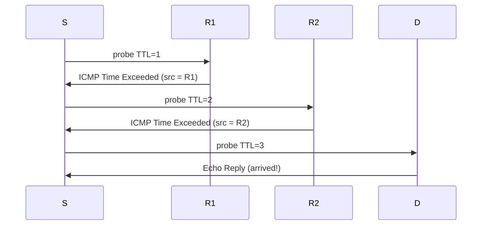

# Lecture 16 — Routing Fundamentals & ICMP — Slide Deck

| Field | Value |
|---|---|
| Slides | 18 (120 min: 10 open · 50 teach · 5 break · 40 LAB-07 · 10 wrap; **midterm next session**) |
| Companions | [`notes.md`](notes.md) · [`worksheet.md`](worksheet.md) · [LAB-07](../../labs/lab-07-static-routing/README.md) |
| Style | [Course deck conventions](../../lectures/README.md#deck-conventions) |

## Deck outline

| # | Slide | # | Slide |
|---|---|---|---|
| 1 | Title | 10 | ICMP: the network's messenger |
| 2 | Hook: the table that decides everything | 11 | Traceroute mechanics (diagram) |
| 3 | The routing table | 12 | Worked example: read a trace |
| 4 | Anatomy of a route line | 13 | LAB-07 brief |
| 5 | Longest-prefix match | 14 | Classroom questions |
| 6 | Worked example: LPM three-way | 15 | Common misconceptions |
| 7 | AD vs metric | 16 | Summary |
| 8 | Default route | 17 | Exit question |
| 9 | Static vs dynamic | 18 | Midterm briefing slide |

## Slides

### Slide 1 — Title
**Computer Networks — Lecture 16**
Routing fundamentals & ICMP (LAB-07 today)

> Notes — Module 3 closes with the layer that actually moves packets between networks. Midterm next session — briefing at the end.

### Slide 2 — Hook: the table that decides everything
- Every packet at every router: one table lookup
- The whole Internet's behavior = billions of these, per second
- Today you read, write, and debug such tables

> Notes — 2 min. The lookup is *simple* (LPM) — the complexity lives in how tables get filled (dynamic protocols = enrichment pointer).

### Slide 3 — The routing table

| Destination | Next hop | Interface |
|---|---|---|
| 10.0.0.0/8 | 10.9.0.1 | eth0 |
| 10.1.0.0/16 | 10.9.0.2 | eth0 |
| 10.1.5.0/24 | local | lan0 |
| 0.0.0.0/0 | 203.0.113.1 | wan0 |

> Notes — The four-line table is the lecture's spine — every slide refers back. "local" = connected route.

### Slide 4 — Anatomy of a route line
- **Destination**: prefix the route serves
- **Next hop**: where to hand it (a neighbor's IP)
- **Interface**: which door out
- *(+ AD/metric: which route *wins* — slide 7)*

> Notes — Quiz W08 Q3 uses this exact table shape. Next hop is always on a *connected* link — the L12 on-link test returns.

### Slide 5 — Longest-prefix match
- Among matching routes, the **most specific** (longest) prefix wins
- Specificity beats metric, beats everything
- Default (/0) matches all — loses to all

> Notes — THE rule of the lecture. The three-way worked example (slide 6) is the exam pattern.

### Slide 6 — Worked example: LPM three-way
- Table from slide 3; lookups: 10.1.5.9 · 10.1.9.9 · 10.9.9.9
- 10.1.5.9 → **local** (/24 beats /16, /8) · 10.1.9.9 → **10.9.0.2** (/16) · 10.9.9.9 → **10.9.0.1** (/8)

> Notes — Students call each answer before reveal. The middle one (skipping the /24) is the discriminator — /24 doesn't match, /16 does.

### Slide 7 — AD vs metric
- **AD** (administrative distance): trust in the *source* (static 1 < OSPF 110)
- **Metric**: cost *within* one source
- Order: longest prefix → lowest AD → lowest metric

> Notes — Quiz W11-adjacent (review-M3 Q14): AD decides *before* metric. The two-stage comparison is the classic exam trap.

### Slide 8 — Default route
- `0.0.0.0/0` — matches everything, loses to everything
- Every host has one (the gateway); every edge router has one
- "Send it upward and let someone smarter decide"

> Notes — Hosts' default gateway = slide 7's flowchart from L12, now in table form. Continuity: same decision, two layers.

### Slide 9 — Static vs dynamic
- Static: you write the line (labs, small nets, honest defaults)
- Dynamic: protocols learn/flood it (OSPF/BGP — enrichment pointer)
- Course scope: *read and debug* tables; the dynamics live beyond

> Notes — Scope honesty: we teach table *reading* plus static writing; dynamic routing is a full course. LAB-07 is static.

### Slide 10 — ICMP: the network's messenger
- IP's control channel: errors, diagnostics, no user data
- Types: Echo (8/0), Time Exceeded (11/0), Dest Unreachable (3)
- Rate-limited by design — ICMP is a *guest*

> Notes — The rate-limiting clause pays off in slide 12 and RT-07. "Guest" framing: traffic may pass where ICMP is dropped.

### Slide 11 — Traceroute mechanics (diagram)

- TTL counts hops; each dying router signs its name

> Notes — THE mechanism diagram (visual-topic list). The reply's *source* is the hop's identity — that's the whole trick.

### Slide 12 — Worked example: read a trace
- `1 r1 0.4 ms · 2 r2 0.9 ms · 3 * * * · 4 srv 2.1 ms`
- Stars at hop 3 with success at 4 → reply suppression, not a break
- The path *works*; hop 3 just won't answer probes

> Notes — RT-07's reasoning in miniature. The "success proves the path" clause is the discriminator students must own.

### Slide 13 — LAB-07 brief
- Pairs: two-router static topology; one route deliberately wrong (instructor-set)
- Find it: `ip route` + `traceroute` evidence → state the corrected line
- Then: ICMP exercises (ping, traceroute, a filtered hop)

> Notes — 40 min. PR-09 (practical bank) is this lab's assessment twin. The "corrected line" clause grades precision.

### Slide 14 — Classroom questions
1. Two routes to 10.5.0.0/16: static (AD 1) and OSPF (AD 110, cost 3). Which wins?
2. Why does traceroute use *increasing* TTL?
3. Your ping to a host fails; ping to its gateway works. Two hypotheses?

> Notes — Q1: static — AD before metric. Q3: host down vs host-side filtering — the asymmetric-reachability drill (review-M3 Q16's cousin).

### Slide 15 — Common misconceptions
- "Routers rewrite IP addresses" → they rewrite MACs (L12) and decrement TTL — IPs persist (NAT excepted)
- "Default route = fastest" → it's the *fallback*, not a preference
- "Stars mean broken" → often just ICMP suppression

> Notes — The first misconception is the semester's most persistent; L12's table gets one more repetition here.

### Slide 16 — Summary
- Table anatomy + LPM + AD/metric = forwarding decisions
- ICMP: echo, time-exceeded, unreachable — the diagnostics channel
- Traceroute = TTL ladder + router signatures
- **Midterm next session** (briefing next slide)

> Notes — Module 3 complete: addressing → assignment → routing. One-breath recap of the arc.

### Slide 17 — Exit question
Route table: `10.0.0.0/8 → R1`, `10.1.0.0/16 → R2`. Next hop for 10.1.7.7?
*(Midterm: sleep, formula sheet is provided.)*

> Notes — Answer: R2 (longest match /16). Exit slips feed W08 pool.

### Slide 18 — Midterm briefing slide
- 90 min, 60 marks: A 18 short · B 24 problems · C 18 trace analysis
- Formula sheet provided; no devices
- Sample paper: review sets M1–M3 are the rehearsal material
- Coverage: L01–L16 (Modules 1–3)

> Notes — 3 min, questions welcome. Point to [`assessments/exams/midterm-student.md`](../../assessments/exams/midterm-student.md) format (instructor releases the sample separately).

### Demonstration instructions (instructor)
- LAB-07: two-router namespaces with the injected wrong route — ITI: pre-set the fault and record the "expected discovery path" for the plenary
- Capture beat: one traceroute run while capturing — students see the TTL-ladder packets themselves
- Midterm logistics: print two variants (A/B reorder) if class size warrants; formula sheet appended to the paper

### References for the deck
- RFC 792/5944 (ICMPv4), RFC 792 (Time Exceeded semantics)
- PD §4.3 (routing), §5 (network layer)
- LAB-07 package: [`../../labs/lab-07-static-routing/README.md`](../../labs/lab-07-static-routing/README.md)
