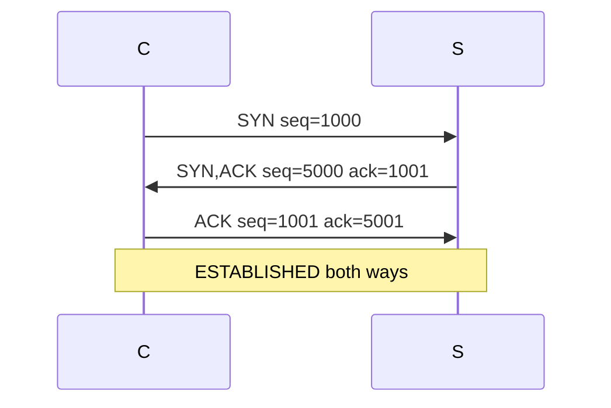
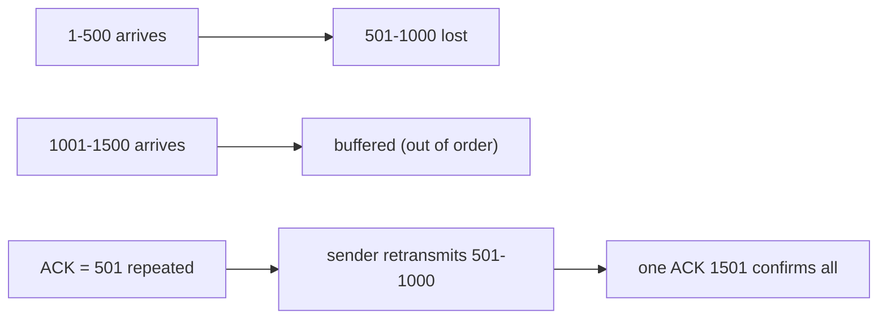

# Lecture 18 — TCP Connections & Reliability — Slide Deck

| Field | Value |
|---|---|
| Slides | 18 (120 min: 10 open · 55 teach · 5 break · 40 GA-18 · 10 wrap) |
| Companions | [`notes.md`](notes.md) · [`worksheet.md`](worksheet.md) (GA-18) |
| Style | [Course deck conventions](../../lectures/README.md#deck-conventions) |

## Deck outline

| # | Slide | # | Slide |
|---|---|---|---|
| 1 | Title | 10 | ACK mechanics |
| 2 | Hook: the conversation protocol | 11 | Out-of-order + cumulative ACK |
| 3 | TCP header walk | 12 | RTO: the adaptive timer |
| 4 | The byte stream model | 13 | Worked example: retransmit timeline |
| 5 | Handshake (diagram) | 14 | GA-18 brief |
| 6 | Why SYN consumes a seq | 15 | Classroom questions |
| 7 | ISN randomness | 16 | Common misconceptions |
| 8 | Connection teardown | 17 | Summary |
| 9 | Worked example: full handshake numbers | 18 | Exit question |

## Slides

### Slide 1 — Title
**Computer Networks — Lecture 18**
TCP connections & reliability (GA-18 today)

> Notes — Yesterday's absences, today's presence: sequence, acknowledgment, connection state.

### Slide 2 — Hook: the conversation protocol
- Phone call: "hello?" → "hello!" → business → "bye"
- TCP's handshake mirrors it — but with *numbers*
- The numbers are the protocol

> Notes — 2 min. The metaphor gets students to the table; the numbers are the examinable part (GA-18 is all numbers).

### Slide 3 — TCP header walk

```text
| Src port | Dst port | Seq | Ack | flags | Window | Checksum | ... |
```

- Today: Seq, Ack, flags (SYN/ACK/FIN/RST), Window
- Window previews L19 (flow control)

> Notes — Flag anatomy: each is one bit with a state-machine meaning. The header walk is deliberately partial — L19 adds Window's depth.

### Slide 4 — The byte stream model
- TCP delivers a **byte stream**, not messages
- Segments carry *slices* of the stream; seq numbers bytes
- Message boundaries = app's problem (HTTP has to say where it ends!)

> Notes — The stream-not-message point surprises everyone once. Content-length framing (L23) exists *because* TCP forgot where messages end.

### Slide 5 — Handshake (diagram)



- Three packets; both directions seeded

> Notes — THE diagram (visual-topic list). Walk it twice: once as hello-hello-go, once with numbers. Quiz W09 Q2 replicates it.

### Slide 6 — Why SYN consumes a seq
- SYN's seq counts as one byte "sent"
- Makes the handshake ACK-able and retransmit-safe
- Data then starts at ISN+1

> Notes — The +1s in slide 5 explained. Without it, a retransmitted SYN would be indistinguishable from data (review-M4 Q4's answer).

### Slide 7 — ISN randomness
- Predictable ISNs → off-path attackers can forge in-window segments
- Random ISNs make the sequence space unguessable
- Security by arithmetic, not by policy

> Notes — Quiz W09-adjacent (review M4 bank SA-14). One slide; the attack class gets its L26 workshop treatment later.

### Slide 8 — Connection teardown
- FIN → ACK → FIN → ACK (half-close possible)
- Or RST: abort on error/refusal
- TIME_WAIT: last-ACK holder lingers (why? — one sentence: stragglers)

> Notes — Teardown gets 90 seconds today; the state machine's full glory is enrichment. RST ties back to L03's "connection refused."

### Slide 9 — Worked example: full handshake numbers
- Client ISN 3000, server ISN 8000; client sends 500 B after
- Handshake: 3000/8001 → 8000/3001 → 3001/8001
- First data: seq=3001, len=500 → server ACKs **3501**

> Notes — GA-18's warm-up on the board; the worksheet generalizes it to six exchanges. Arithmetic desk-checked.

### Slide 10 — ACK mechanics
- **Cumulative**: "I have everything through N−1; send N"
- One ACK can confirm many segments
- Delayed ACK: receivers may hold ~40 ms (course-level)

> Notes — Cumulative = efficient but coarse (slide 11's cost). The delayed-ACK sentence is context for L19's timers.

### Slide 11 — Out-of-order + cumulative ACK



- The hole blocks *cumulative* progress; SACK reports around it

> Notes — The stream's traffic jam. SACK named here, dissected in bank C-22; L19's fast retransmit builds on the duplicate-ACK pattern.

### Slide 12 — RTO: the adaptive timer
- Inputs: RTT samples → smoothed srtt + variance rttvar
- RTO = srtt + 4·rttvar
- Too short → spurious retransmits; too long → idle stalls

> Notes — The formula is course-level (RFC 6298's shape). The *why adaptive* is the examinable part (quiz W09 Q5).

### Slide 13 — Worked example: retransmit timeline
- Send at t=0; RTO fires at t=1.0; retransmit; ACK at t=1.05
- Original arrives *late* → receiver sees duplicate → discards silently
- Duplicates are normal, not errors

> Notes — The timeline shows why duplicates exist and why they're harmless. Pairs with excerpt B's stall question (bank PA-05/06).

### Slide 14 — GA-18 brief
- Worksheet: complete two handshakes with given ISNs; annotate three data/ACK exchanges
- Then: read excerpt B (packet-analysis bank) and answer its stall questions
- 30 min pairs + plenary on the stall hypotheses

> Notes — The bank excerpt inside the worksheet is deliberate cross-instrument rehearsal (README §3's dedup rule: same skill, different artifact).

### Slide 15 — Classroom questions
1. Why 3-way and not 2-way?
2. Server ACKs 3501 — what does it *assert*?
3. A capture shows SYN → SYN,ACK → nothing. Which side died?

> Notes — Q1: both directions must sync independently (2-way syncs one). Q3: the client — no ACK, no data; the SYN-ACK proved the server path.

### Slide 16 — Common misconceptions
- "ACK means 'send more'" → it means "received through N−1"
- "Retransmission = failure" → it's the *design working*
- "TCP knows message boundaries" → it knows bytes only

> Notes — The first is the deepest; use the "next expected byte" phrasing every time, all semester.

### Slide 17 — Summary
- Stream model; handshake with numbers; cumulative ACKs
- RTO adapts; duplicates are normal
- Next: what limits the *rate* — flow & congestion control (L19)

> Notes — Recap by re-reading slide 5's diagram aloud with numbers called by the class.

### Slide 18 — Exit question
Client ISN 7000, server ISN 9000, client sends 200 B. Server's next ACK?
*(GA-18 worksheet due at break's end.)*

> Notes — Answer: 7201 (7000+1 SYN+200). Exit slips feed W09 pool.

### Demonstration instructions (instructor)
- GA-18 paper-first; excerpt B prints in the worksheet
- Optional live beat: `nc` listener + telnet-style client while capturing — the real 3-way appears; freeze-frame the seq/ack values
- No-device fallback fully supported (all excerpts printed)

### References for the deck
- RFC 9293 (TCP — current consolidated RFC)
- PD §5.2 (TCP), KR §3.5 (connection-oriented transport)
- Packet-analysis bank: Excerpt B
