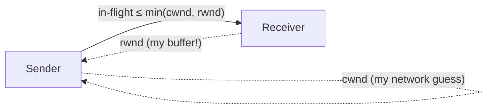
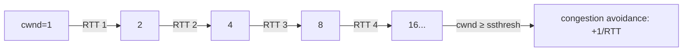

# Lecture 19 — TCP Flow & Congestion Control — Slide Deck

| Field | Value |
|---|---|
| Slides | 18 (120 min: 10 open · 50 teach · 5 break · 50 LAB-09 · 10 wrap) |
| Companions | [`notes.md`](notes.md) · [`worksheet.md`](worksheet.md) · [LAB-09](../../labs/lab-09-tcp-netem/README.md) |
| Style | [Course deck conventions](../../lectures/README.md#deck-conventions) |

## Deck outline

| # | Slide | # | Slide |
|---|---|---|---|
| 1 | Title | 10 | Congestion avoidance |
| 2 | Hook: the pipe that was full | 11 | Fast retransmit/recovery |
| 3 | Two windows (diagram) | 12 | Worked example: post-loss cwnd |
| 4 | rwnd: protecting the receiver | 13 | BDP: sizing windows |
| 5 | cwnd: protecting the network | 14 | Worked example: BDP check |
| 6 | min(cwnd, rwnd) | 15 | LAB-09 brief |
| 7 | Slow start (diagram) | 16 | Classroom questions |
| 8 | Worked example: slow-start ladder | 17 | Common misconceptions |
| 9 | Loss → ssthresh | 18 | Summary + exit |

## Slides

### Slide 1 — Title
**Computer Networks — Lecture 19**
TCP flow & congestion control (LAB-09 today)

> Notes — L18 made TCP *correct*; today makes it *polite and fast* — the two windows.

### Slide 2 — Hook: the pipe that was full
- A sender with "all the bandwidth" still stalls — why?
- Because it must fill a 30 ms pipe *before* the link matters
- Windows: how much may be in flight

> Notes — 2 min. The BDP intuition arrives at slide 13; the hook's stall = window smaller than the pipe.

### Slide 3 — Two windows (diagram)

- Effective limit = **min(cwnd, rwnd)**

> Notes — THE slide of the lecture (visual-topic). Two windows, two masters: receiver and network. Quiz W10 Q1 replicates.

### Slide 4 — rwnd: protecting the receiver
- Advertised in every ACK: "my buffer has this much room"
- Apps that read slowly shrink it → sender throttles
- "Slow reader, slow sender"

> Notes — The receiver's voice in the protocol. rwnd=0 pauses the flow (zero-window probe exists — enrichment footnote).

### Slide 5 — cwnd: protecting the network
- Sender's *belief* about safe in-flight amount
- No network signal exists — loss is the messenger
- Grows while unacked data keeps ACKing

> Notes — "Loss is the messenger" frames everything: congestion control is loss *interpretation*. LAB-09 makes the messenger visible under netem.

### Slide 6 — min(cwnd, rwnd)
- Both windows must allow a byte to fly
- Whichever is smaller *is* the throughput ceiling
- Diagnosing which one binds = L19's real skill (slide 14)

> Notes — The min() is the quiz's favorite phrase. The diagnostic skill transfers to the final exam's B4(d).

### Slide 7 — Slow start (diagram)

- Exponential probe, then linear creep

> Notes — The ladder is the visual (quiz W10 Q3 computes it). "Slow start isn't slow" — exponential; the name misleads everyone.

### Slide 8 — Worked example: slow-start ladder
- Start 1 MSS, RTT 40 ms, ssthresh 16
- RTT 1→2, 2→4, 3→8, 4→16 → transition at **160 ms**
- After: +1 MSS per RTT

> Notes — The table on the board mirrors the diagram. Students predict the transition RTT before the reveal.

### Slide 9 — Loss → ssthresh
- On loss: ssthresh ← cwnd/2; cwnd ← 1 (course's simplified rules)
- Slow start re-runs to ssthresh, then avoidance
- The sawtooth: grow, lose, halve, repeat

> Notes — Quiz W10 Q4 replicates. The sawtooth sketch (one line, repeated) is the classic congestion picture — draw it once.

### Slide 10 — Congestion avoidance
- Linear: +1 MSS per RTT — cautious growth near capacity
- Why linear? You're *at* the edge; probing must be gentle
- AIMD: add per RTT, multiply down on loss

> Notes — AIMD's fairness argument is enrichment (notes.md has the two-flow convergence sketch). The asymmetry (+1/−½) is the examinable shape.

### Slide 11 — Fast retransmit/recovery
- 3 duplicate ACKs → retransmit *now* (don't wait for RTO)
- Why 3? Three later segments arrived — reordering unlikely, loss likely
- Recovery: halve cwnd and continue (not reset)

> Notes — Connects to L18's duplicate-ACK mechanics. Fast recovery's "continue, don't reset" distinguishes from timeout behavior — course-level.

### Slide 12 — Worked example: post-loss cwnd
- Loss at cwnd = 20, ssthresh was 16
- New ssthresh = **10**; cwnd → 1; slow start to 10, then +1/RTT
- Time to return to 10: 4 RTTs (1,2,4,8,10-ish ladder)

> Notes — The ladder arithmetic keeps the numbers honest (desk-checked). LAB-09's T3 asks students to *observe* this shape in ss -ti.

### Slide 13 — BDP: sizing windows
- BDP = rate × RTT = the pipe's capacity in bytes
- Window < BDP → pipe never fills → rate = window/RTT
- Window ≥ BDP → link-limited (that's the goal)

> Notes — THE design formula (visual-topic: worked examples). 100 Mb/s × 50 ms = 625 kB (quiz W10 Q2) — memorize the *method*, not the number.

### Slide 14 — Worked example: BDP check
- Observed: 5 Mb/s at RTT 20 ms, loss-free
- Implied window = 5×10⁶ × 0.02 = 100 kb = **12.5 kB**
- BDP = 250 kB → window-bound, not network-bound

> Notes — The diagnostic template: compute implied window, compare to BDP, name the limiter (review-M4 Q16, final B4(d)).

### Slide 15 — LAB-09 brief
- Pairs: netem path (50 ms each way), then 0/1/2% loss runs
- Record throughput + retransmit counters per setting
- Interpretation: which mechanism limited each run

> Notes — 50 min. The lab's physics was corrected in the build phase — both directions shaped (lab README notes the one-sided teaching variant).

### Slide 16 — Classroom questions
1. Which window shrinks when the app reads slowly?
2. cwnd doubles per RTT — what stops the doubling?
3. Loss-free path, 1 Gb/s, 40 ms: what window fills the pipe?

> Notes — Q3: 5 MB (review-M4 Q8). All three are retrieval from slides 4/7/13 — spaced practice by design.

### Slide 17 — Common misconceptions
- "Slow start is slow" → exponential; it's *cautious-start*
- "Loss means the link is broken" → loss is congestion's *signal* here
- "Bigger rwnd fixes everything" → cwnd may still bind

> Notes — The second one reframes loss positively — it's how TCP *learns*; LAB-09's 2% run shows the cost of learning.

### Slide 18 — Summary + exit
- min(cwnd, rwnd); slow start → avoidance; AIMD sawtooth
- BDP tells you what "full" means
- **Exit question**: 10 Mb/s at 30 ms RTT, loss-free — implied window?
*(Next: you build your own reliability — the project.)*

> Notes — Answer: 10×10⁶×0.03 = 300 kb = 37.5 kB. Exit slips feed W10 pool (graded-window candidate week).

### Demonstration instructions (instructor)
- LAB-09: netem on *both* directions of the lab router (build-phase fix) — ITI: verify `tc qdisc` on the teaching image the week before
- Capture beat: `ss -ti` during a run shows cwnd live — the sawtooth in numbers
- Fallback: worksheet's synthetic ss/iperf3 outputs (labeled) allow full interpretation offline

### References for the deck
- RFC 5681 (congestion control), RFC 6298 (RTO)
- PD §5.2 (flow/congestion), KR §3.5–3.6
- LAB-09 package: [`../../labs/lab-09-tcp-netem/README.md`](../../labs/lab-09-tcp-netem/README.md)
