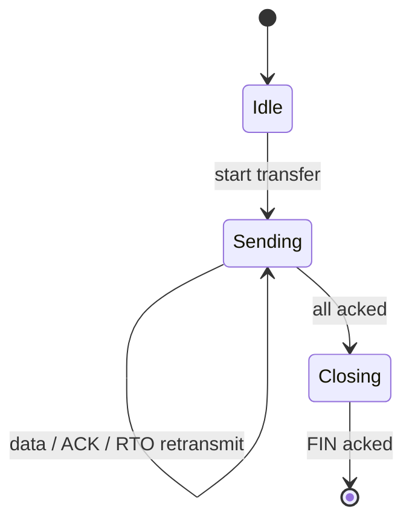

# Lecture 20 — Reliable Transport over UDP: Project Lab — Slide Deck

| Field | Value |
|---|---|
| Slides | 16 (120 min: 10 open · 35 teach · 5 break · 60 LAB-10 spec+build · 10 wrap; graded window candidate) |
| Companions | [`notes.md`](notes.md) · [`worksheet.md`](worksheet.md) · [LAB-10](../../labs/lab-10-reliable-design/README.md) · [project brief](../../assessments/assignments/reliable-transport-project-student.md) |
| Style | [Course deck conventions](../../lectures/README.md#deck-conventions) |

## Deck outline

| # | Slide | # | Slide |
|---|---|---|---|
| 1 | Title | 9 | Sliding window |
| 2 | Hook: rebuild TCP in two weeks | 10 | Worked example: window state |
| 3 | The reliability toolkit | 11 | LAB-10 brief: spec milestone |
| 4 | Segment format design | 12 | Classroom questions |
| 5 | Sequence & ACK design | 13 | Common pitfalls |
| 6 | Retransmission policy | 14 | Summary |
| 7 | The state machine (diagram) | 15 | Exit question |
| 8 | Worked example: one loss cycle | 16 | Project logistics slide |

## Slides

### Slide 1 — Title
**Computer Networks — Lecture 20**
Reliable transport over UDP — project lab

> Notes — The course's pair project begins: L17's datagrams + L18/L19's ideas = your own TCP.

### Slide 2 — Hook: rebuild TCP in two weeks
- You know the parts: seq, ACK, RTO, window
- Today: design *your* protocol; W10 spec, W12 demo
- Constraint: Python stdlib, UDP only

> Notes — 2 min. Point at the brief (10% weight, pair work, explainability rule). The spec milestone is *this week's* deliverable.

### Slide 3 — The reliability toolkit

| Tool | Fixes | Cost |
|---|---|---|
| Sequence numbers | reorder/dup detection | header bytes |
| ACKs | confirmation | traffic |
| RTO retransmit | loss | latency on false fire |
| Sliding window | throughput | buffer + bookkeeping |

> Notes — The menu for their design; every row was learned at L18/L19. "Pick deliberately, justify each" — that's the spec.

### Slide 4 — Segment format design

```text
| magic | type(DATA/ACK/FIN) | seq | ack | window | len | payload |
```

- Fixed header, your field sizes, documented
- Type field = your own state machine's vocabulary

> Notes — Students design *their* layout today; the worksheet provides a strawman to argue with. Design-quality marks live here (project rubric).

### Slide 5 — Sequence & ACK design
- Per-segment or per-byte? (Per-segment: simpler, fine at lab scale)
- Cumulative vs selective ACK (selective = design bonus)
- ACK piggybacking on data — free win

> Notes — The trade-off triangle from bank LA-07: latency vs reliability vs ordering. Decisions must be *written*, not implied.

### Slide 6 — Retransmission policy
- RTO value: fixed is acceptable — *stated and justified*
- Adaptive (srtt/rttvar) = bonus territory
- Duplicate-suppression: ignore re-ACKed data

> Notes — The rubric's correctness dimension hinges on this working under 2% loss. The brief's common-pitfalls list (fixed-RTO-too-short) comes from the instructor guide.

### Slide 7 — The state machine (diagram)



- One direction suffices; document the events on every arrow

> Notes — The diagram is the spec's spine; review-M4 Q11 asks students to *name* these states. Missing close/teardown is the classic spec gap.

### Slide 8 — Worked example: one loss cycle
- Send seq 1–5; seq 3 lost
- Receiver: ACK 1,2 → buffer 4,5 (if buffering) → duplicate ACK pattern
- Sender: RTO or gap-detect → retransmit 3 → receiver completes, ACKs 6

> Notes — The full story on one slide; the worksheet's T2 makes pairs *trace* it with their own format. Order-of-events precision is the skill.

### Slide 9 — Sliding window
- Window = how many unacked segments may be outstanding
- Fill, wait for ACKs, slide forward
- Size rationale: ≥ 2× BDP, or a documented reason for less

> Notes — L19's min(cwnd,rwnd) intuition, minus congestion (their window is *policy*, not network-inferred — a deliberate simplification to state).

### Slide 10 — Worked example: window state
- Window 4; sent 1–4, ACKed 1–2
- In-flight = 2 → may send 5,6
- ACK 3 arrives → slide; send 7

> Notes — The bookkeeping in 3 lines; the worksheet's T3 has pairs run it for 10 events. This is the project's beating heart.

### Slide 11 — LAB-10 brief: spec milestone
- Pairs write the ≤4-page spec: format, states, timers, window, *test plan*
- Test plan must name real netem commands (1%, 2%)
- Spec due W10 (this week); gate-checked by instructor

> Notes — 60 min build+draft starts now. The four spec gates from the instructor guide: seq/ACK layout, timers, close, test plan.

### Slide 12 — Classroom questions
1. Why does per-byte seq complicate your design?
2. Your RTO fires while the ACK is in flight — what did you build wrong?
3. Window=1: what protocol did you just invent?

> Notes — Q2: RTO shorter than RTT = spurious retransmits (the brief's pitfall list). Q3: stop-and-wait — correct but slow; honest sizing earns design marks.

### Slide 13 — Common pitfalls
- Seq counted per-segment in sender, per-byte in receiver
- No close/teardown — receiver can't know "done"
- Test plan that never runs netem ("it worked on loopback")

> Notes — Read verbatim from the instructor guide's pitfall list; spec gate-checking catches all three in week one.

### Slide 14 — Summary
- Toolkit → format → states → window: the design order
- Spec = the deliverable *this week*
- Next week: build + test under loss (LAB-11)
- Next: DNS — the Internet's phone book (L21)

> Notes — Timeline check: spec drafts should exist before students leave; 10 minutes of quiet drafting ends the session.

### Slide 15 — Exit question
Your window is 4; segments 1–3 are unacked. How many new segments may you send?
*(Spec due next session — bring a draft.)*

> Notes — Answer: 1 (4−3). Exit slips feed W10 pool.

### Slide 16 — Project logistics slide
- Pairs fixed this week; both members answer demo questions (W12)
- Integrity: pair instrument — no outside/AI code (integrity doc §1/§3)
- Rubric: correctness 40 / design 25 / interpretation 20 / clarity 15

> Notes — Point to the brief + rubric files; the explainability rule is the one that surprises pairs — say it twice.

### Demonstration instructions (instructor)
- LAB-10: namespaces ready; a reference skeleton (segment format stub) helps weaker pairs start — keep it optional
- ITI: run the reference solution once this week (instructor guide's checklist); verify netem helper
- Wrap-up: collect spec *draft titles* (who-pairs-with-whom) for the W10 gate

### References for the deck
- Project brief: [`../../assessments/assignments/reliable-transport-project-student.md`](../../assessments/assignments/reliable-transport-project-student.md)
- RFC 9293 (the protocol you're re-deriving)
- LAB-10/11 packages: [`../../labs/lab-10-reliable-design/README.md`](../../labs/lab-10-reliable-design/README.md)
