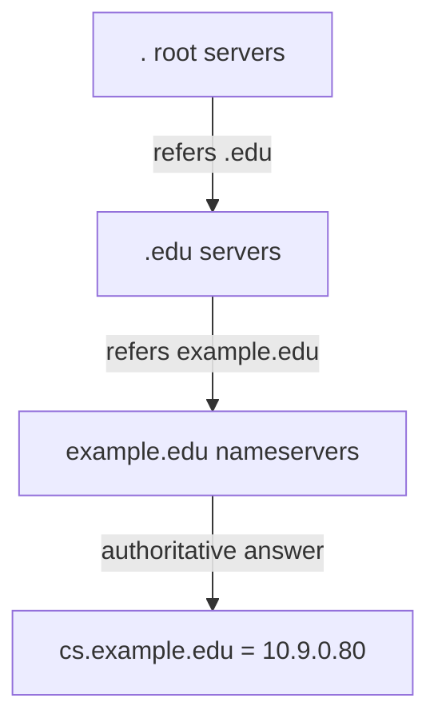
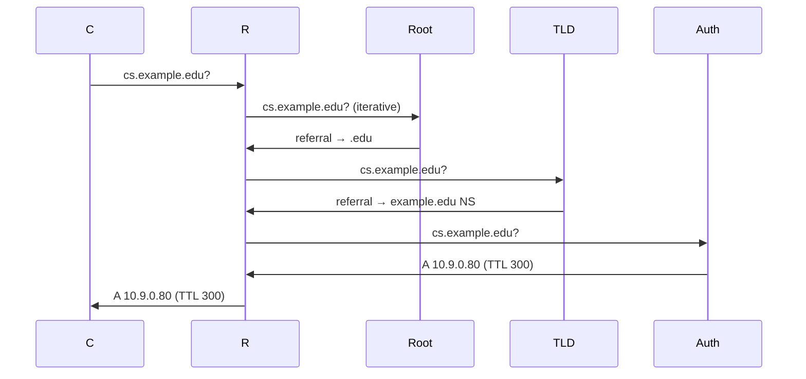

# Lecture 21 — DNS — Slide Deck

| Field | Value |
|---|---|
| Slides | 18 (120 min: 10 open · 55 teach · 5 break · 40 GA-21 · 10 wrap) |
| Companions | [`notes.md`](notes.md) · [`worksheet.md`](worksheet.md) (GA-21) |
| Style | [Course deck conventions](../../lectures/README.md#deck-conventions) |

## Deck outline

| # | Slide | # | Slide |
|---|---|---|---|
| 1 | Title | 10 | Record types table |
| 2 | Hook: the phone book that runs the world | 11 | TTL: the staleness dial |
| 3 | The naming tree | 12 | Worked example: TTL judgment |
| 4 | Delegation (diagram) | 13 | GA-21 brief |
| 5 | Recursive vs iterative | 14 | Classroom questions |
| 6 | Resolution walk (diagram) | 15 | Common misconceptions |
| 7 | Caching: who remembers | 16 | Summary |
| 8 | Worked example: trace the queries | 17 | Exit question |
| 9 | UDP vs TCP for DNS | 18 | DNSSEC preview |

## Slides

### Slide 1 — Title
**Computer Networks — Lecture 21**
DNS

> Notes — Module 5: the application protocols. DNS first — every other protocol depends on it.

### Slide 2 — Hook: the phone book that runs the world
- You typed a name; a connection used a number
- Names → numbers at planetary scale, mostly answered from *cache*
- The protocol is a tree walk + a caching rule

> Notes — 2 min. "Mostly cache" is the punchline slide 7 develops; today ends with a TTL judgment call.

### Slide 3 — The naming tree
- Root → TLD (`.edu`) → domain (`example.edu`) → host (`cs.example.edu`)
- Written right-to-left; read right-to-left as *increasing specificity*
- Zones: the slices one server is authoritative for

> Notes — The tree is the data structure; zones are its management slices. Draw the tree once; slide 4 animates a walk on it.

### Slide 4 — Delegation (diagram)

- Each level answers "ask *there*" — referrals, not lookups

> Notes — THE mechanism diagram (visual-topic list). Referral semantics = quiz W11 Q2's answer skeleton.

### Slide 5 — Recursive vs iterative
- **Recursive** (your resolver): does the whole walk *for* you
- **Iterative** (the walk itself): each server hands a referral
- Your stub resolver is simple: ask the recursive one

> Notes — Who-does-the-legwork phrasing (review-M5 Q1). The campus resolver is recursive; the root is strictly iterative.

### Slide 6 — Resolution walk (diagram)

- Cache fills at every step on the way back

> Notes — The full sequence on one slide; slide 8 re-walks it with *hits* instead of misses. Packet-analysis bank's excerpt C is this walk's wire form.

### Slide 7 — Caching: who remembers
- Your OS caches → your resolver caches → resolvers worldwide cache
- TTL governs each cache's memory span
- Fewer root queries globally because of this pyramid

> Notes — The pyramid explains why the root survives (billions of queries, ~1500/s per root server region — order-of-magnitude, not precise stats).

### Slide 8 — Worked example: trace the queries
- Resolver, empty cache, queries `www.example.com` — 3 queries out
- Second client asks same name: **0 queries** (cache hit)
- Third asks `api.example.com` — 1 query (only the A record missing)

> Notes — The cache-hit ladder (quiz W11 Q2's second half). Students predict each query count before reveal.

### Slide 9 — UDP vs TCP for DNS
- UDP :53 default — one query, one reply
- TCP :53 for truncation (big answers) and zone transfers
- The L17 "when UDP wins" list, exhibit A

> Notes — One slide; the truncation fallback is the honest nuance (review-M5's backup question). Port 53 in both protocols — same port number, two demux lanes.

### Slide 10 — Record types table

| Type | Holds |
|---|---|
| A | name → IPv4 |
| AAAA | name → IPv6 |
| CNAME | name → name |
| MX | mail routing |
| NS | zone's servers |

> Notes — Quiz W11 Q1 tests the first four verbatim. CNAME chains appear in excerpt C — students decode them there.

### Slide 11 — TTL: the staleness dial
- TTL = how long a resolver may keep the answer
- Short: fast change propagation, more query load
- Long: quiet networks, slow emergencies

> Notes — The dial's two directions (quiz W11 Q3). The judgment call arrives at slide 12.

### Slide 12 — Worked example: TTL judgment
- Server move planned Saturday 02:00; records at TTL 86 400
- Question: when must TTL drop, and to what?
- Answer: **days before**, to ~300 s — caches must expire *before* the move

> Notes — The operational judgment (LA-08's second mechanism). Quiz-level: "what breaks with high TTL before a move" — exactly this.

### Slide 13 — GA-21 brief
- Worksheet: resolve 3 names on paper given a cache-state table
- Then: excerpt C (CNAME chain) — count records, name the stale object
- Plenary: TTL choices for three scenarios

> Notes — 30 min. The cache-state table makes cache *hits* computable — the worksheet's core mechanic.

### Slide 14 — Classroom questions
1. Root servers don't know `cs.example.edu` — what do they send?
2. TTL expired mid-flight: serve stale or refetch? (both defensible — argue)
3. Which record type does a mail client look up?

> Notes — Q2 is the lazy-vs-eager cache discussion (bank C-24) — there is no single right answer; the *argument* is the mark.

### Slide 15 — Common misconceptions
- "DNS finds *the* IP" → it finds *an* answer the zone owner chose (CDNs, round-robin)
- "TTL is the query timeout" → it's the *caching* span
- "Changing DNS is instant" → caches age at TTL speed

> Notes — The first misconception sets up slide 18's DNSSEC boundary and L23's CDN mechanics.

### Slide 16 — Summary
- Tree + delegation; recursive resolvers do the walking
- Cache pyramid; TTL is the staleness dial
- Records: A/AAAA/CNAME/MX/NS
- Next: DHCP deep dive — the address side of the same story (L22)

> Notes — Recap by the resolution-walk diagram; students name the three query targets in order.

### Slide 17 — Exit question
A record's TTL is 300. You change the IP now. Worst-case staleness for a caching resolver?
*(GA-21 due at session end.)*

> Notes — Answer: up to 300 s (minus elapsed age). Exit slips feed W11 pool.

### Slide 18 — DNSSEC preview
- Signs DNS records: origin authenticity + integrity
- Stops: forged answers (resolver-side validation)
- Doesn't stop: post-resolution interception, malicious-but-legit domains

> Notes — One-slide preview (full crypto machinery at L24; bank SA-16/C-27 carry the boundary). Quiz W11 Q6 asks the "why is trust a security question" framing.

### Demonstration instructions (instructor)
- GA-21 paper-first; excerpt C prints in the worksheet
- Live beat: `dig +trace cs.example.edu` (or any live domain) — the referrals scroll exactly like slide 6 (ITI: needs outbound DNS; else run on a campus domain from the lab VM)
- No-network fallback: worksheet's printed dig transcripts (labeled synthetic where edited)

### References for the deck
- RFC 1034/1035 (DNS), RFC 2181 (TTL semantics)
- PD §7.1 / KR §2.4 (DNS — ⚠ verify sections)
- Packet-analysis bank: Excerpt C
