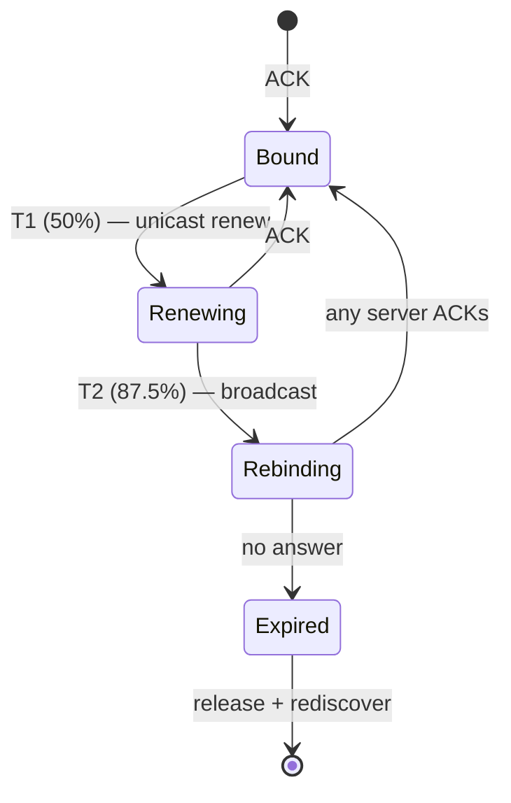
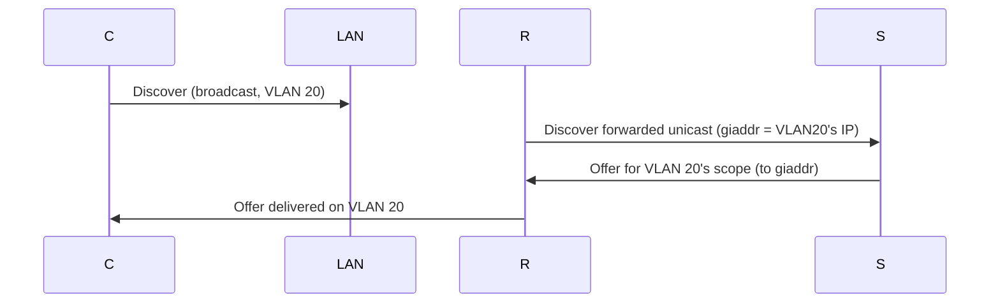

# Lecture 22 — DHCP Deep Dive & Address Management — Slide Deck

| Field | Value |
|---|---|
| Slides | 17 (120 min: 10 open · 55 teach · 5 break · 40 GA-22 · 10 wrap) |
| Companions | [`notes.md`](notes.md) · [`worksheet.md`](worksheet.md) (GA-22) |
| Style | [Course deck conventions](../../lectures/README.md#deck-conventions) |

## Deck outline

| # | Slide | # | Slide |
|---|---|---|---|
| 1 | Title | 10 | Relay: giaddr (diagram) |
| 2 | Hook: the pool that drained itself | 11 | Worked example: capacity math |
| 3 | Lease lifecycle (diagram) | 12 | Address management practices |
| 4 | T1/T2/expiry walk | 13 | GA-22 brief |
| 5 | Renewal: unicast vs broadcast | 14 | Classroom questions |
| 6 | Pool sizing | 15 | Common misconceptions |
| 7 | Worked example: churn math | 16 | Summary |
| 8 | Reservations & exclusions | 17 | Exit question |
| 9 | Multiple scopes & VLANs | | |

## Slides

### Slide 1 — Title
**Computer Networks — Lecture 22**
DHCP deep dive & address management

> Notes — L14 introduced DORA in 5 minutes; today owns the lifecycle, the math, and the failure stories.

### Slide 2 — Hook: the pool that drained itself
- 09:00: 300 devices; pool: 241 addresses; leases: 24 h
- By 09:07: "no network" for the last 60 arrivals
- Every number here is a design decision

> Notes — 2 min. Case bank PB-044 is this story's full version; today builds the vocabulary to solve it.

### Slide 3 — Lease lifecycle (diagram)

- The state machine L14 compressed into one slide — now it's the syllabus

> Notes — THE diagram (visual-topic). Quiz W11 Q4 and review-M5 Q5 both trace it. Bound→Expired without renewal = the APIPA story.

### Slide 4 — T1/T2/expiry walk
- **T1 (50%)**: renew with the *original* server — unicast, calm
- **T2 (87.5%)**: any server will do — broadcast, desperate
- **Expiry**: stop using the address immediately

> Notes — The escalation ladder: polite → urgent → abandon. Why fractions, not minutes: leases vary from hours to weeks (review-M5 Q6).

### Slide 5 — Renewal: unicast vs broadcast
- At T1 the client *has* an address — it can talk unicast to the server
- Broadcast only when identity/address no longer suffice
- The symmetry with DORA's broadcast rule is the lesson

> Notes — Quiz W09-adjacent (quiz bank has the DORA broadcast question; this is its renewal-side twin). "Broadcast when you must be found, unicast when you know where to go."

### Slide 6 — Pool sizing
- Pool ≥ concurrent demand, not enrolled devices
- Lease duration trades churn vs recycling speed
- Short leases: fast recycle, noisy; long: quiet, sticky

> Notes — The sizing equation is slide 11's worked example. "Concurrent, not enrolled" is the quiz-phrase.

### Slide 7 — Worked example: churn math
- Pool: 241; morning burst: 300 devices in 10 min; lease 24 h
- First 10 min: ~60 devices find no address
- Fix levers: shorter leases (recycle), bigger pool, staggered logins

> Notes — The arithmetic behind the hook. GA-22's worksheet scales this to three scenarios; quiz W11 Q5 replicates the diagnosis shape.

### Slide 8 — Reservations & exclusions
- Reservation: MAC → fixed IP (printers, servers-ish)
- Exclusion: carve ranges out of the pool (static devices)
- Both = "DHCP with guardrails"

> Notes — The operator's everyday tools. Exam design questions love "which devices get reservations and why."

### Slide 9 — Multiple scopes & VLANs
- One scope per subnet/VLAN (L09's design returns)
- Scopes never overlap; options differ per scope (gateway!)
- Wrong scope = the PC-2 story from quiz W07 Q5

> Notes — Ties L9's segmentation to address management. The wrong-scope failure is a real campus classic — PB-047-adjacent.

### Slide 10 — Relay: giaddr (diagram)

- giaddr tells the server *which scope* to serve

> Notes — Why one server can serve the whole campus. Review-M3 Q8's answer in diagram form; LAB-05 configured exactly this.

### Slide 11 — Worked example: capacity math
- Scope 10.1.6.0/23: 512 − 2 = 510; minus 10 printers = **500** dynamic
- Demand: 490 devices, 2 devices/hour turnover
- Verdict: fits — but headroom is 2%; growth plan needed (bank N-22's habit)

> Notes — Bank N-16's numbers reused deliberately (README §3 dedup rule: different artifact, same skill). The 2% headroom flag is the design-judgment payoff.

### Slide 12 — Address management practices
- Document every scope: range, gateway, DNS, purpose
- Monitor utilization (5-min polls at L29 will alert at 90%)
- Change control: scope edits go through review

> Notes — The operations turn: DHCP is now a *managed service*, not a config file. Feeds the capstone's services section.

### Slide 13 — GA-22 brief
- Worksheet: three scenarios (draining pool, wrong scope, relay failure)
- For each: diagnose from symptoms, name the mechanism, propose the fix
- 30 min pairs + plenary on the relay one

> Notes — The three scenarios map to quiz W07 Q5, PB-044, and slide 10 respectively. Deliberate convergence — the worksheet is the rehearsal surface.

### Slide 14 — Classroom questions
1. Why does a client broadcast at T2 but unicast at T1?
2. Two DHCP servers, one subnet — what happens? (both answer!)
3. Where does the relay insert its address, and what does the server do with it?

> Notes — Q2: race → both offers; client picks (usually first) — the PB-027-style duel. Q3: giaddr → scope selection (slide 10).

### Slide 15 — Common misconceptions
- "Expired lease = device keeps the IP quietly" → it must stop using it
- "Bigger pools fix everything" → churn still exhausts small windows (slide 7)
- "DHCP gives addresses to MACs it's never seen" → yes — that's the point (and the security angle, L26)

> Notes — The last one seeds rogue-DHCP (attacker serving answers) — named here, defended in L25/L26.

### Slide 16 — Summary
- Lifecycle: Bound → T1 → T2 → Expired
- Pool math is churn math; reservations/exclusions are guardrails
- Relays + giaddr scale DHCP across VLANs
- Next: the protocols you *use* — HTTP/2/3, SMTP, SSH (L23)

> Notes — Recap by the state machine; students name the two timers and their trigger behaviors.

### Slide 17 — Exit question
T1 = 4 h. What's the full lease, and what happens at T1 if the original server is down?
*(GA-22 due at session end.)*

> Notes — Answer: 8 h lease; at T1 unicast renew fails → client waits/retries until T2 (7 h), then broadcasts. Exit slips feed W11 pool.

### Demonstration instructions (instructor)
- GA-22 paper-first; scenarios print in the worksheet
- Live beat (optional): shorten a lab scope's lease to 60 s, watch renewals in the capture — the T1 unicast appears (ITI: lab router + dnsmasq, per LAB-05 environment)
- Fallback: worksheet's printed captures carry the beats offline

### References for the deck
- RFC 2131 (DHCP semantics, T1/T2), RFC 3046 (relay agent information)
- PD §4.3 / KR §4.3 (DHCP — ⚠ verify sections)
- Case bank: PB-027, PB-044
