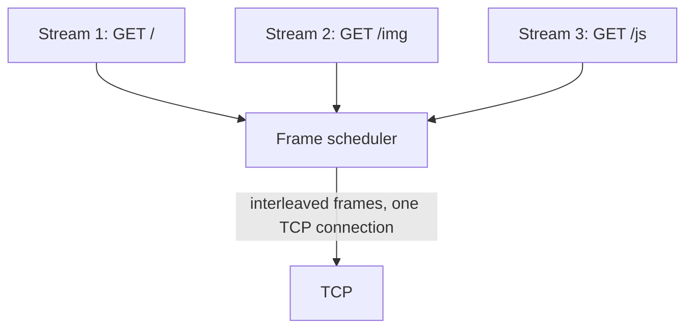
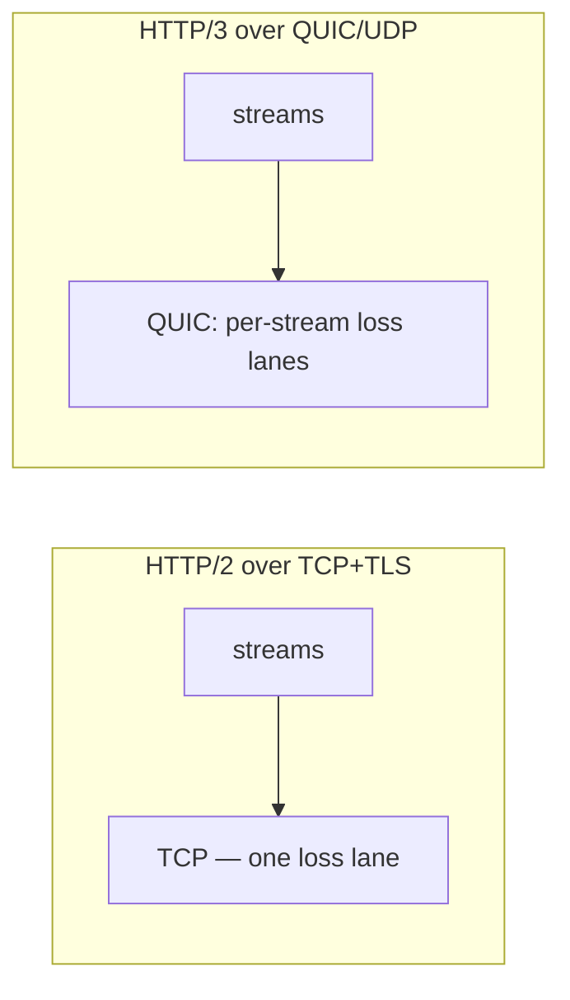

# Lecture 23 — HTTP/2 & HTTP/3, SMTP, SSH — Slide Deck

| Field | Value |
|---|---|
| Slides | 18 (120 min: 10 open · 50 teach · 5 break · 50 LAB-12 · 10 wrap) |
| Companions | [`notes.md`](notes.md) · [`worksheet.md`](worksheet.md) · [LAB-12](../../labs/lab-12-app-protocols/README.md) |
| Style | [Course deck conventions](../../lectures/README.md#deck-conventions) |

## Deck outline

| # | Slide | # | Slide |
|---|---|---|---|
| 1 | Title | 10 | SMTP: push & relays |
| 2 | Hook: 40 objects, 6 connections | 11 | Envelope vs headers |
| 3 | HTTP/1.1: the serial protocol | 12 | SSH: one channel, many sessions |
| 4 | Pipelining's false promise | 13 | Worked example: read the capture |
| 5 | HTTP/2 multiplexing (diagram) | 14 | LAB-12 brief |
| 6 | Streams: the fix | 15 | Classroom questions |
| 7 | Residual HOL at TCP | 16 | Common misconceptions |
| 8 | Worked example: 40 objects math | 17 | Summary |
| 9 | HTTP/3: QUIC (diagram) | 18 | Exit question |

## Slides

### Slide 1 — Title
**Computer Networks — Lecture 23**
HTTP/2 & HTTP/3, SMTP, SSH (LAB-12 today)

> Notes — Three protocols you use daily; each is a transport-design story.

### Slide 2 — Hook: 40 objects, 6 connections
- A page = 40 images/scripts; HTTP/1.1 = one request per connection
- Browser opens 6 parallel connections — still 7 rounds
- Today: two rewrites of this problem + two side quests

> Notes — The hook's math resolves at slide 8. Keep the browser behavior concrete: connection limits were real.

### Slide 3 — HTTP/1.1: the serial protocol
- One outstanding request per connection
- New connection = TCP + (once) TLS setup each time
- Simple to implement, wasteful to use

> Notes — The baseline everyone knows implicitly. Quiz W11-adjacent vocabulary: head-of-line *at the application layer*.

### Slide 4 — Pipelining's false promise
- Send request 2 before response 1? Allowed — but responses stay in order
- One slow response blocks everything behind it (head-of-line)
- Browsers disabled it; the fix needed new framing

> Notes — "Pipelining failed" is history's design lesson: you can't multiplex without *framing*. Sets up H2's binary frames.

### Slide 5 — HTTP/2 multiplexing (diagram)

- Requests/responses interleave as small *frames* with stream IDs

> Notes — THE diagram (visual-topic list). Framing is the magic: the receiver reassembles by stream ID. Quiz W11-adjacent Q8/Q9 material.

### Slide 6 — Streams: the fix
- Each request = a stream; streams interleave freely
- Slow response on stream 2 no longer blocks stream 3
- Header compression (HPACK) rides along

> Notes — One sentence per gain; HPACK by name only. The exam question: "what do streams prevent that pipelining couldn't" (review-M5 Q8).

### Slide 7 — Residual HOL at TCP
- One lost TCP segment: *all* streams stall waiting for retransmission
- L7 solved; L4 kept the traffic jam
- The problem HTTP/3 was invented to delete

> Notes — The setup slide for H3. Quiz W12 Q6 asks exactly where the residual blocking lives (TCP layer).

### Slide 8 — Worked example: 40 objects math
- HTTP/1.1, 6 connections, 50 ms RTT, no reuse: 40/6 → 7 rounds → **350 ms**
- HTTP/2, 1 connection: all 40 interleaved → ≈ 1–2 RTT-scale
- Same network; protocol design changed the number

> Notes — Review-M5 Q12's arithmetic live. Assumptions aloud (no server processing time, objects are small).

### Slide 9 — HTTP/3: QUIC (diagram)

- UDP + per-stream reliability + integrated crypto handshake

> Notes — Quiz W12 Q1's answer rendered. "Folds transport+crypto into fewer round trips" — the handshake-win clause from the quiz key.

### Slide 10 — SMTP: push & relays
- Mail *pushes* hop to hop: sender → relay → relay → mailbox
- Store-and-forward: delivery in minutes-to-days, not interactive
- Queues retry on failure — patience built in

> Notes — The timing consequence (quiz W12 Q2 first clause). "Mail has more in common with postal routes than web requests."

### Slide 11 — Envelope vs headers
- Envelope: MAIL FROM / RCPT TO — what the *protocol* uses
- Headers: From:/To: — what *humans* see
- Spoofing lives in the gap between them

> Notes — The two-identity structure (quiz W12 Q2's second clause). SPF/DKIM/DMARC named as the modern patchwork — mechanism at L24/L26.

### Slide 12 — SSH: one channel, many sessions
- One authenticated+encrypted transport; sessions multiplexed inside
- One handshake protects all — no per-session cost
- The multiplexing pattern *again* (H2, QUIC, SSH — same idea)

> Notes — The pattern-recognition payoff: three protocols, one transport design lesson. Quiz W11-adjacent SA-17 (review-M5 Q11) asks it for SSH.

### Slide 13 — Worked example: read the capture
- LAB-12's offline trace: H1.1 vs H2 connection for the same page
- Count connections, count outstanding requests, find the stall
- H3 excerpt (if captured): no TCP at all — QUIC packets

> Notes — 5 min guided read; the worksheet's T1–T3 formalize it. No fake screenshots — the trace files print as text listings.

### Slide 14 — LAB-12 brief
- Pairs: dissect HTTP/1.1 → H2 → H3 handoffs on provided captures
- Then TLS handshake anatomy + one SMTP dialog
- Deliverable: side-by-side table + 5 interpretation questions

> Notes — 50 min. The lab is dissection-only (no server admin) — safe and offline-capable.

### Slide 15 — Classroom questions
1. Where does HTTP/2's multiplexing live — TCP or the HTTP layer?
2. Why does mail retry rather than fail?
3. What do H2 and SSH have in common transport-wise?

> Notes — Q1: HTTP layer — the residual problem is TCP's (the trap). Q3: multiplexing over one protected channel.

### Slide 16 — Common misconceptions
- "HTTP/2 always faster" → lossy links can make H2 *worse* (HOL); case bank PB-046 rehearses it
- "QUIC = UDP with no reliability" → QUIC *adds* reliability per stream
- "SMTP From: is authenticated" → only the envelope was; headers are display

> Notes — The first misconception's counterexample (lossy link) is the case bank's PB-046 — assign it as reading tonight.

### Slide 17 — Summary
- H1.1 serial → H2 multiplexed → H3 per-stream loss lanes
- SMTP: push, relays, envelope≠headers
- SSH: one channel, many sessions — the pattern repeats
- Next: the crypto under all of it (L24)

> Notes — Recap by the three-diagram arc; students name the residual-HOL location cold.

### Slide 18 — Exit question
One lost TCP segment during an H2 transfer: which streams stall? Under H3?
*(LAB-12 due next session.)*

> Notes — Answer: all streams (TCP-level HOL); only the affected stream's (QUIC per-stream). Exit slips feed W12 pool — **syllabus Quiz-2 window next session**.

### Demonstration instructions (instructor)
- LAB-12: offline capture bundle (H1.1/H2/H3 + TLS + SMTP) ships with the lab package — ITI: capture once on the teaching image, label, print excerpts
- Live beat (optional): `curl --http2 -v` vs `--http3` against a test endpoint (needs outbound; else use the bundle)
- No-device rooms: the printed trace listings carry the whole lab

### References for the deck
- RFC 9110/9112 (HTTP), RFC 7540 (H2), RFC 9000 (QUIC), RFC 5321 (SMTP), RFC 4251 (SSH)
- PD §2.5 (application layer)
- LAB-12 package: [`../../labs/lab-12-app-protocols/README.md`](../../labs/lab-12-app-protocols/README.md)
