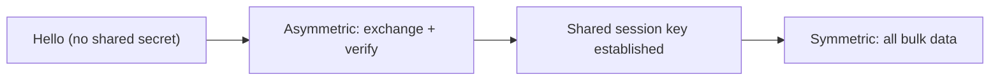
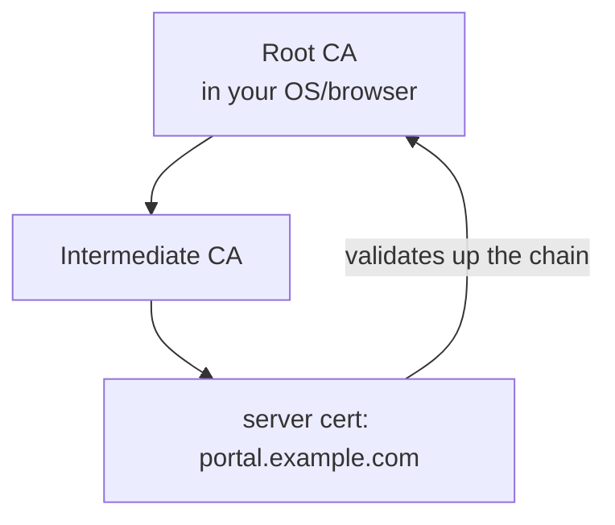

# Lecture 24 — Security Principles & Cryptographic Building Blocks — Slide Deck

| Field | Value |
|---|---|
| Slides | 17 (120 min: 10 open · 55 teach · 5 break · 40 GA-24 · 10 wrap) |
| Companions | [`notes.md`](notes.md) · [`worksheet.md`](worksheet.md) (GA-24: certificate chain + TLS) |
| Style | [Course deck conventions](../../lectures/README.md#deck-conventions) |

## Deck outline

| # | Slide | # | Slide |
|---|---|---|---|
| 1 | Title | 10 | Certificates: the binding |
| 2 | Hook: the envelope, the seal, the signature | 11 | Trust chains (diagram) |
| 3 | The CIA triad (+accountability) | 12 | Worked example: read a warning |
| 4 | Symmetric vs asymmetric | 13 | TLS 1.3 handshake sketch |
| 5 | Why both (diagram) | 14 | GA-24 brief |
| 6 | Hashes | 15 | Classroom questions |
| 7 | Signatures | 16 | Common misconceptions |
| 8 | Worked example: match goal to tool | 17 | Summary + exit |

## Slides

### Slide 1 — Title
**Computer Networks — Lecture 24**
Security principles & cryptographic building blocks (GA-24 today)

> Notes — Module 6: security. Today is *vocabulary + mechanisms*; L25–L26 apply them.

### Slide 2 — Hook: the envelope, the seal, the signature
- Envelope: nobody reads it (confidentiality)
- Seal: broken if opened (integrity)
- Signature: provably yours (authenticity)
- Crypto = these three, formalized

> Notes — 2 min. The metaphor maps 1:1 to the lecture's three tools; quiz W12 Q3's triad mapping rides on it.

### Slide 3 — The CIA triad (+accountability)

| Letter | Goal | Example |
|---|---|---|
| C | confidentiality | encrypted dumps are unreadable |
| I | integrity | balances can't change in flight |
| A | availability | DDoS can deny service |
| + | accountability | logs prove who approved |

> Notes — Quiz W12 Q3's mapping table. Availability's attacker is *volume*, not crypto — the triad's odd one out.

### Slide 4 — Symmetric vs asymmetric
- **Symmetric**: one shared key; very fast (AES-class)
- **Asymmetric**: keypair; slow per byte; solves the "no shared secret yet" problem
- Real systems: asymmetric to bootstrap, symmetric for bulk

> Notes — The speed split is the design lesson (quiz W12 Q4). RSA vs AES as named examples, no math today.

### Slide 5 — Why both (diagram)

- One slow public-key operation per session; fast crypto forever after

> Notes — The bootstrap diagram (visual-topic). The "why not asymmetric for everything" arithmetic: ~1000× slower per byte (order of magnitude, teaching model).

### Slide 6 — Hashes
- Fixed-length fingerprint of any input; no key
- Properties: collision/preimage resistance (course-level phrasing)
- Uses: integrity checks, password storage (with salt+work factor)

> Notes — Quiz W12 Q5's content. The salt+work-factor pair (review-M6 Q4) named here, dissected in notes.md.

### Slide 7 — Signatures
- Hash the message, encrypt the *hash* with your private key
- Anyone with your public key verifies
- Gives authenticity + integrity + non-repudiation

> Notes — The "sign the digest, not the message" efficiency point. Connects to certificates (slide 10) and DKIM (L23's patchwork).

### Slide 8 — Worked example: match goal to tool

| Goal | Tool |
|---|---|
| tamper-evident ledger | hash |
| sealed envelope | encryption |
| notarized signature | digital signature |
| all three on a download | signature + TLS |

> Notes — Quiz W12-adjacent (review-M6 Q1). Students propose rows 1–3 before reveal; row 4 shows composition.

### Slide 9 — Threats: on-path vs off-path
- **On-path**: sees and can modify traffic (café Wi-Fi, compromised router)
- **Off-path**: sends blind (no reading) — harder
- Crypto's job: make on-path useless too

> Notes — The attacker-position taxonomy organizes L26's workshop (review-M6 Q9). "On-path" is the classic man-in-the-middle, renamed.

### Slide 10 — Certificates: the binding
- A certificate binds **name ↔ public key**, signed by a CA
- Without it: any on-path attacker presents *their* key for the victim's name
- The browser's trust store is the anchor

> Notes — Quiz W12 Q6's chain-of-trust answer source. "The warning is the system working" — the slide's takeaway sentence.

### Slide 11 — Trust chains (diagram)

- Unknown CA = no anchor = the warning you saw

> Notes — The chain walk (GA-24's core exercise). Root→intermediate→leaf is the hierarchy; expiry/mismatch errors live one click away in the worksheet.

### Slide 12 — Worked example: read a warning
- "Certificate signed by unknown authority" on a campus printer
- Diagnosis path: chain break vs expired vs name-mismatch
- Expected case: private corporate CA not installed — but the warning is *still correct*

> Notes — Quiz W12 Q6's full scenario. The three error classes (unknown/expired/mismatch) are the worksheet's matching drill.

### Slide 13 — TLS 1.3 handshake sketch
- ClientHello (versions, key shares) → ServerHello + cert → keys → done in 1 RTT
- Everything after: symmetric, encrypted, authenticated
- 0-RTT exists (replay caveats — enrichment footnote)

> Notes — Sketch, not dissect: the *shape* (cert proves server, keys derive, symmetric flows) is the course depth. GA-24's worksheet walks the real messages.

### Slide 14 — GA-24 brief
- Worksheet: walk one real certificate chain (provided); classify three warnings
- Match 6 goals to crypto tools; one TLS-message ordering task
- 30 min pairs + plenary on the chain

> Notes — The chain exercise uses a *printed* real chain (no live fetch needed). The ordering task tests slide 13's shape.

### Slide 15 — Classroom questions
1. Why does TLS switch to symmetric keys after the handshake?
2. A hash proves integrity — why does a *signature* prove more?
3. What does the browser trust-store contain?

> Notes — Q2: the digest is signed with a private key → identity binds to it. Q3: root CA certificates — the anchors.

### Slide 16 — Common misconceptions
- "Encryption = security" → without authentication, you encrypt *to the attacker*
- "HTTPS means the site is safe" → it means the *transport* is protected; the site can still be malicious
- "Hashing passwords is enough" → unsalted/fast hashes fall to precomputation

> Notes — The second misconception is the most important correction of the module; notes.md has the full counterexample.

### Slide 17 — Summary + exit
- CIA(+A); three tools: hash, encrypt, sign
- Asymmetric bootstraps, symmetric runs
- Certificates bind names to keys via chains
- **Exit**: what failed in "unknown authority" — chain, expiry, or name?
*(Next: walls and tunnels — applying this (L25).)*

> Notes — Answer: chain (no trusted anchor). Exit slips feed W12 pool — syllabus Quiz-2 window: this week's quiz draws on W09–W12 material.

### Demonstration instructions (instructor)
- GA-24: printed certificate chain (from any public site, captured once — ITI) + the three warning screenshots *recreated as text* (no fake screenshots: render the browser dialog text verbatim, labeled as reconstruction)
- Live beat (optional): click through the browser's certificate viewer on a projector
- No-device rooms: worksheet is fully printed

### References for the deck
- RFC 8446 (TLS 1.3), RFC 5280 (certificates)
- KR §8.1–8.5 (security/crypto — ⚠ verify sections)
- GA-24 worksheet ([`worksheet.md`](worksheet.md))
