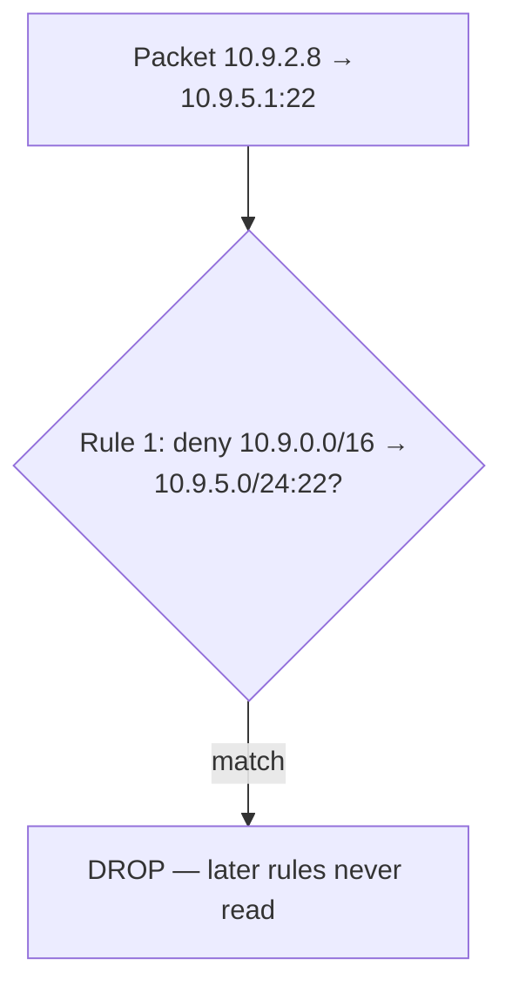
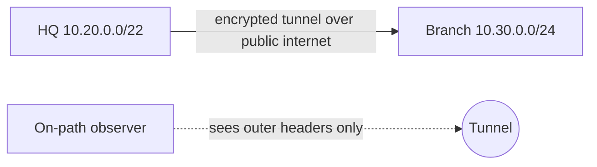

# Lecture 25 — Firewalls, Segmentation & VPNs — Slide Deck

| Field | Value |
|---|---|
| Slides | 18 (120 min: 10 open · 50 teach · 5 break · 50 LAB-13 · 10 wrap) |
| Companions | [`notes.md`](notes.md) · [`worksheet.md`](worksheet.md) · [LAB-13](../../labs/lab-13-firewall-vpn/README.md) |
| Style | [Course deck conventions](../../lectures/README.md#deck-conventions) |

## Deck outline

| # | Slide | # | Slide |
|---|---|---|---|
| 1 | Title | 10 | VPN: what it protects (diagram) |
| 2 | Hook: the default password night | 11 | Tunnel selectors |
| 3 | Firewall = policy point | 12 | What a VPN does NOT do |
| 4 | Stateless packet filter | 13 | Worked example: write the rules |
| 5 | Stateful inspection | 14 | LAB-13 brief |
| 6 | First-match ordering (diagram) | 15 | Classroom questions |
| 7 | Zones & default-deny | 16 | Common misconceptions |
| 8 | The permit matrix | 17 | Summary |
| 9 | Worked example: rule race | 18 | Exit question |

## Slides

### Slide 1 — Title
**Computer Networks — Lecture 25**
Firewalls, segmentation & VPNs (LAB-13 today)

> Notes — L24 gave the tools; today builds the walls: policy points, zones, tunnels.

### Slide 2 — Hook: the default password night
- One IoT camera, factory password, flat campus network
- By morning: lateral movement to a file server
- Every wall that was *missing* has a name — today we build them

> Notes — 2 min narrative, no live attack content. The story decomposes into: no segmentation, no filtering, no auth — the lecture's three chapters.

### Slide 3 — Firewall = policy point
- A device (or host software) that **decides which flows pass**
- Placement = power: at zone borders it governs everything crossing
- Decisions from headers (L3/L4) and *state* (L4+)

> Notes — The placement sentence is the design lesson: a firewall in the wrong spot is a speed bump. LAB-13 puts one at a router.

### Slide 4 — Stateless packet filter
- Per-packet header test: IPs, ports, flags → permit/deny
- Fast, cheap, blind to context
- Cannot see "this packet *belongs* to a conversation"

> Notes — Quiz W13 Q1's first half. The blindness example: a forged ACK-only packet *looks* like a reply to a stateless filter.

### Slide 5 — Stateful inspection
- Tracks connections: SYN seen → return traffic allowed
- "allow established/related" = the workhorse rule
- Unsolicited inbound that *pretends* to be a reply → dropped

> Notes — Quiz W13 Q1's second half + SA-28's distinction. The connection table is the state — show it conceptually, LAB-13 shows it live (conntrack).

### Slide 6 — First-match ordering (diagram)

- Rules evaluate **top-down, first match wins**

> Notes — Quiz W13 Q2 / final B4(a) both use this exact race. The diagram IS the answer; students must trace it, not memorize it.

### Slide 7 — Zones & default-deny
- Zone = a group of interfaces/VLANs with one policy (staff, servers, guests, IoT)
- **Default deny**: everything not explicitly permitted is dropped
- Safer failure mode: forgotten rule = unreachable, not exposed

> Notes — SA-25's argument on a slide. The permit matrix (slide 8) is the design artifact the capstone requires.

### Slide 8 — The permit matrix

| from → to | staff | servers | guests | IoT |
|---|---|---|---|---|
| staff | — | 443 | — | — |
| servers | — | — | — | — |
| guests | — | — | — | internet only |
| IoT | — | — | — | — |

- Read it as "who may start what, where"

> Notes — The matrix format the capstone design doc uses. Blank = deny (default); the only explicit cell for guests is egress. Notes.md has the filled teaching version.

### Slide 9 — Worked example: rule race
- Rules: (1) deny 10.9.0.0/16 → 10.9.5.0/24:22 (2) allow 10.9.0.0/16 → 10.9.5.0/24:any
- Admin from 10.9.2.8 to 10.9.5.1:22 → **denied by rule 1**
- Fix: reorder, or scope rule 1 tighter

> Notes — The reveal of slide 6 with the fix discussed. LAB-13 T2 makes students *build* this race and watch it lose.

### Slide 10 — VPN: what it protects (diagram)

- Inner packets: confidential + integrity-protected across untrusted transit

> Notes — THE tunnel diagram (visual-topic list). What the observer sees (outer headers, timing/volume) is quiz W13 Q3's second half.

### Slide 11 — Tunnel selectors
- Site-to-site policy must name **both** protected subnets
- 10.20.0.0/22 ↔ 10.30.0.0/24 — miss one, blackhole
- Case bank PB-050 is exactly this failure

> Notes — The "two selectors" rule. LAB-13's VPN task uses these two subnets deliberately — the case bank rehearses the failure.

### Slide 12 — What a VPN does NOT do
- Does not authenticate *users* to applications (machine/network-level only)
- Does not stop malware on an authenticated device
- Does not replace the firewall — it *adds* paths the firewall must then judge

> Notes — SA-20's boundary with teeth. "A VPN is a road, not a checkpoint" — the summary line students quote back.

### Slide 13 — Worked example: write the rules
- Given: staff VLAN 10, servers VLAN 20, default-deny
- Write: permit staff→servers tcp/443; permit established/related; drop all
- Check order: specific permits *before* the catch-all drop

> Notes — The three-rule starter set; LAB-13 T1 implements it in nftables. The order check is the slide-6 lesson applied.

### Slide 14 — LAB-13 brief
- Pairs: nftables ruleset on the lab router + one site-to-site tunnel config
- Demonstrate: one allowed flow, one blocked flow, one tunneled flow
- Deliverable: ruleset + evidence of all three demonstrations

> Notes — 50 min. Isolated lab environment only (ethics gate); the VPN is between lab namespaces, not external services.

### Slide 15 — Classroom questions
1. Why is default-deny *safer* than default-allow?
2. NAT already filters inbound — why add a firewall?
3. The tunnel is up but 10.30.1.5 is unreachable — first suspect?

> Notes — Q2: accidental ≠ designed; NAT's behavior is an implementation side effect. Q3: the missing selector (slide 11) — PB-050's answer.

### Slide 16 — Common misconceptions
- "Firewall = antivirus" → network policy ≠ host malware defense
- "VPN = anonymity" → it protects traffic, not identity from the VPN operator
- "Deny rules make you safe" → *order* and coverage decide; one missed path leaks

> Notes — The third misconception primes L26's workshop: rule audits exist because rules lie.

### Slide 17 — Summary
- Policy point; stateless vs stateful; first-match order
- Zones + default-deny + permit matrix
- VPNs protect transit; selectors must be complete
- Next: attack & defense workshop — all of it, applied (L26)

> Notes — Recap via the permit matrix; students read one row aloud with deny-semantics.

### Slide 18 — Exit question
Rules: (1) permit staff→servers:443 (2) deny all. A staff→servers:22 packet — result and deciding rule?
*(LAB-13 evidence due next session.)*

> Notes — Answer: denied by rule 2 (no permit matches). Exit slips feed W13 pool (graded-window candidate week).

### Demonstration instructions (instructor)
- LAB-13: nftables + WireGuard-class tunnel between namespaces (per lab package) — ITI: verify kernel modules on the teaching image
- Evidence capture: one `conntrack` listing, one blocked-flow log line — printed in the worksheet's key
- Ethics gate reminder: no scanning/probing beyond the lab's own addresses

### References for the deck
- nftables documentation (rule semantics); NIST SP 800-41 (firewall policy — cite for concepts)
- PD §8.4 (firewalls/VPN — ⚠ verify section)
- LAB-13 package: [`../../labs/lab-13-firewall-vpn/README.md`](../../labs/lab-13-firewall-vpn/README.md)
