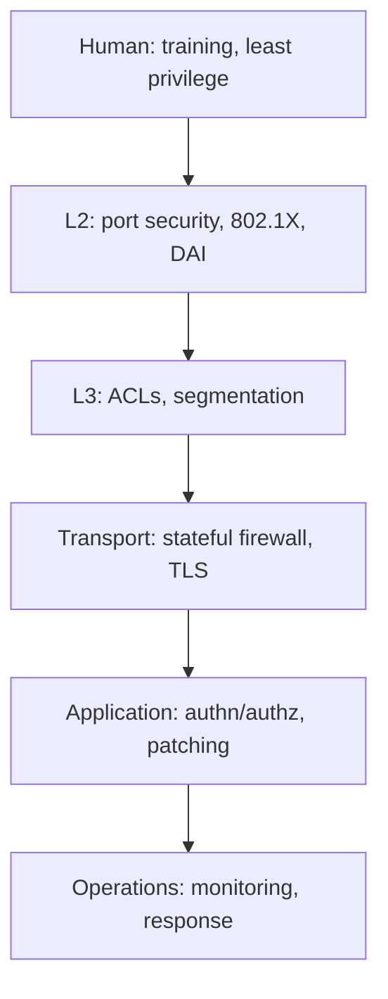

# Lecture 26 — Attack & Defense Case Workshop — Slide Deck

| Field | Value |
|---|---|
| Slides | 17 (120 min: 10 open · 30 teach · 5 break · 65 workshop · 10 wrap; capstone stage-2 report due) |
| Companions | [`notes.md`](notes.md) · [`worksheet.md`](worksheet.md) · case bank PB-047…PB-052 |
| Style | [Course deck conventions](../../lectures/README.md#deck-conventions) |

## Deck outline

| # | Slide | # | Slide |
|---|---|---|---|
| 1 | Title | 10 | Defense: defense-in-depth |
| 2 | Hook: the red team found it in 20 min | 11 | Controls per layer (diagram) |
| 3 | Workshop rules & ethics | 12 | Worked example: map attack→controls |
| 4 | Attacker positions | 13 | Workshop brief: three cases |
| 5 | Attack gallery (taxonomy) | 14 | Classroom questions |
| 6 | L2: ARP poisoning | 15 | Common misconceptions |
| 7 | L3+: on-path & DNS attacks | 16 | Summary |
| 8 | Human layer: phishing | 17 | Exit question |
| 9 | Detection: alerts & tuning | | |

## Slides

### Slide 1 — Title
**Computer Networks — Lecture 26**
Attack & defense case workshop

> Notes — Today flips the seat: from *building* networks to *breaking and defending* them — safely, on paper cases.

### Slide 2 — Hook: the red team found it in 20 minutes
- Pen-test debrief (public-patterned): flat L2, no port auth, one phished password
- Not an exotic attack — a *missing wall* inventory
- Today you learn to see missing walls

> Notes — 2 min. Frame: attackers reuse known doors; defense is completeness, not cleverness.

### Slide 3 — Workshop rules & ethics
- Analysis of *provided synthetic cases only* — no scanning, no live targets
- Techniques discussed at concept level (how it's detected/prevented)
- The week-1 ethics acknowledgment governs today as always

> Notes — Read the gate line verbatim. The line between "understand the attack" and "perform the attack" is the course's bright line — restate it.

### Slide 4 — Attacker positions

| Position | Can do | Example |
|---|---|---|
| Off-path | send blind | phishing, spam |
| On-path | see + modify flow | DNS spoofing on café Wi-Fi |
| On-link (local) | L2 games | ARP poisoning |

> Notes — The taxonomy from L24 (review-M6 Q9) now powers the whole workshop. Every case today gets a position label first.

### Slide 5 — Attack gallery (taxonomy)

| Layer | Attack | Signature |
|---|---|---|
| L2 | ARP poisoning | one IP, many MACs |
| L3/L7 | DNS spoofing | wrong answers, real-looking |
| App | credential phishing | humans typed secrets |
| Volume | DoS | resource exhaustion |

> Notes — The gallery is the workshop's index card; each row = one case station. DoS stays conceptual (no techniques) per the gate.

### Slide 6 — L2: ARP poisoning
- Attacker answers ARP for the gateway → traffic flows *through* them
- Signature in the capture: conflicting MAC per IP
- Defenses: dynamic ARP inspection, port security, static pairs

> Notes — Quiz W13 Q6's scenario is this row. The defense list is the examinable part; notes.md has the DAI mechanism sketch (validation of bindings).

### Slide 7 — L3+: on-path & DNS attacks
- Spoofed DNS answers redirect users (bank ≠ bank)
- Raising the bar: DNSSEC (forged answers fail validation)
- Transport hardening: DoT/DoH named — one line each

> Notes — Review-M6 Q10's answer. The bar-raising framing ("inject a packet" → "forge a signature chain") is the transferable idea.

### Slide 8 — Human layer: phishing
- No network position needed — deception is the vector
- Network-side mitigation is *limited*: mail filtering, DMARC-based rejection
- Human-side: training + report culture — the real wall

> Notes — The honest slide: network engineers can't patch people. The DMARC tie-back completes L23's envelope story.

### Slide 9 — Detection: alerts & tuning
- Signature alerts: known-bad patterns
- Anomaly alerts: deviations from baseline (L29 preview)
- Tuning: precision vs recall — 200 alerts/hour with 2 true = useless

> Notes — Review-M6 Q12's tuning problem. The numbers are synthetic (labeled) — the *ratio* is the lesson.

### Slide 10 — Defense: defense-in-depth
- Layers: human · L2 · L3 · transport · application · operations
- One control per layer; no single wall decides
- Missing-layer analysis = the workshop's core skill

> Notes — Review-M6 Q11's list rendered. The diagram next slide; this slide names the principle.

### Slide 11 — Controls per layer (diagram)

- The stack the capstone design must populate

> Notes — THE defense stack (visual-topic: workflows). The capstone's security section literally fills this in — say so.

### Slide 12 — Worked example: map attack→controls
- Attack: on-path DNS spoofing on the guest VLAN
- Controls: DNSSEC (validation), guest isolation (no route to staff), TLS (transport), training
- Which control *most directly* raises the attacker's bar? (DNSSEC)

> Notes — The mapping template the workshop uses; students replicate it on their cases. The "most directly" clause forces prioritization.

### Slide 13 — Workshop brief: three cases
- Stations (paper cases, pairs rotate): PB-047 (pillars), PB-051 (resolver lies), PB-048 (leaked key)
- Per case: position label → control list → the ONE control you'd add first, defended
- 20 min per station

> Notes — 65 min total with rotation. The "defend your first pick" clause is where trade-off reasoning (CLO6) gets exercised.

### Slide 14 — Classroom questions
1. Which layer failed when a phished password beats your firewall?
2. Why does DAI need a *binding database*?
3. Your alert fires 200×/hour with 2 true positives — what do you change first?

> Notes — Q1: human/identity — walls don't check passwords. Q3: scope the rule/correlate a second signal (review-M6 Q12's fix list).

### Slide 15 — Common misconceptions
- "Security = a firewall product" → it's a *layered process*
- "Encryption stops phishing" → phishing steals credentials pre-crypto
- "One strong wall suffices" → completeness beats strength (the hook's lesson)

> Notes — The first misconception is the exam's favorite distractor family; name the product-vs-process distinction explicitly.

### Slide 16 — Summary
- Positions → attacks → controls: the workshop loop
- Defense-in-depth: populate every layer, know your blast radius
- Detection needs tuning, or it drowns you
- Next: where networks actually run — cloud (L27)

> Notes — Recap by the gallery table; students name one defense per row from memory.

### Slide 17 — Exit question
One control per layer against "unauthorized access to a staff server" — name three layers' controls.
*(Capstone stage-2 report due today.)*

> Notes — Any three correct pairs (review-M6 Q11). Exit slips feed W13 pool. Stage-2 hand-in logistics in the wrap.

### Demonstration instructions (instructor)
- Workshop is fully paper-based (cases print from the bank); no live attack demos per the gate
- Rotation logistics: 3 stations × 20 min + 5 min plenary per rotation
- ITI: pre-read the three cases' instructor keys; harvest common wrong answers for the plenary

### References for the deck
- Case bank: PB-047…PB-052
- NIST CSF (control categories — concept citation)
- Course ethics gate: [`../../docs/prerequisites.md`](../../docs/prerequisites.md) week-1 acknowledgment
