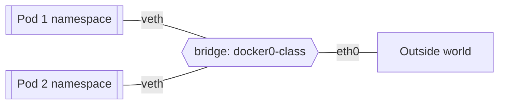
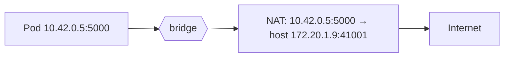
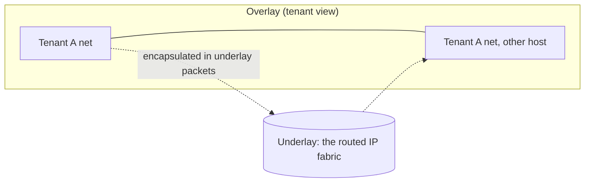

# Lecture 27 — Cloud & Virtual Networking — Slide Deck

| Field | Value |
|---|---|
| Slides | 18 (120 min: 10 open · 55 teach · 5 break · 40 GA-27 · 10 wrap) |
| Companions | [`notes.md`](notes.md) · [`worksheet.md`](worksheet.md) (GA-27) |
| Style | [Course deck conventions](../../lectures/README.md#deck-conventions) |

## Deck outline

| # | Slide | # | Slide |
|---|---|---|---|
| 1 | Title | 10 | Security groups |
| 2 | Hook: the pod that couldn't phone home | 11 | Worked example: MTU arithmetic |
| 3 | Namespaces: the private island | 12 | VPC: the private island, rented |
| 4 | veth & bridge (diagram) | 13 | Peering vs public path |
| 5 | Outbound path (diagram) | 14 | GA-27 brief |
| 6 | NAT for egress | 15 | Classroom questions |
| 7 | MTU: the silent killer | 16 | Common misconceptions |
| 8 | Overlays (diagram) | 17 | Summary |
| 9 | Overlay overhead | 18 | Exit question |

## Slides

### Slide 1 — Title
**Computer Networks — Lecture 27**
Cloud & virtual networking (GA-27 today)

> Notes — Module 7: where networks actually run now. Today: the same course concepts, wearing containers and clouds.

### Slide 2 — Hook: the pod that couldn't phone home
- Small requests fine; file uploads die
- "Network is down"? Ping works. DNS works.
- One number, invisible everywhere: MTU

> Notes — 2 min. The reveal lands at slide 7; bank PB-053 is this story's full case. Students love that the villain is 28 bytes.

### Slide 3 — Namespaces: the private island
- A container = processes + its **own network view**: interfaces, routes, ports
- Two containers on one host: two islands
- Islands need bridges and boats — next slides

> Notes — The island metaphor anchors the lecture. Isolation is the point: no shared port space, no shared interfaces.

### Slide 4 — veth & bridge (diagram)

- veth = virtual cable pair; bridge = the host's L2 switch

> Notes — L08's switch, resurrected in software. Quiz W14 Q1 tests the trio by name; the diagram is the memory anchor.

### Slide 5 — Outbound path (diagram)

- Pod IPs are host-private; egress is source-NAT'd

> Notes — L14's NAT, second appearance. Quiz W14 Q2's debugging story and review-M7 Q1 both build here. The port rewrite mirrors L14's table exactly.

### Slide 6 — NAT for egress
- Why default? Pod IPs are meaningless off-host (millions of hosts use 10.42.0.5)
- Replies return to the host → mapped back to the pod
- Inbound needs explicit publishing (the flip side)

> Notes — The debugging cost named (bank C-30): external connections can't be traced to a pod without the NAT table. Publish-vs-NAT asymmetry previews ingress rules.

### Slide 7 — MTU: the silent killer
- Ethernet MTU 1500; overlays add headers (VXLAN-style ≈ 50 B)
- Inner packets must shrink: 1500 − overhead
- Symptom: small packets pass, big ones vanish — *handshakes succeed, transfers stall*

> Notes — THE failure story of cloud networking (quiz W14 Q2 verbatim). Why ping lies: small probes fit; the transfer doesn't. Bank PB-053's full diagnosis.

### Slide 8 — Overlays (diagram)

- Tenant L2 segments tunneled across the L3 datacenter

> Notes — The underlay/overlay split (quiz W14 Q3). "L2 over L3" sounds wrong until the encapsulation arrow is drawn — walk it twice.

### Slide 9 — Overlay overhead
- Encapsulation headers ride *inside* the underlay MTU
- 1500 − 50 = 1450 effective inner MTU (teaching numbers)
- Wrong inner MTU = PMTUD black holes = slide 2's hook

> Notes — Quiz W14 Q2's answer arithmetic. The fix list: match MTU, or ensure PMTUD works (ICMP "frag needed" must not be firewalled — L16's guest-protocol theme returns).

### Slide 10 — Security groups
- Stateful per-instance rules: allow-in 443 → return traffic auto-allowed
- Egress rules govern *connection initiation* outward
- Distributed firewall: policy follows the instance

> Notes — Quiz W14-adjacent (review-M7 Q3's stateful explanation). "Both an ingress 443 rule and an egress 443 rule exist" is the discussion nugget.

### Slide 11 — Worked example: MTU arithmetic
- Underlay path MTU: 1500; overlay adds 50 B headers
- Inner must be ≤ 1450; a pod left at 1500 → outer = 1550 → dropped
- Where does it break first? TLS hello passes (small); first data burst dies

> Notes — Numbers on the board; students compute the 1550 overshoot. The symptom-ordering clause is the diagnostic lesson.

### Slide 12 — VPC: the private island, rented
- Your own RFC-1918-style address space inside a provider
- Subnets, route tables, NAT gateways — L13/L14 concepts as services
- Everything in this course, minus the hardware closet

> Notes — The payoff slide: the course *is* cloud networking's prerequisite chain. Route tables = slide 3 of L16 rendered in a web console.

### Slide 13 — Peering vs public path

| | Peering | Public path |
|---|---|---|
| Exposure | private | internet |
| Latency | provider backbone | transit |
| Cost | per-GB regional | egress-heavy |

> Notes — Review-M7 Q4's two properties per column. The egress-cost note is the real-world economics students never hear.

### Slide 14 — GA-27 brief
- Worksheet: label the veth/bridge/NAT path for two pods; compute two MTUs; classify three security-group rules
- Then: one diagnosis scenario (the hook's story) in 5 lines
- 30 min pairs + plenary

> Notes — The worksheet mirrors quiz W14 Q1/Q2 + bank PB-053. The 5-line diagnosis caps the session — concision is graded.

### Slide 15 — Classroom questions
1. Two pods on one host, same port 8080 — conflict?
2. Where does the pod's IP appear on the wire once it leaves the host?
3. Your overlay's inner MTU is 1450 but a pod has 1500 — exactly which packets fail?

> Notes — Q1: no — separate namespaces. Q3: only packets > 1450 inner (i.e., full-payload ones); the "exactly" forces precision.

### Slide 16 — Common misconceptions
- "Containers have their own network stack *hardware*" → namespaces are *views*, all virtual
- "Cloud networking is different networking" → same IP/NAT/MTU concepts, new ownership
- "Bigger instance = bigger MTU" → MTU is a path property, not a size tier

> Notes — The second misconception is the lecture's thesis; say it as the closing line of the teach block.

### Slide 17 — Summary
- Namespaces + veth + bridge = the pod's network
- Egress NAT; overlays tunnel L2 across L3; MTU math rules them all
- VPC = this course's concepts as managed services
- Next: SDN — who *decides* all this forwarding (L28)

> Notes — Recap via slide 4→5 path walk; students name each component aloud.

### Slide 18 — Exit question
Underlay MTU 1500, overlay overhead 50 B. What inner MTU must a pod use?
*(GA-27 due at session end.)*

> Notes — Answer: 1450. Exit slips feed W14 pool.

### Demonstration instructions (instructor)
- GA-27 paper-first; the pod-path diagram prints in the worksheet
- Live beat (optional): two namespaces on a bridge, `ip netns` MTU set to 1450 vs 1500 — show the big-packet ping fail with `-s 1472` (ITI: any namespace-capable host; 1472+28 = 1500 boundary)
- Fallback: worksheet's printed command transcripts (labeled synthetic where reconstructed)

### References for the deck
- RFC 1191 (PMTUD), RFC 7348 (VXLAN — cite for the overlay concept)
- Docker networking docs (bridge/driver concepts — vendor-neutral framing)
- Case bank: PB-053, PB-054
