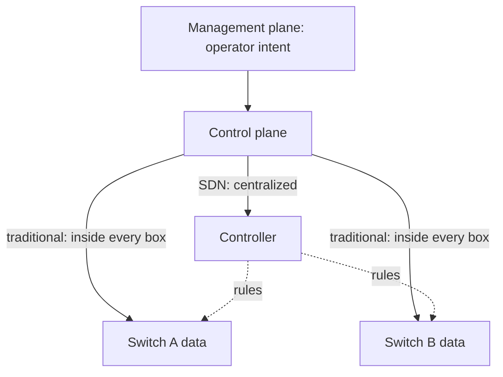
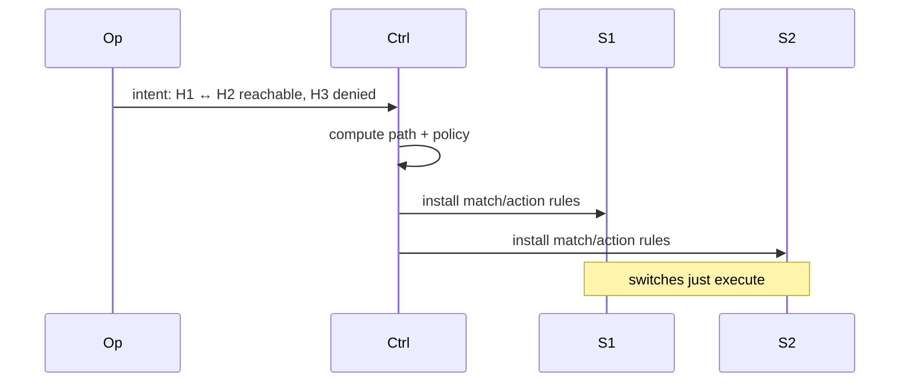

# Lecture 28 — SDN & Programmable Networks — Slide Deck

| Field | Value |
|---|---|
| Slides | 17 (120 min: 10 open · 55 teach · 5 break · 40 GA-28 · 10 wrap) |
| Companions | [`notes.md`](notes.md) · [`worksheet.md`](worksheet.md) (GA-28 controller exercise) |
| Style | [Course deck conventions](../../lectures/README.md#deck-conventions) |

## Deck outline

| # | Slide | # | Slide |
|---|---|---|---|
| 1 | Title | 10 | Match/action rules |
| 2 | Hook: for 30 years, switches decided alone | 11 | Worked example: write two rules |
| 3 | The three planes | 12 | SDN in the datacenter |
| 4 | Planes: where they live (diagram) | 13 | GA-28 brief |
| 5 | The controller idea (diagram) | 14 | Classroom questions |
| 6 | Distributed vs central decision | 15 | Common misconceptions |
| 7 | What centralization buys | 16 | Summary |
| 8 | What it costs | 17 | Exit question |
| 9 | Worked example: L08 replayed | | |

## Slides

### Slide 1 — Title
**Computer Networks — Lecture 28**
SDN & programmable networks (GA-28 today)

> Notes — L08's switch decided alone. Today: what if one brain saw the whole network? (CLO6 architecture thread.)

### Slide 2 — Hook: for 30 years, switches decided alone
- Each switch: own FDB, own protocols, own timers
- Result: 30 years of per-device configuration drift
- SDN's bet: *decide once, centrally, push everywhere*

> Notes — 2 min. The L08 callback (quiz-style): "who decided forwarding in L08?" — each switch. That's the thing being replaced.

### Slide 3 — The three planes

| Plane | Question | Lived in (traditional) |
|---|---|---|
| Management | what does the operator want? | config/CLI |
| Control | how should packets flow? | each device's CPU |
| Data | forward this packet | each device's ASIC |

> Notes — Quiz W14 Q4's sort lives here. The table is the vocabulary; the diagram on slide 4 shows the SDN change.

### Slide 4 — Planes: where they live (diagram)



- SDN moves control *out* of the boxes; data plane stays

> Notes — THE architecture diagram (visual-topic list). The data plane never moves — only the *decision-making* does. That distinction is the quiz trap.

### Slide 5 — The controller idea (diagram)



- Intent in, rules out; switches become fast, dumb executors

> Notes — The workflow in four lines. GA-28 has students *be* the controller on paper.

### Slide 6 — Distributed vs central decision
- Distributed (L08): fast local reaction, no single brain, but drift
- Central: one consistent view, global policy, but a coordination point
- Real fabrics: hybrid — local fast-path, central policy

> Notes — The honest comparison (bank C-31's two halves). "Which wins where" is the exam question; slide 16/17 elaborate.

### Slide 7 — What centralization buys
- Consistency: one policy, applied identically everywhere
- Programmability: intent ( YAML/API) instead of per-box CLI
- Visibility: the controller *sees* the whole fabric

> Notes — The three buys each map to a pain from earlier lectures (config drift, CLI errors, blind troubleshooting). Concrete, not hype.

### Slide 8 — What it costs
- Controller = coordination point: outage freezes *changes*
- Scale: one brain vs thousands of devices
- Skills: programmability becomes a networking job requirement

> Notes — The costs taken seriously (bank C-31, quiz W14 Q6). The outage nuance: existing flows keep forwarding; *changes* stop — the blast-radius sentence.

### Slide 9 — Worked example: L08 replayed
- L08's three-frame rule: learn, look up, forward/flood — *per switch, per frame*
- SDN version: controller learns topology once, installs all paths
- The FDB migrates from the box to the (central) control logic

> Notes — The continuity slide: nothing new conceptually, only the *location* of decision-making moved. L08↔L28 bookends.

### Slide 10 — Match/action rules

```text
match: in-port=1, eth-dst=H2  → action: output 2
match: src=H3, dst=H2         → action: drop
```

- The rule pair that *is* SDN: classify, then act
- Priority field resolves overlaps (first-match logic returns!)

> Notes — Quiz W14 Q5's answer format. The priority/first-match return is a delightful full-circle to L25's firewall ordering.

### Slide 11 — Worked example: write two rules
- Goal 1: H1 (S1 port 1) reaches H2 via S1→S2
- Goal 2: H3 may not talk to H2 — anywhere
- Students write match/action per switch, then trace one packet

> Notes — GA-28's core exercise done once together; the worksheet extends to three switches. The trace step catches the missing-rule bugs.

### Slide 12 — SDN in the datacenter
- Cloud fabrics: tenant overlays programmed centrally (L27's connection!)
- Network functions virtualized at the controller's mercy
- The campus single-pane-of-glass dream (and its migration realities)

> Notes — The L27 tie-in is the payoff: overlays *are* SDN-applied. Keep vendor names out; patterns only.

### Slide 13 — GA-28 brief
- Worksheet: be the controller — three goals, three switches, write the rules
- Then: one failure scenario (controller down mid-reconfig) — predict behavior
- 30 min pairs + plenary

> Notes — The failure scenario tests slide 8's nuance (existing flows survive; changes stall). The plenary harvests rule-conflict bugs.

### Slide 14 — Classroom questions
1. Which plane does a switch's ASIC belong to?
2. Controller dies mid-morning: who can still talk to whom?
3. Why did first-match priority logic return in SDN rules?

> Notes — Q2: existing-rule flows continue; new/unreachable destinations fail — the precise answer earns the mark. Q3: because rule sets overlap.

### Slide 15 — Common misconceptions
- "SDN = OpenFlow" → OpenFlow is one protocol; SDN is the architecture
- "Controller outage = network outage" → only *changes* freeze
- "SDN removes protocols" → it replaces *distributed* control with centralized; something still computes paths

> Notes — The first misconception is ubiquitous in job ads; the course keeps protocol-agnostic on purpose.

### Slide 16 — Summary
- Three planes; control moves out, data stays
- Match/action rules; intent → installed rules
- Buys: consistency, programmability, visibility; costs: coordination, skills
- Next: monitoring & troubleshooting — operating all of it (L29)

> Notes — Recap by slide 4's diagram; students label the three planes on a blank copy.

### Slide 17 — Exit question
Sort: "operator pushes a VLAN template" · "switch forwards a frame" · "controller recomputes paths after a link dies" — which plane each?
*(GA-28 worksheet due at session end.)*

> Notes — Answers: management, data, control. Exit slips feed W14 pool.

### Demonstration instructions (instructor)
- GA-28 paper-first; the rule table prints in the worksheet
- Optional live beat: mininet-style single-controller demo on the teaching laptop (ITI: install/lightweight VM needed; else narrate the sequence diagram)
- No-device rooms: fully supported — the exercise is rule-writing on paper

### References for the deck
- Open Networking Foundation SDN architecture primer (concept citation)
- PD §4.3 (SDN sections — ⚠ verify edition)
- Quiz + case cross-refs: quiz W14, bank C-31, PB-055/PB-065
