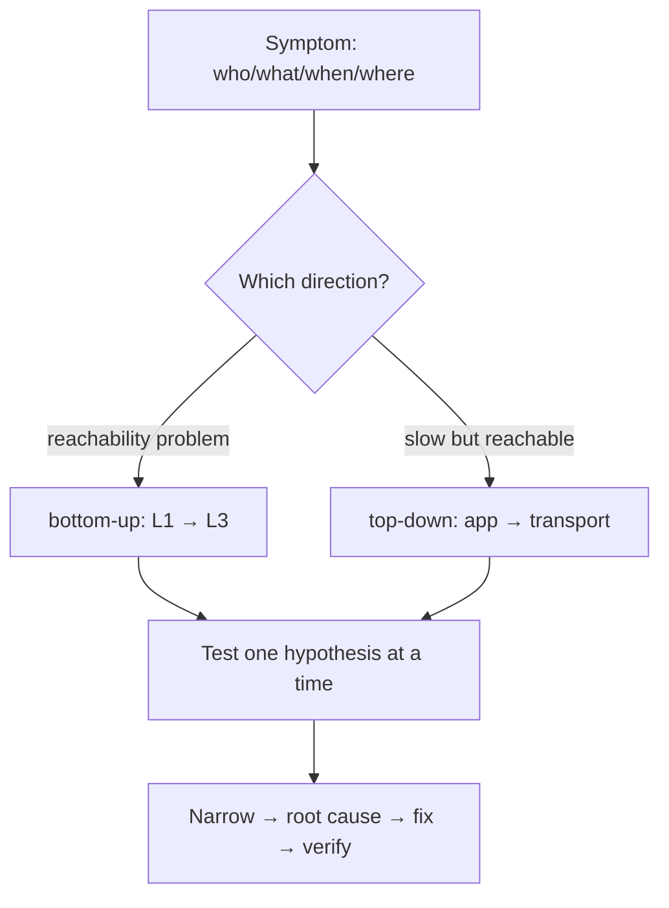

# Lecture 29 — Monitoring & Troubleshooting — Slide Deck

| Field | Value |
|---|---|
| Slides | 18 (120 min: 10 open · 50 teach · 5 break · 50 LAB-14 · 10 wrap) |
| Companions | [`notes.md`](notes.md) · [`worksheet.md`](worksheet.md) · [LAB-14](../../labs/lab-14-monitoring-faults/README.md) |
| Style | [Course deck conventions](../../lectures/README.md#deck-conventions) |

## Deck outline

| # | Slide | # | Slide |
|---|---|---|---|
| 1 | Title | 10 | Alerting: thresholds vs baselines |
| 2 | Hook: the green dashboard | 11 | Worked example: baseline judgment |
| 3 | What monitoring collects | 12 | The troubleshooting workflow (diagram) |
| 4 | Continuous metrics | 13 | Worked example: run the workflow |
| 5 | Event records | 14 | LAB-14 brief |
| 6 | Sampling & blind windows | 15 | Classroom questions |
| 7 | The 30-second outage | 16 | Common misconceptions |
| 8 | Baselines: memory of normal | 17 | Summary |
| 9 | Worked example: 90% at 03:00 | 18 | Exit question |

## Slides

### Slide 1 — Title
**Computer Networks — Lecture 29**
Monitoring & troubleshooting (LAB-14 today)

> Notes — Everything so far assumed you can *see* the network. Today: the seeing discipline (CLO4/5/6 converge).

### Slide 2 — Hook: the green dashboard
- Every panel green. Users: "everything is slow."
- Utilization 40%, CPU 30%, uptime 99.9%
- What did the dashboard never measure?

> Notes — 2 min. Collect candidates (latency! tails! retransmits!). Bank PB-058/LA-12 is this story; the reveal lands at slide 10.

### Slide 3 — What monitoring collects

| Class | Examples | Cadence |
|---|---|---|
| Continuous metrics | utilization, RTT, loss | every N seconds |
| Event records | syslog, flow records, config changes | as they happen |
| State snapshots | interface up/down, table sizes | on change |

> Notes — Quiz W15 Q1's answer table. The three classes organize every monitoring stack; LAB-14 installs one.

### Slide 4 — Continuous metrics
- Utilization (% of capacity) — per interface
- RTT/loss — probes (ping-class) from *inside* the network
- Retransmits/errors — L2/L4 counters

> Notes — Layer attribution matters (quiz W15 Q1's second clause). "Probes from inside" preps the blind-window discussion.

### Slide 5 — Event records
- Syslog: what devices *said* happened
- Flow records: who talked to whom, how much
- Config-change logs: who touched what, when

> Notes — Flow records = the network's phone bill (metadata, not content). The config-change log solves more "who broke it" mysteries than any packet capture.

### Slide 6 — Sampling & blind windows
- Poll every 60 s → a 30 s outage can hide between polls
- The poll *is* a sample, not a video
- Fixes: event-driven traps, faster polls on critical paths

> Notes — Quiz W15 Q6 / review-M7 Q12's answer. The 60-second-poll arithmetic: up to 60 s of blindness per cycle (quiz bank's numbers).

### Slide 7 — The 30-second outage
- Poll at t=0 (up), outage t=5–35, poll at t=60 (up)
- The dashboard: nothing happened
- But users experienced 30 s of error

> Notes — The concrete timeline of slide 6. "Monitoring is a sampling process" — the sentence that changes how students read dashboards forever.

### Slide 8 — Baselines: memory of normal
- A baseline = the metric's *normal shape* per time-of-day
- 90% at 03:00 may be normal (backups); 40% at 14:00 may be crisis
- Deviation-from-baseline beats fixed thresholds

> Notes — Quiz W15 Q3's answer source. "Normal-but-loud vs quiet-but-wrong" is the alerting wisdom of the whole course.

### Slide 9 — Worked example: 90% at 03:00
- Alert: uplink 92% at 03:00 nightly
- Two questions: (1) is that the baseline shape? (2) what does it *cost* (loss/latency)?
- If baseline + no cost → silence it; if cost → reschedule or widen

> Notes — The judgment template (quiz W15 Q3 verbatim). Alerts become *decisions*, not noises.

### Slide 10 — What the green dashboard missed
- p95/p99 latency (tails!) — never collected
- Retransmit/queue-depth counters — never collected
- The brownout lived entirely in the tails

> Notes — The hook's reveal (LA-12's mechanism). Green = averages; pain = tails. The two families to add = the quiz-level takeaway.

### Slide 11 — Worked example: baseline judgment
- CPU alert at 90%: server's baseline at 09:00 is 85–95% (report generation)
- Same 90% at 03:00 (baseline 10–20%) → real incident
- Same number, different meaning — the baseline is the meaning

> Notes — One number, two verdicts; the cleanest baseline demonstration. Mirrors slide 9's logic on a different metric.

### Slide 12 — The troubleshooting workflow (diagram)

- Direction choice is the first decision — it halves the work

> Notes — THE workflow diagram (visual-topic list). Quiz W15 Q2 asks exactly the direction-choice logic.

### Slide 13 — Worked example: run the workflow
- "App times out; ping clean" → top-down (path proven)
- 1) process listening? (`ss -tlnp`) 2) port reachable? (`nc -vz`) 3) capture the handshake
- Each test halves the hypothesis space

> Notes — Review-M7 Q11's drill on slides. The three commands are the practical bank's PR-11 toolkit.

### Slide 14 — LAB-14 brief
- Pairs: monitoring stack on the lab fabric (metrics + syslog + one dashboard pane)
- Then: instructor injects a hidden fault; 15-min diagnosis with evidence log
- Deliverable: dashboard screenshot-or-text + ordered evidence log

> Notes — 50 min. PR-11 grades the *method*; the injected fault is the semester's capstone of troubleshooting skills.

### Slide 15 — Classroom questions
1. Two metrics that would have caught the green-dashboard brownout?
2. Why poll from inside the network rather than a user's laptop?
3. Your alert fired at 03:00 for the 30th night — what's wrong with the alert?

> Notes — Q3: it's noise — baseline it or silence it (slide 9's verdict). Alert fatigue is an operational disease; name it.

### Slide 16 — Common misconceptions
- "Monitoring = uptime checks" → uptime misses brownouts entirely
- "More alerts = more safety" → un-tuned alerts = alert fatigue = missed real ones
- "The dashboard is the truth" → it's a *sample* of chosen metrics

> Notes — The third misconception is the hook's lesson generalized; say it as the teach-block closer.

### Slide 17 — Summary
- Collect: continuous + events + state; beware sampling blind windows
- Baselines give numbers meaning; tails carry the pain
- Troubleshooting: direction first, one hypothesis at a time
- Next: wireless at enterprise scale (L30)

> Notes — Recap by the three classes of collection; students name one fix for the blind window.

### Slide 18 — Exit question
Poll interval 60 s; outage lasts 25 s. Worst case: how invisible is it?
*(LAB-14 evidence due next session.)*

> Notes — Answer: fully invisible (fits inside one blind window) if it starts just after a poll. Exit slips feed W15 pool.

### Demonstration instructions (instructor)
- LAB-14: the fault-injection helper (lab package) — ITI: test the injector the week before; keep a second fault in reserve for re-runs
- Dashboard beat: even a text-based metrics dump + grep counts as a dashboard for the lab (no fake screenshots: real command output required)
- Fallback: worksheet's synthetic metric tables (labeled) support the analysis half offline

### References for the deck
- RFC 7011 (IPFIX/flow records — cite for the concept)
- PD performance/monitoring sections revisited
- LAB-14 package: [`../../labs/lab-14-monitoring-faults/README.md`](../../labs/lab-14-monitoring-faults/README.md)
