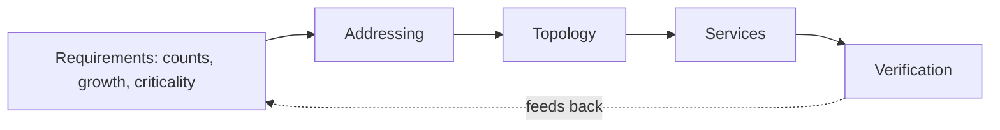

# Lecture 31 — Enterprise Design & Capstone Kickoff — Slide Deck

| Field | Value |
|---|---|
| Slides | 18 (120 min: 10 open · 50 teach · 5 break · 45 design drill · 10 wrap; CS-04 kickoff) |
| Companions | [`notes.md`](notes.md) · [`worksheet.md`](worksheet.md) · [capstone rubric](../../assessments/rubrics/capstone-rubric.md) |
| Style | [Course deck conventions](../../lectures/README.md#deck-conventions) |

## Deck outline

| # | Slide | # | Slide |
|---|---|---|---|
| 1 | Title | 10 | The data-science connection |
| 2 | Hook: the design that survived audit | 11 | Worked example: DS transfer math |
| 3 | What a design document contains | 12 | Chatty-workload failure mode |
| 4 | Requirements first (diagram) | 13 | The design drill brief |
| 5 | Addressing: the plan of record | 14 | Classroom questions |
| 6 | Topology & failure domains | 15 | Common misconceptions |
| 7 | Services & policy matrix | 16 | Summary |
| 8 | Verification: planned before built | 17 | CS-04 kickoff |
| 9 | Worked example: two designs compared | 18 | Exit question |

## Slides

### Slide 1 — Title
**Computer Networks — Lecture 31**
Enterprise design & capstone kickoff

> Notes — The course's arcs converge: every prior lecture is a *section* of one design document.

### Slide 2 — Hook: the design that survived audit
- Two student designs, same requirements: one passed the failover question, one didn't
- Difference: the first *planned* verification before building
- Today: the document that survives hostile questions

> Notes — 2 min. "Hostile questions" = the capstone defense (slide 17 announces it). The failover question is L32's examiner favorite.

### Slide 3 — What a design document contains

| Section | Artifact |
|---|---|
| Requirements | scope, host counts, growth |
| Addressing | VLSM plan + reservations |
| Topology | L2/L3 diagram, failure domains |
| Services & policy | DHCP/DNS placement, permit matrix |
| Verification | test list with pass criteria |

> Notes — Review-M8 Q4's five sections = the capstone rubric's stage-1 structure (25%). Each row is a prior lecture's exam skill.

### Slide 4 — Requirements first (diagram)

- Every downstream artifact traces to a stated requirement

> Notes — The traceability arrow is the audit-proofing device: "why /26 here?" must point at a requirement line. The capstone rubric grades the trace.

### Slide 5 — Addressing: the plan of record
- One subnet per role/site, headroom by growth math (L13)
- Reservations documented; aggregation planned (L16)
- The plan *is* the firewall matrix's backbone (L25)

> Notes — L13's three questions + growth = the addressing section. The cross-links (L16 aggregation, L25 zones) show the document's cohesion.

### Slide 6 — Topology & failure domains
- Draw the L2/L3 picture with *failure boundaries* marked
- Question each boundary: what dies when this does?
- Redundancy where requirements demand — not everywhere

> Notes — "What dies when X dies" = the failover question (slide 2). Cost-discipline: redundancy buys reliability with complexity — say where you'd *not* pay.

### Slide 7 — Services & policy matrix
- DHCP scopes per subnet (L22); DNS resolver placement (L21)
- Permit matrix: zone×zone, default-deny (L25)
- Monitoring: which metrics, which baselines (L29)

> Notes — Three service rows, three lecture callbacks. The matrix format was slide 8 of L25 — students fill it for *their* design.

### Slide 8 — Verification: planned before built
- Test list with pass criteria, written *before* the build
- Failover test, load test, security test — each with expected numbers
- "It worked in the lab" is not verification (L32's defense rehearses this)

> Notes — The capstone's stage-2/3 rubric rows demand exactly this. The lesson generalizes: designs without tests are opinions.

### Slide 9 — Worked example: two designs compared
- Same brief; Design A: flat L2, one VLAN, "simple"
- Design B: per-role VLANs, failover core, planned tests
- Audit question: "switch dies?" — A: everything; B: one floor

> Notes — The comparison table on the board; students argue which they'd sign. Both *work* on day one — the difference appears on day 300.

### Slide 10 — The data-science connection
- DS systems are network tenants: clusters, pipelines, model serving
- Same physics: RTT-bound vs bandwidth-bound workloads
- The design doc now has a *tenant* with spiky, chatty traffic

> Notes — CLO5/DS thread (L31's DS-specialized CLO). The failure modes land at slide 12; the math at slide 11.

### Slide 11 — Worked example: DS transfer math
- Nightly 200 GB, 1 Gb/s link, 30 ms RTT
- Ideal: 1.6×10¹² bits ÷ 10⁹ = **1600 s ≈ 26.7 min**
- Real: window vs BDP (3.75 MB) → TCP can't fill the pipe → tune window/parallelism

> Notes — Quiz W16 Q2's arithmetic (desk-checked) on slides. The BDP-tuning clause is the design lever DS engineers actually pull.

### Slide 12 — Chatty-workload failure mode
- 100 000 small files: per-file round trips dominate
- 100 000 × 2 ms ≈ 200 s of pure waiting per worker — bandwidth irrelevant
- Design answer: fewer/larger objects, parallel workers, local caching

> Notes — Quiz W16 Q3's mechanism. This is the single most valuable DS-networking insight of the course — name it as such.

### Slide 13 — The design drill brief
- Worksheet: design a 3-building campus (500 staff, guests, IoT, one DS cluster)
- 45 min: fill the five-section skeleton with *one* justification per choice
- Plenary: cross-examine two volunteer designs

> Notes — The capstone's full dress rehearsal at worksheet scale. Cross-examination uses the defense question bank from L32's rubric.

### Slide 14 — Classroom questions
1. Your addressing plan has no headroom — which requirement failed?
2. Where does the permit matrix come from, physically?
3. Which design section would you *never* skip, and why?

> Notes — Q1: growth requirement (N-22's compounding lesson). Q3: answers vary — verification is the defensible favorite; demand the why.

### Slide 15 — Common misconceptions
- "Design = drawing the network" → the diagram is 1/5 of the document
- "Requirements are obvious" → unstated growth kills plans (slide 14's Q1)
- "Verification happens after" → it's *designed* before the build

> Notes — The third misconception is the phase's core teaching; the rubric enforces it mechanically.

### Slide 16 — Summary
- Five sections; every artifact traces to requirements
- Failure domains and permit matrices are design *artifacts*
- DS tenants bring RTT-bound workloads — design for them
- Next: capstone clinic & synthesis (L32)

> Notes — Recap by the flow diagram; students name all five sections in order.

### Slide 17 — CS-04 kickoff
- Teams of 3–4; Meridian campus scenario (case-study-strategy §5)
- Stage 1: design document — due W13 (25% of capstone)
- Rubric: [`assessments/rubrics/capstone-rubric.md`](../../assessments/rubrics/capstone-rubric.md)

> Notes — 5 min logistics. Teams announced today; the explainability rule (defense Q&A, 15% stage) applies from day one.

### Slide 18 — Exit question
200 GB nightly over 1 Gb/s, 30 ms RTT: ideal time, and the first tuning lever if real time is 4×?
*(Design drill worksheet due at session end.)*

> Notes — Answer: 1600 s ≈ 26.7 min; lever = window/parallelism toward BDP. Exit slips feed W16 pool.

### Demonstration instructions (instructor)
- Design drill: worksheet skeleton prints; no devices needed (the deliverable is the document, not a config)
- Cross-examination: use the capstone rubric's defense questions as the examiner script
- CS-04 logistics: team roster, scenario packet distribution, stage-1 template pointer ([`../../assessments/rubrics/capstone-rubric.md`](../../assessments/rubrics/capstone-rubric.md))

### References for the deck
- Case-study strategy §5 (CS-04): [`../../docs/case-study-strategy.md`](../../docs/case-study-strategy.md)
- Capstone rubric: [`../../assessments/rubrics/capstone-rubric.md`](../../assessments/rubrics/capstone-rubric.md)
- Case bank: PB-061…PB-064
